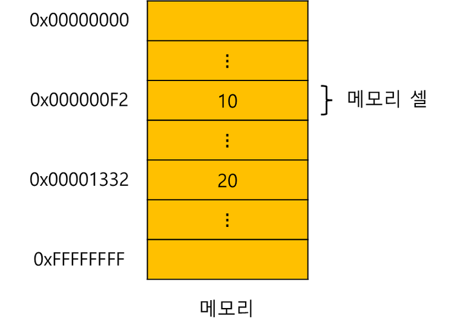
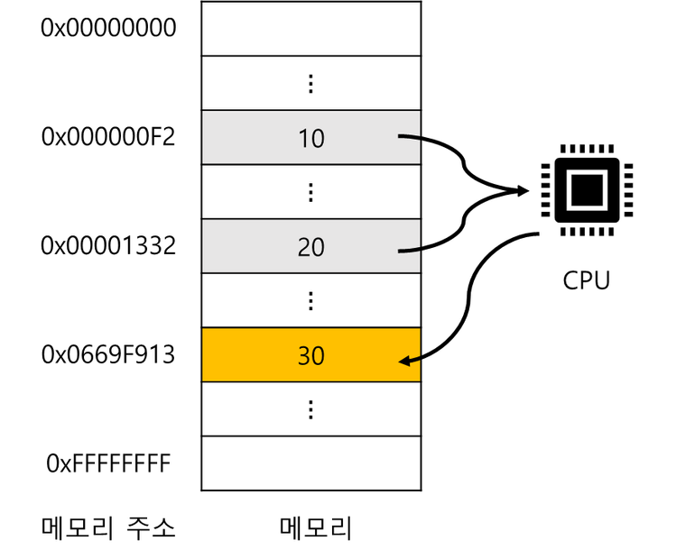
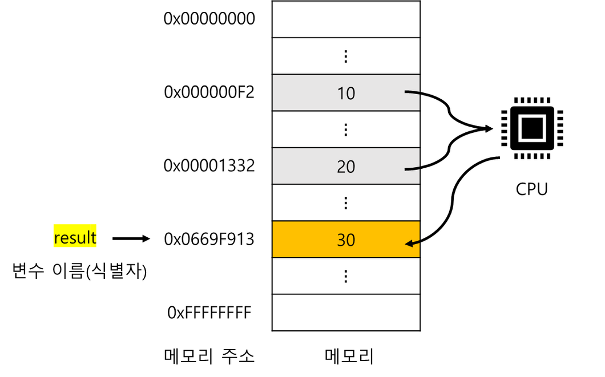
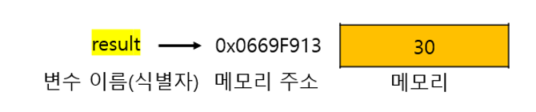
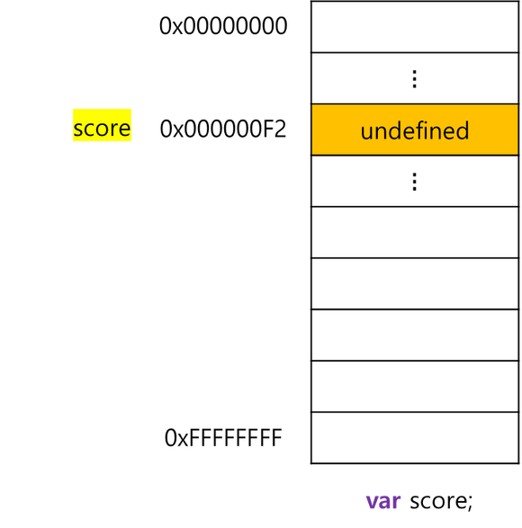
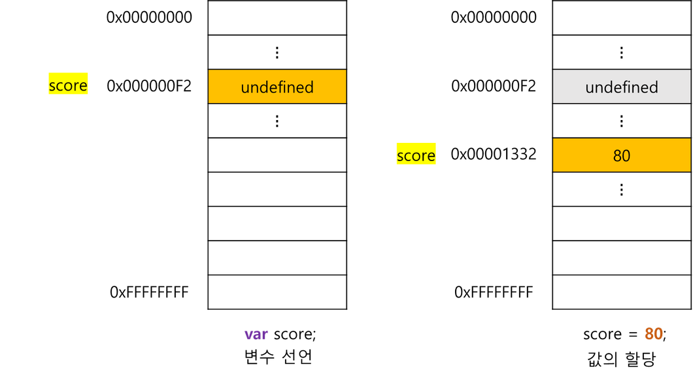
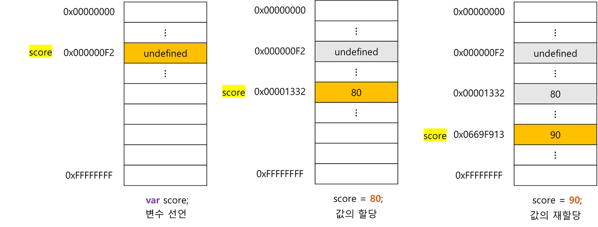

## 4.1 변수란 무엇인가? 왜 필요한가?

```jsx
10 + 20;
```

- 자바스크립트 엔진이 위 코드를 계산(평가)하려면 먼저 10, 20, + 라는 기호(리터럴과 연산자)의 의미를 알고 있어야 하며, 10 + 20 이라는 식(표현식)의 의미도 해석(파싱)할 수 있어야 함
- 자바스크립트 엔진은 + 연산을 수행하기 전에 피연산자 값을 기억함
- 컴퓨터는 연산과 기억을 수행하는 부품이 나눠져 있음
  - CPU를 통해 연산
  - 메모리를 사용해 데이터를 기억

### 메모리

- 데이터를 저장할 수 있는 메모리 셀의 집합체
- 메모리 셀 하나의 크기: 1byte(8bit)
- 컴퓨터는 메모리 셀의 크기인 1byte 단위로 데이터를 저장하거나 읽어들임

  

- 각 셀은 고유의 메모리 주소를 갖음
- 메모리 주소
  - 메모리 공간의 위치를 나타냄
  - 0부터 시작해서 메모리 크기만큼 정수로 표현
    <br/> ex) 4GB 메모리는 0부터 4,294,967,295(0x00000000~0xFFFFFFFF)까지의 메모리 주소를 가짐
- 컴퓨터는 데이터 종류(숫자, 텍스트, 이미지 등)와 상관 없이 모든 데이터를 2진수로 처리
- 위 예제에서 숫자 값 10과 20은 메모리 상의 임의의 위치(메모리 주소)에 기억(저장)되고 CPU는 이 값을 읽어들여 연산을 수행, 연산의 결과도 메모리 상의 임의의 위치에 저장
- 그림에는 메모리에 저장된 숫자 값을 편의상 10진수로 표기했지만,
  메모리에 저장되는 모든 값은 2진수로 저장된다는 것을 기억

  

- 성공적으로 연산이 끝났고 연산 결과가 메모리에 저장되었어도, 값 30을 재사용할 수 없음
  - 30이 저장된 메모리 공간에 직접 접근하는 것 외에 방법이 없지만 이는 매우 위험하고,
    JavaScript는 개발자의 직접적인 메모리 제어 허용X
  - 동일한 컴퓨터에서 동일한 코드를 실행해도 코드가 실행할 때마다 값이 저장될 메모리 주소는 바뀜

### 변수

- 하나의 값을 저장하기 위해 확보한 메모리 공간 자체 또는 그 메모리 공간을 식별하기 위해 붙인 이름
- 값의 위치를 가리키는 상징적인 이름
- 변수는 프로그래밍 언어의 컴파일러 또는 인터프리터에 의해 값이 저장된 메모리 공간의 주소로 치환되어 실행 → 변수를 통해 안전하게 값에 접근

```jsx
var result = 10 + 20;
```

- 연산을 통해 생성된 값은 메모리 공간에 저장되며,
  재사용 할 수 있도록 이 메모리 공간에 상징적인 이름을 붙인 것이 변수
- 변수 이름(변수명): 메모리 공간에 저장된 값을 식별할 수 있는 고유한 이름
- 변수 값: 변수에 저장된 값
- 할당(대입, 저장): 변수에 값을 저장하는 것
- 참조: 변수에 저장된 값을 읽어 들이는 것

  

## 4.2 식별자

- 어떤 값을 구별해서 식별할 수 있는 고유한 이름, 메모리 주소에 붙인 이름
- 식별자는 값이 저장되어있는 메모리 주소와 매핑 관계를 맺으며, 이 매핑 정보도 메모리에 저장돼야 함

  

- 메모리 상에 존재하는 어떤 값을 식별할 수 있는 이름은 모두 식별자라 부름
- 선언에 의해 자바스크립트 엔진에 식별자의 존재를 알림

## 4.3 변수 선언

- 변수를 생성하는 것
- 값을 저장하기 위한 메모리 공간을 확보하고 변수 이름과 확보된 메모리 공간의 주소를 연결해서 값을 저장할 수 있게 준비하는 것
- 확보가 해제되기 전까지는 누구도 확보된 메모리 공간을 사용할 수 없도록 보호되므로 안전하게 사용 가능
- 변수를 사용하려면 반드시 선언이 필요 - var, let, const 키워드 사용

### var 키워드

- 뒤에 오는 변수 이름으로 새로운 변수를 선언할 것을 지시하는 키워드
- 키워드: js 코드를 해석하고 실행하는 js 엔진이 수행할 동작을 규정한 일종의 명령어
  js 엔진은 키워드를 만나면 자신이 수행해야 할 약속된 동작을 수행

```jsx
var score; // 변수 선언(변수 선언문)
```

- 위 선언문은 변수 이름을 등록하고 저장할 메모리 공간을 확보
- 확보한 메모리 공간에는 js 엔진에 의해 undefined라는 값이 암묵적으로 할당되어 초기화됨

  

- js 엔진은 변수 선언을 2단계에 거쳐 수행
  1. 선언 단계: 변수 이름을 등록해서 js 엔진에 변수의 존재를 알림
  2. 초기화 단계: 값을 저장하기 위한 메모리 공간을 확보하고 암묵적으로 undefined를 할당해 초기화 함
- var 키워드를 사용한 변수 선언은 선언단계와 초기화 단계가 동시 진행
- 초기화: 변수가 선언된 이후 최초로 값을 할당하는 것, 어떠한 값을 할당 안해도 undefined라는 값을 가짐
- 만약 초기화 단계를 거치지 않으면 확보된 메모리 공간에는 이전에 다른 애플리케이션이 사용했던 값이 남아 있을 수 있는데 이를 쓰레기 값이라고 함
  → js는 암묵적으로 초기화 하므로 이러한 위험에 안전
- 변수를 사용하려면 반드시 선언이 필요

## 4.4 변수 선언의 실행 시점과 변수 호이스팅

- 변수 선언을 포함한 모든 선언문은 소스코드가 한 줄씩 순차적으로 실행되는 시점인 런타임이 아니라 그 이전 단계에 먼저 실행
- 이 과정 후에 선언문을 제외하고 소스코드를 한 줄씩 순차적으로 실행
- 변수 호이스팅: 변수 선언문이 코드의 선두로 끌어 올려진 것처럼 동작하는 자바스크립트의 고유의 특징

## 4.5 값의 할당

- 변수에 값을 할당(대입, 저장)할 때는 할당 연산자 `=` 를 사용
- 할당연산자: 우변의 값을 좌변의 변수에 할당

```jsx
var score; // 변수 선언
score = 80; // 값의 할당
```

- 변수 선언과 값의 할당은 하나의 문으로 단축 표현할 수 있음

```jsx
var score = 80; // 변수 선언과 값의 할당
```

- js 엔진은 변수 선언과 값의 할당을 하나의 문으로 단축 표현해도 2개의 문으로 나누어 각각 실행되며 실행 시점이 다름
  - 변수 선언: 런타임 이전에 먼저 실행
  - 값의 할당: 런타임에 실행
- 이미 undefined로 초기화되어 있으므로 변수에 값을 할당하는 것은 재할당되는 것임
- 변수에 값을 할당할 때는 새로운 메모리 공간을 확보하고 그곳에 저장

  

## 4.6 값의 재할당

- 재할당: 이미 값이 할당되어 있는 변수에 새로운 값을 또 다시 할당하는 것
- 재할당 할 때는 새로운 메모리 공간을 확보하고 그 메모리 공간에 값을 저장함
- 상수: 값을 재할당 할 수 없어서 변수에 저장된 값을 변경할 수 없는 것
- 어떤 식별자와도 연결되어 있지 않는 값은 가비지 콜렉터에 의해 메모리에서 자동 해제됨

  

## 4.7 식별자 네이밍 규칙

- 식별자는 다음 네이밍 규칙을 준수해야함
  - 식별자는 특수문자를 제외한 문자, 숫자, 언더스코어(\_), 달러 기호($)를 포함할 수 있다.
  - 식별자는 특수문자를 제외한 문자, 숫자, 언더스코어(\_), 달러 기호($)로 시작해야한다.
    숫자로 시작할 수 없다.
  - 예약어는 식별자로 사용할 수 없다.

### 네이밍 컨벤션

- 하나 이상의 영어 단어로 구성된 식별자를 만들 때 가독성 좋게 단어를 한눈에 구분하기 위해 규정한 명명 규칙

```jsx
// 카멜 케이스 (camelCase)
var firstName;

// 스네이크 케이스 (snake_case)
var first_name;

// 파스칼 케이스 (PascalCase)
var FirstName;

// 헝가리언 케이스 (typeHungarianCase)
var strFirstName; // type + identifier
var $elem = document.getElementById("myId"); // DOM 노드
var observable$ = fromEvent(document, "click"); // RxJS 옵저버블
```

- js는 일반적으로 변수나 함수의 이름에는 카멜 케이스를 사용하고,
  생성자 함수, 클래스 이름에는 파스칼 케이스를 사용
