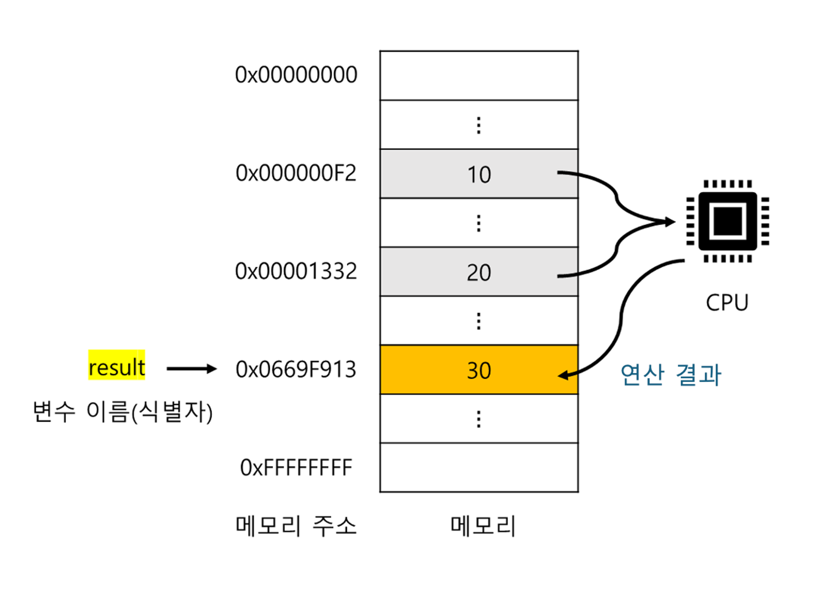
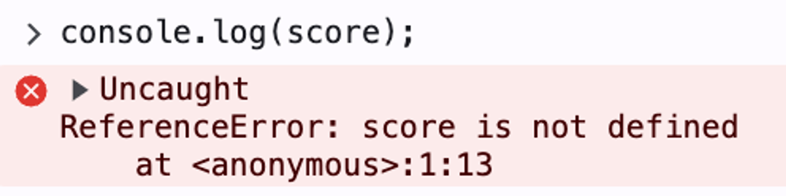
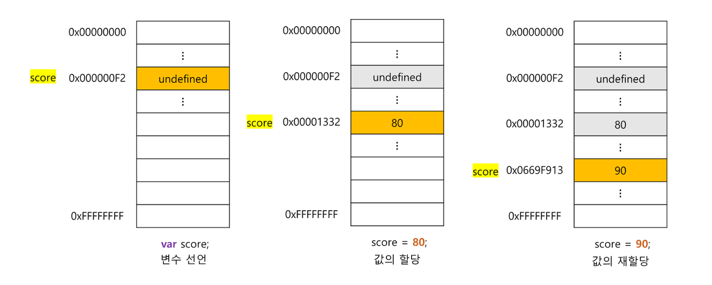

# 변수

## 메모리

변수에 대해 알기 전, 먼저 메모리에 대해 간단히 짚어보자.

> 컴퓨터는 CPU를 사용해 연산하고, 메모리를 사용해 데이터를 기억한다.

메모리는 데이터를 저장할 수 있는 메모리 셀의 집합체다. 메모리 셀 하나는 1Byte이며, 컴퓨터는 메모리 셀 단위로 데이터를 저장하거나 읽어들인다. 각 셀은 고유의 메모리 주소를 갖는다.

  

컴퓨터는 모든 데이터를 2진수로 처리한다(위 그림은 편의상 10진수로 표기했다). 숫자 값 10, 20은 **임의의 메모리 주소에 저장**되고 CPU는 이 값을 읽어 들여 연산을 수행한다. 연산 결과인 30도 메모리의 임의의 주소에 저장된다.

자, 이제 연산이 끝났고 나는 연산 결과인 숫자 30을 이용해 어떠한 작업을 하고 싶다.  
하지만, **연산 결과가 메모리에 저장되었지만 재사용을 할 수가 없다**.

메모리 주소를 통해 값에 직접 접근하는 방법이 있지만, 실수로 운영체제가 사용하고 있는 값을 변경하는 등 치명적 오류를 발생시킬 가능성이 높다. 또한 값이 저장될 메모리 주소는 코드가 실행될 때 메모리의 상황에 따라 임의로 결정된다. 즉, 코드가 실행될 때마다 값이 저장될 메모리 주소는 변경된다.
따라서 **자바스크립트는 개발자의 직접적인 메모리 제어를 허용하지 않는다.**

여기서 변수의 필요성이 대두된다.

<br/>

## 변수

**변수는 하나의 값을 저장하기 위해 확보한 메모리 공간 자체**, 또는 **그 메모리 공간을 식별하기 위해 붙인 이름**을 말한다. 이는 컴파일러 혹은 인터프리터에 의해 값이 저장된 메모리 공간의 주소로 치환되어 실행된다.

따라서 개발자가 직접 메모리 주소를 통해 값을 저장하고 참조할 필요 없이, **변수를 통해 안전하게 값에 접근**할 수 있다.

  

관련 용어를 정리하자면 다음과 같다.

- 변수 이름: 메모리 공간에 저장된 값을 식별할 수 있는 고유한 이름
- 변수 값: 변수에 저장된 값
- 할당(= 대입, 저장): 변수에 값을 저장하는 것
- 참조: 변수에 저장된 값을 읽어 들이는 것

<br/>

## 식별자 (변수의 상위 개념)

  

메모리 상에 존재하는 어떤 값을 식별할 수 있는 이름을 식별자라고 한다.  
변수, 함수, 클래스 등의 이름은 모두 식별자다.

식별자는 네이밍 규칙을 준수해야하며, 선언에 의해 자바스크립트 엔진에 존재를 알린다. 또한 가독성을 높이기 위한 네이밍 컨벤션이 존재한다.

### 식별자 네이밍 규칙

- 식별자는 특수문자를 제외한 문자, 숫자, 언더스코어(\_), 달러 기호($)를 포함할 수 있다.
- 식별자는 특수문자를 제외한 문자, 언더스코어(\_), 달러 기호($)로 시작해야한다. 숫자로 시작할 수 없다.
- 예약어는 식별자로 사용할 수 없다.

자바스크립트는 대소문자를 구별하며, 변수 이름은 변수 존재 목적을 쉽게 이해할 수 있도록 의미를 명확히 표현해야 한다. 좋은 변수 이름은 코드의 가독성을 높인다.

### 식별자 네이밍 컨벤션

```jsx
// 카멜 케이스 (camelCase)
var firstName;

// 스네이크 케이스 (snake_case)
var first_name;

// 파스칼 케이스 (PascalCase)
var FirstName;

// 헝가리언 케이스 (typeHungarianCase)
var strFirstName; // type + identifier
var $elem = document.getElementById("myId"); // DOM 노드
var observable$ = fromEvent(document, "click"); // RxJS 옵저버블
```

javascript는 일반적으로 변수나 함수의 이름에는 카멜 케이스를 사용하고, 생성자 함수, 클래스 이름에는 파스칼 케이스를 사용한다.

<br/>

## 변수 선언

변수 선언은 변수를 생성하는 것을 말한다. **변수를 사용하려면 반드시 선언**이 필요하다.  
var, let, const 키워드를 사용해서 선언할 수 있다.

자바스크립트 엔진은 변수 선언을 2단계에 거쳐 수행한다.

1. 선언 단계: 변수 이름을 등록해서 자바스크립트 엔진에 변수의 존재를 알린다.
2. 초기화 단계: 값을 저장하기 위한 메모리 공간을 확보하고 암묵적으로 undefined를 할당해 초기화한다.

> 💡 모든 식별자는 실행 컨텍스트에 등록된다. 식별자 이름은 key, 값은 value 형식인 객체로 등록된다. 지금은 일단 javascript 엔진이 변수를 관리할 수 있도록 변수의 존재를 알린다 정도로 알아두자.

변수가 선언된 이후 최초로 값을 할당하는 것을 초기화라고 하는데, var 변수는 선언과 동시에 undefined로 암묵적인 초기화가 자동으로 수행된다.

만약 **초기화 단계를 거치지 않으면 확보된 메모리 공간에는 이전에 다른 애플리케이션이 사용했던 값이 남아있을 수 있는데, 이러한 값을 쓰레기 값(garbage value)** 이라 한다.

만약, 변수 뿐만아니라 선언하지 않은 식별자에 접근하면 ReferenceError(참조 에러)가 발생한다.

  

<br/>

## 호이스팅

```jsx
console.log(score); // undefined
var score; // 변수 선언문
```

javascript는 인터프리터 언어라 한 줄씩 순차적으로 실행이 된다. 그런데 위 코드에서 변수 선언 전에 console.log를 수행해서 참조 에러가 발생할 것 같지만 그렇지 않다.

**식별자 선언은 소스코드가 한 줄씩 순차적으로 실행되는 시점, 즉 런타임이 아니라 그 이전 단계에서 먼저 실행**되기 때문이다.

**javascript 엔진은 모든 선언문(변수, 함수, 클래스 등)을 런타임 이전 단계에서 먼저 실행**한다. 즉, 소스코드의 어디에 있든 상관없이 다른 코드보다 먼저 실행한다.

이처럼 선언문이 코드의 선두로 끌어 올려진 것처럼 동작하는 javascript의 고유 특징을 **호이스팅**이라고 한다.

<br/>

## 값의 할당

```jsx
var score = 80; // 변수 선언과 값의 할당
```

변수 선언은 소스코드가 순차적으로 실행되는 시점인 런타임 이전에 먼저 실행되지만, 값의 할당은 런타임에 실행된다.  
따라서 위 코드처럼 변수 선언과 값의 할당을 하나의 문장으로 단축 표현해도 js 엔진은 2개의 문으로 나누어 각각 실행한다.

이때, 할당 할때는 이전 값 undefined가 저장되어 있던 메모리 공간이 아닌, 새로운 메모리 공간을 확보하고 그곳에 할당 값을 저장한다.

<br/>

## 값의 재할당

**재할당이란 이미 값이 할당되어 있는 변수에 새로운 값을 또다시 할당하는 것**을 말한다.

var 키워드로 선언한 변수는 선언과 동시에 undefined로 초기화되기 때문에 엄밀히 말하면 처음으로 값을 할당하는 것도 사실 재할당이다.

변수는 저장된 값을 다른 값으로 변경할 수 있지만, 값을 재할당 할 수 없다면 변수가 아니라 상수다. 즉, **값을 한번만 할당할 수 있는 것을 상수**라고 한다.

  

score 변수의 이전 값인 undefined와 80은 어떤 식별자와도 연결되어 있지 않다. 이러한 **불필요한 값들은 가비지 콜렉터에 의해 메모리에서 자동 해제**된다. 단, 언제 해제될지는 예측할 수 없다.

> 💡 C언어 같은 저수준 언어에서는, 메모리 관리를 위해 malloc()과 free() 같은 제어 기능을 제공한다. 따라서 메모리 제어를 통해 최적의 성능을 확보할 수 있지만, 치명적 오류를 생산할 가능성도 있다.
> javascript 같은 고수준 언어에서는 개발자가 명시적으로 메모리를 제어할 수 없으며, 가비지 콜렉터가 자동으로 관리해준다.  
> [\* javascript에서 메모리 성능을 관리하는 방법과 가비지 콜렉터의 원리를 파악하는데 참고하기 좋은 자료](https://velog.io/@sejinkim/%EC%9E%90%EB%B0%94%EC%8A%A4%ED%81%AC%EB%A6%BD%ED%8A%B8%EC%9D%98-%EB%A9%94%EB%AA%A8%EB%A6%AC-%EA%B4%80%EB%A6%AC-%EC%84%A4%EB%AA%85)
