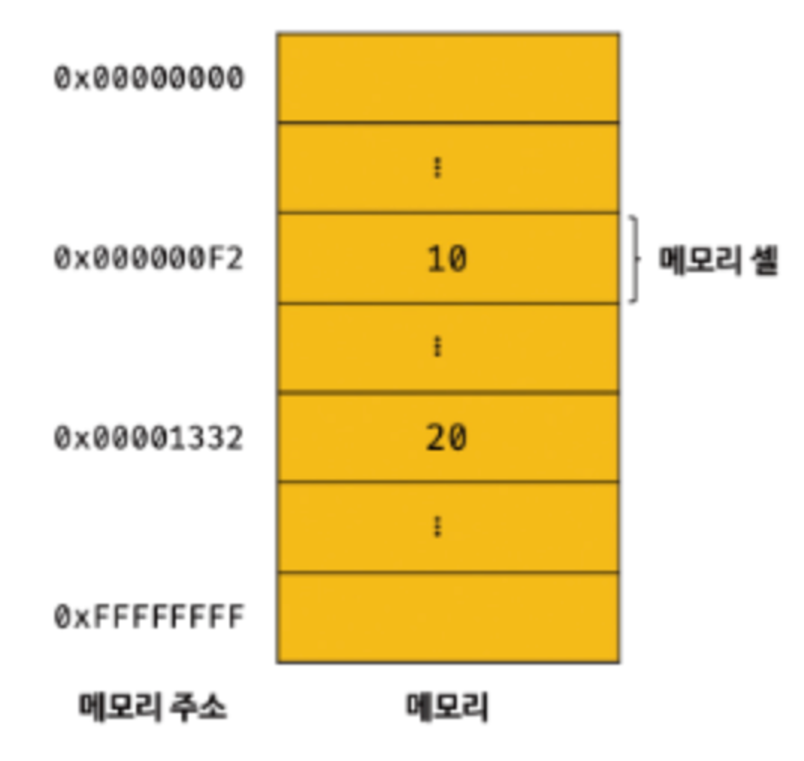
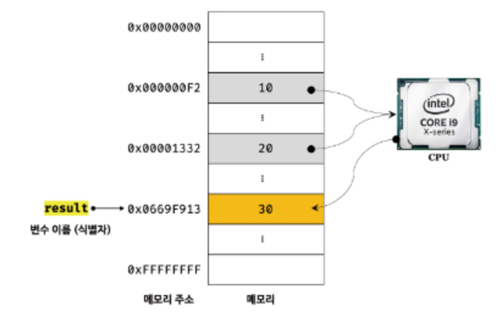
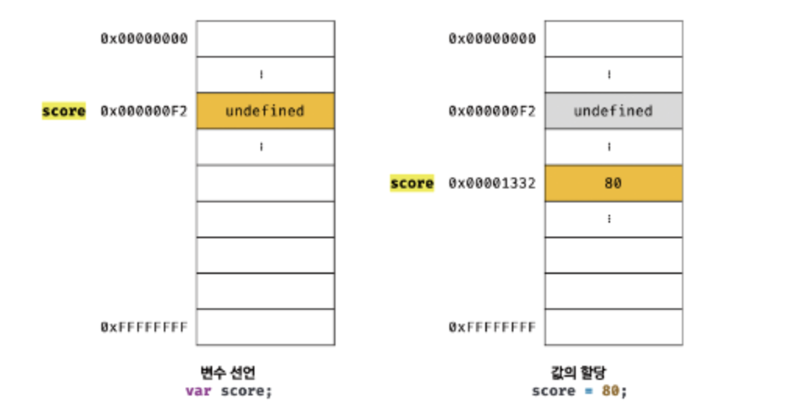
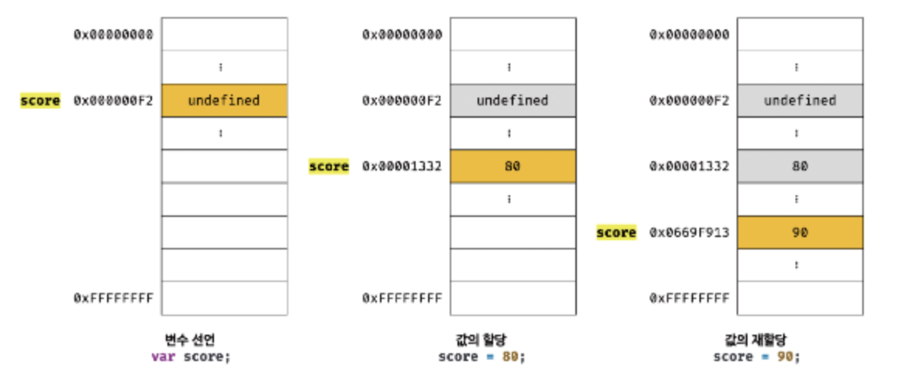

## 4.1 변수란 무엇인가? 왜 필요한가?

- 10 + 20
  - 사람: 10 / 20 / + 라는 기호의 의미 알아야 함, “10 + 20” 식의 의미를 해석할 수 있어야 함
  - 컴퓨터: 10 / 20 / + 라는 기호(리터럴과 연산자)의 의미 알아야 함, “10 + 20” 식(표현식)의 의미를 해석(파싱)할 수 있어야 함
  - 사람은 계산과 기억을 모두 두뇌에서 하지만, 컴퓨터는 CPU를 통해 계산하고 메모리를 통해 기억함
- 메모리
  - 데이터를 저장할 수 있는 메모리 셀의 집합체
  - 메모리 셀 하나의 크기는 1 바이트(8 비트), 컴퓨터는 1 바이트 단위로 데이터를 저장하고 읽어들임
    <br>
  - 각 셀은 고유의 메모리 주소(메모리 공간의 위치)를 가짐, 메모리 주소는 0부터 시작해서 메모리의 크기만큼 정수로 표현됨
  - 컴퓨터는 모든 데이터를 2진수로 처리하므로 종류(숫자, 텍스트, 이미지, 동영상 등)에 상관없이 모두 2진수로 메모리에 저장됨
  - 위의 예제에서 10과 20은 메모리 상의 임의의 위치에 저장됨 → CPU가 이 값들을 읽어와서 연산 수행 → 연산 결과인 30도 메모리 상의 임의의 위치에 저장 → 값 30을 재사용 할 수 없는 문제 발생
  - 30을 재사용 하기 위해서 직접 메모리 주소 찾아갈 수는 있겠지만 치명적 오류 발생 가능성 ↑
    - 실수로 운영체제가 사용하고 있는 값을 변경한다면 시스템이 멈춰버릴 수도…
    - 따라서 자바스크립트는 개발자의 직접적 메모리 제어 허용 X
    - 메모리 직접 제어할 수 있어도 문제, 동일한 코드를 실행해도 실행할 때마다 값이 저장되는 메모리 주소는 계속 변경되기 때문
- 변수
  - 하나의 값을 저장하기 위해 확보한 메모리 공간 자체 또는 그 메모리 공간을 식별하기 위해 붙인 이름 (값의 위치를 가리키는 상징적인 이름)
  - 변수는 컴파일러 또는 인터프리터에 의해 값이 저장된 메모리 공간 주소로 치환되어 실행됨 → 직접 메모리 주소 이용할 필요없이 안전하게 값에 접근 가능
  - 30을 재사용하기 위해 변수를 만들고 그 안에 저장(할당 또는 대입)할 수 있음
    <br>
  - 변수 이름을 사용해 참조 요청 → JS 엔진이 변수 이름에 매핑되는 메모리 주소 찾음 → 메모리 공간 접근 → 저장된 값 반환

<br>

## 4.2 식별자

- 어떤 값을 구별해서 식별할 수 있는 고유한 이름
- 변수, 함수, 클래스 등의 이름은 모두 식별자 (ex. let result = 0; 에서 result는 식별자)
- 식별자는 값이 아닌 메모리 주소를 기억
  - 식별자로 값을 구별한다는 것 = 식별자가 기억하고 있는 메모리 주소 통해 값에 접근할 수 있다는 의미
- 식별자는 네이밍 규칙을 준수해야 하고, 선언에 의해 자바스크립트 엔진에 식별자의 존재를 알림

<br>

## 4.3 변수 선언

- 변수를 생성하는 것
- 값을 저장하기 위한 메모리 공간을 확보, 그 공간의 주소를 연결해서 값을 저장할 수 있게 준비하는 것
- var, let, const 키워드를 사용
  - 키워드: 자바스크립트 코드를 해석하고 실행하는 JS 엔진이 수행할 동작을 규정한 일종의 명령어
  - var은 블록 레벨 스코프 X, 함수 레벨 스코프 O → 의도치 않게 전역 변수로 선언되는 경우 발생
- 변수를 선언하고 값을 할당하지 않으면, 그 변수 안에는 undefined 값이 할당되어 초기화 (자바스크립트의 특징)
  - 값을 할당하지 않으면 쓰레기 값(다른 애플리케이션이 사용했던 값)이 나올 수 있음, 자바스크립트의 경우 알아서 undefined 값이 할당됨
- ReferenceError
  - 참조 에러, 식별자를 통해 값을 참조하려 했지만 JS 엔진이 그 식별자를 찾을 수 없을 때 발생

<br>

## 4.4 변수 선언의 실행 시점과 변수 호이스팅

- 선언보다 참조가 먼저 작성되었을 때
  ```jsx
  console.log(score); // undefined
  var score; // 변수 선언
  ```
  - 참조 에러가 발생할 것 같지만 undefined가 출력됨
  - 변수 선언이 소스코드가 한 줄씩 순차적으로 실행되는 시점(런타임)이 아닌, 그 이전 단계에서 먼저 실행되기 때문
  - JS 엔진은 소스코드 평가 과정 거치고 한 줄씩 실행함, 평가 과정에는 선언문 실행이 포함되어 있음
- 변수 호이스팅(variable hoisting)
  - 변수 선언문이 코드의 선두로 올려진 것처럼 동작하는 자바스크립트 고유의 특징
  - 변수 뿐만 아니라 함수/클래스 등도 호이스팅 됨, 모든 선언문이 런타임 이전에 실행되기 때문

<br>

## 4.5 값의 할당

- 변수 선언은 런타임 이전에, 값 할당은 런타임 시점에 실행됨
  ```jsx
  console.log(score); // undefined, 런타임 이전
  score = 80;
  var score;
  console.log(score); // 80, 런타임 시점
  ```
- 변수에 값 할당할 때, undefined가 저장되어 있던 메모리 공간을 지우고 80이 할당되는 게 아님
  - 새로운 메모리 공간을 확보하고 그 안에 할당값을 넣게 됨
    <br>

<br>

## 4.6 값의 재할당

- 이미 값이 할당되어 있는 변수에 새로운 값을 다시 할당하는 것
- 상수(const)는 재할당 할 수 없는 변수 (const가 상수만을 위해 사용되는 건 아님)
- 재할당 또한 처음 할당할 때와 마찬가지로 새로운 메모리 공간을 확보하고 그 안에 할당값을 넣게 됨
  <br>
- 가비지 콜렉터(garbage collector)
  - 애플리케이션이 할당한 메모리 공간을 주기적으로 검사, 더 이상 사용되지 않는 메모리(어떤 식별자도 참조하지 않는 메모리 공간)를 해제하는 기능 → 메모리 누수 방지
  - 메모리 제어 기능을 제공하는 언매니지드 언어(ex. C언어)
    - 메모리 제어를 개발자가 주도할 수 있어 개발자 역량 따라 최적의 성능 확보, 치명적 오류 가능성
  - 메모리 제어 기능을 언어 차원에서 담당하는 매니지드 언어(ex. 자바스크립트)
    - 가비지 콜렉터가 메모리 관리하므로 개발자는 생산성 확보, 성능에서 어느 정도의 손실 가능성

<br>

## 4.7 식별자 네이밍 규칙

- 식별자는 특수문자를 제외한 문자, 숫자, \_, $를 포함 가능
- 식별자는 숫자로 시작될 수 없음
- 식별자로 예약어(프로그래밍 언어에서 이미 사용되고 있는 단어, ex. class/do/const/else…)는 사용 불가능
- 자바스크립트의 식별자는 유니코드 문자를 허용하지만(한글, 일본어 이름 가능) 권장사항 X
- 네이밍 컨벤션
  - 하나 이상의 영단어로 구성된 식별자 만들 때 가독성 좋게 단어를 구분하기 위해 규정한 명명 규칙
  - camelCase, snake_case, PascalCase, typeHungarianCase
  - JS에서는 일반적으로 변수/함수-카멜 케이스, 클래스-파스칼 케이스 사용
