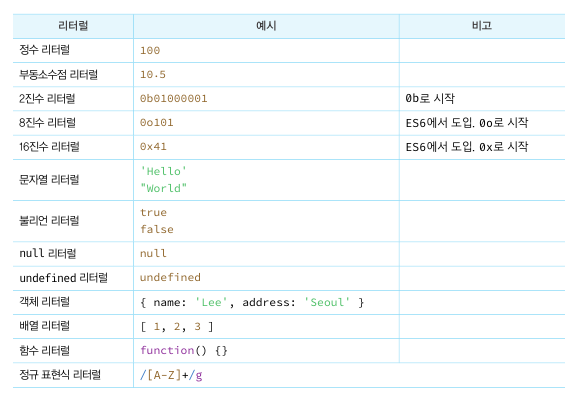
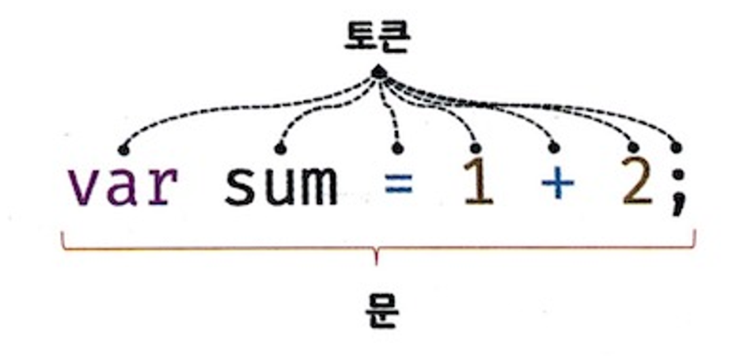
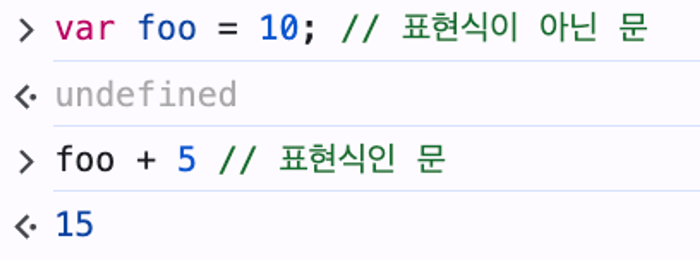

# 표현식과 문

## 값

값은 식이 평가되어 생성된 결과다. 평가란 식을 해석해서 값을 생성하거나 참조하는 것을 의미한다.

```jsx
// 변수에는 10 + 20이 평가되어 생성된 숫자 값 30이 할당된다.
var sum = 10 + 20;
```

변수 sum이 기억하는 메모리 공간에 저장된 것은 10 + 20이 아니라 값 30이다.  
모든 값은 데이터 타입을 가지며, 메모리에 2진수로 저장된다. 메모리에 저장된 값은 데이터 타입에 따라 다르게 해석될 수 있다.  
ex) 0100 0001 는 숫자로 해석하면 65, 문자로 해석하면 ‘A’ 이다.

<br/>

## 리터럴

리터럴은 사람이 이해할 수 있는 문자 또는 약속된 기호를 사용해 값을 생성하는 표기법이다.  
javascript 엔진은 코드가 실행되는 시점인 런타임에 리터럴을 평가해 값을 생성한다.

  

<br/>

## 표현식

**표현식은 값으로 평가될 수 있는 문**이다. 즉, 표현식이 평가되면 새로운 값을 생성하거나 기존 값을 참조한다.

```jsx
// 리터럴 표현식
10;
("Hello");

// 식별자 표현식(선언이 이미 존재한다고 가정)
sum;
person.name;
arr[1];

// 연산자 표현식
10 + 20;
sum = 10;

// 함수/메서드 호출 표현식(선언이 이미 존재한다고 가정)
square();
person.getName();
```

표현식과 표현식이 평가된 값은 동등한 관계(동치)여서, 문법적으로 값이 위치할 수 있는 자리에 표현식도 위치할 수 있다.

<br/>

## 문

문은 프로그램을 구성하는 기본 단위이자 최소 실행 단위다. 명령문이라고도 불리며, 선언문, 할당문, 조건문, 반복문 등으로 구분할 수 있다.

문은 여러 토큰(token)으로 구성되는데, 토큰은 문법적으로 의미를 가지며, 문법적으로 더 이상 나눌 수 없는 코드의 기본 요소를 말한다.  
ex) 키워드, 식별자, 연산자, 리터럴, 세미콜론 등

  

<br/>

## 세미콜론과 세미콜론 자동 삽입 기능(ASI)

세미콜론(;)은 문의 종료를 나타낸다. js 엔진은 세미콜론으로 문이 종료한 위치를 파악하고 순차적으로 하나씩 문을 실행한다.

따라서 문을 끝낼 땐 세미콜론을 붙여야 하는데, js 엔진이 이를 예측해서 자동으로 붙여준다. 이를 세미콜론 자동 삽입 기능(ASI)라고 한다.

코드 블록은 언제나 문의 종료를 의미하는 자체종결성을 가지므로 세미콜론을 붙이지 않는다.

<br/>

## 표현식인 문과 표현식이 아닌 문

- 표현식인 문: 값으로 평가될 수 있는 문
- 표현식이 아닌 문: 값으로 평가될 수 없는 문 → 변수에 할당하면 에러가 발생한다.

이 둘은, 변수에 할당해보며 구별할 수 있다.

```jsx
// 변수 선언문은 표현식이 아닌 문이다.
var foo = var x; // X
```

```jsx
// 할당문은 그 자체가 표현식이지만 완전한 문이기도 하다. 즉, 할당문은 표현식인 문이다.
var foo = (x = 100); // O
```

> 💡 개발자 도구 콘솔에서 표현식이 아닌 문을 실행하면 undefined가 출력되며, 표현식인 문을 실행하면 평가된 값을 반환한다.  
>  
