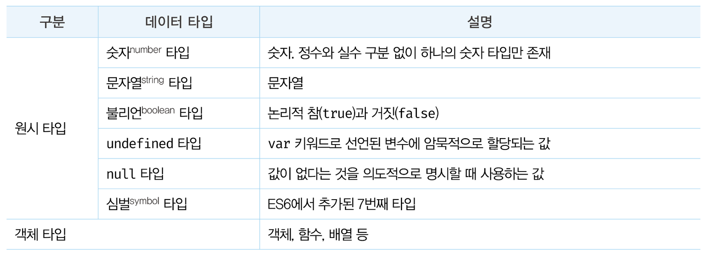
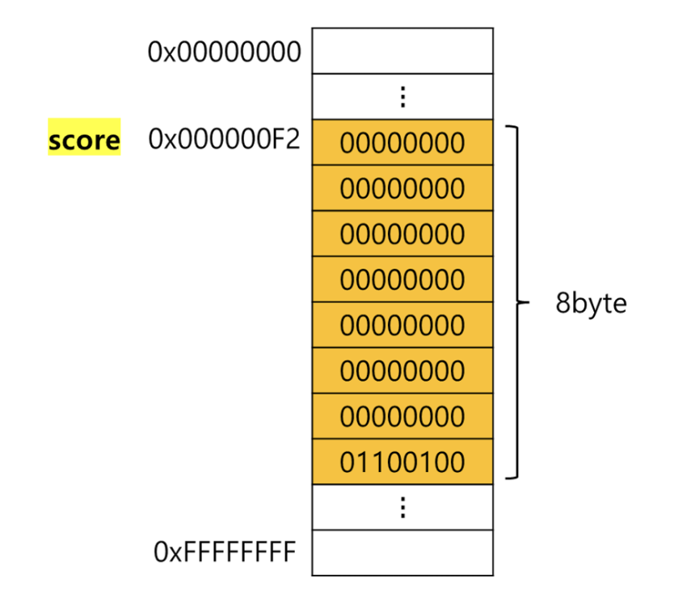

> 이번 장에서는 **원시 타입**에에 대해 다루고, **데이터 타입이 왜 필요한지** 알아보고자 한다.  
> 또한 javascript는 **동적 타입 언어**인데, 해당 언어의 특징이 무엇인지 알아보고자 한다.

<br/>

# 데이터 타입

데이터 타입은 값의 종류를 말하며, javascript(ES6)에서는 **7개의 데이터 타입을 제공**한다. 그 중 **원시 타입은 6개이며, 그 외에는 모두 객체 타입**이다.

  
javascript는 객체 기반 언어이므로 거의 모든 것이 객체로 이루어져 있다. 이번 장에서는 원시 타입에 대해 다루고, 객체 타입은 추후 다루고자 한다.

js 엔진은 타입을 구별해서 값을 취급한다. 따라서 값이 같더라도 타입에 따라 해석하는 방식이 다르다.

ex) 0100 0001 - 숫자로 해석하면 65, 문자로 해석하면 ‘A’

<br/>

## 원시 타입 1 - 숫자 타입

C나 java의 경우, 정수와 실수를 구분해서 int, long, float 등 다양한 숫자 타입을 제공한다. 하지만 **javascript에서 숫자는 실수 타입만 존재**한다. 정수로 표기해도 사실은 실수다.

```jsx
// 숫자 타입은 모두 실수로 처리된다.
console.log(1 === 1.0); // true
```

그리고 2진수, 8진수, 16진수를 표현하기 위한 데이터 타입이 없어서 값을 참조하면 모두 10진수로 해석된다.

```jsx
var binary = ob01000001; // 2진수
var octal = 0o101; // 8진수
var hex = 0x41; // 16진수

// 표기법만 다를 뿐 모두 같은 값이다.
console.log(binary); // 65
console.log(octal); // 65
console.log(hex); // 65
console.log(binary === octal); // true
console.log(octal === hex); // true
```

그 외 숫자 타입 가능한 표현 방법은 다음과 같다.

- Infinity: 양의 무한대
- -Infinity: 음의 무한대
- NaN: 산술 연산 불가(not-a-number)

<br/>

## 원시 타입 2 - 문자열 타입

문자열 타입은 텍스트 데이터를 나타내는 데 사용한다. UTF-16의 집합으로 전 세계 대부분의 문자를 표현할 수 있다.

작은따옴표(’’), 큰따옴표(””), 백틱(``)으로 텍스트를 감싸서 표기하는데, 이는 키워드나 식별자 같은 토큰과 구변하기 위해서다.

<br/>

### 템플릿 리터럴

ES6에 도입된 문자열 표기법으로 백틱(``)을 사용해 표현한다.  
일반 문자열과 달리 줄바꿈이 허용되며 공백도 있는 그대로 적용된다.  
또한 `${}` 으로 문자열 내부에 표현식을 삽입 할 수 있다. 이때 표현식은 문자열로 타입이 강제로 변환되어 삽입된다.

```jsx
var name = "Lee";

console.log("My name is" + name); // 일반 문자열인 경우
console.log(`My name is ${name}.`); // 템플릿 리터럴의 경우
// My name is Lee.
```

<br/>

## 원시 타입 3 - 불리언 타입

불리언 타입의 값은 논리적 참, 거짓을 나타내며, true, false이 있다.

<br/>

## 원시 타입 4 - undefined 타입

undefined 타입은 개발자가 의도적으로 할당하기 위한 값이 아닌, js 엔진이 변수를 초기화할 때 사용하는 값이다.  
변수를 참조했을 때 undefined가 반환된다면 쵝화되지 않은 변수라는 것을 간파할 수 있다.

<br/>

## 원시 타입 5 - null 타입

null 타입은 변수에 값이 없다는 것을 의도적으로 명시할 때 사용한다.  
변수에 null을 할당하는 것은, 변수가 이전에 참조하던 값을 더 이상 참조하지 않겠다고 알리는 것이다.

```jsx
var foo = "Lee";
foo = null;
```

함수가 유효한 값을 반환할 수 없는 경우 명시적으로 null을 반환하기도 한다.

```jsx
var element = document.querySelector(".myClass");

// HTML 문서에 해당 요소가 없다면 null을 반환한다.
console.log(element); // null
```

<br/>

## 원시 타입 6 - 심벌 타입

심벌 타입은 변경 불가능한 원시 타입의 값으로, 주로 이름이 충돌할 위험이 없는 객체의 유일한 프로퍼티 키를 만들기 위해 사용한다.  
Symbol 함수를 호출해 생성하며, 외부에 노출되지 않고 다른 값과 절대 중복되지 않는 유일무이한 값이다.

```jsx
// 심벌 값 생성
var key = Symbol("key");
console.log(typeof key); // symbol

// 객체 생성
var obj = {};

// 이름이 충돌할 위험이 없는 유일무이한 값인 심벌을 프로퍼티 키로 사용한다.
obj[key] = "value";
console.log(obj[key]); // value
```

<br/>

## 데이터 타입의 필요성

### 1. 데이터 타입에 의한 메모리 공간의 확보와 참조

값은 메모리에 저장하고 참조할 수 있어야 한다. 메모리에 값을 저장하려면 먼저 확보해야 할 메모리 공간의 크기(메모리 셀의 개수(byte 수))를 알고 결정해야 한다.

js 엔진은 데이터 타입(값의 종류)에 따라 정해진 크기의 메모리 공간을 확보한다

확보되는 메모리 공간의 크기는 js 엔진 제조사에 의해 다를 수 있다. ECMAScript에는 숫자 타입은 배정밀도 64bit(8byte) 부동소수점 형식을 사용하다고 명시되어 있다.

```jsx
var score = 100;
```

  

위 예제에서 js 엔진은 리터럴 100을 숫자 타입의 값으로 해석하고 이를 저장하기 위해 8byte의 메모리 공간을 확보한 뒤 2진수로 저장한다.

> 💡 **심벌 테이블**  
> 컴파일러 또는 인터프리터는 심벌 테이블이라고 부르는 자료 구조를 통해 식별자를 키로 바인딩된 값의 메모리 주소, 데이터 타입, 스코프 등을 관리한다.

<br/>

### 2. 데이터 타입에 의한 값의 해석

모든 값은 데이터 타입을 가지며, 메모리에 2진수, 즉 bit의 나열로 저장된다. 메모리에 저장된 값은 데이터 타입에 따라 다르게 해석될 수 있다.  
ex) 0100 0001 - 숫자로 해석하면 65, 문자로 해석하면 ‘A’

<br/>

### 정리

데이터 타입이 필요한 이유

- 값을 저장할 때 확보해야 하는 메모리 공간의 크기를 결정하기 위해
- 값을 참조할 때 한번에 읽어 들여야 할 메모리 공간의 크기를 결정하기 위해
- 메모리에서 읽어 들인 2진수를 어떻게 해석할지 결정하기 위해

<br/>

## 동적 타이핑

**javascript의 모든 값은 데이터 타입을 갖는다** 했다. 그렇다면 **변수는 데이터 타입을 가질까?**

javascript는 **동적 타입 언어**로 변수를 선언할 때 타입 선언을 하지 않는다. 어떠한 데이터 타입의 값이라도 자유롭게 할당 가능하다.  
**값을 할당하는 시점에 변수의 타입이 동적으로 결정(타입 추론)되고, 변수의 타입은 재할당에 의해 언제든지 자유롭게 변경할 수 있다.**  
변수는 값에 대한 별명이다. 따라서 타입을 갖지 않으며, 현재 변수에 할당되어 있는 값에 의해 변수의 타입이 동적으로 결정된다.

typeof 연산자로 변수에 할당된 값의 데이터 타입을 확인할 수 있으며, 이는 문자열로 반환한다.

> 💡 C, Java 같은 언어는 **정적 타입 언어**로, 변수를 선언할 때 변수에 할당할 수 있는 값의 종류, 즉 데이터 타입을 사전에 선언해야 한다(int, float 등). 그리고 컴파일 시점에 타입 체크를 한다.

동적 타입 언어의 단점으로는 복잡한 프로그램에서는 변화하는 변수 값 추적하기 어려울 수도 있다. 변수는 값을 확인하기 전에는 타입을 확신할 수 없으며, 개발자 의도와 달리 js 엔진에 의해 암묵적으로 타입이 자동으로 변환된다. 즉, 유연성은 높지만 신뢰성은 떨어진다.

따라서, 변수 사용시 아래와 같은 주의사항을 참고해 오류를 예방하도록 노력해야한다.

- 변수는 꼭 필요한 경우에 한해 제한적으로 사용하자.
- 변수의 유효 범위(스코프)는 최대한 좁게 만들어 변수의 부작용 억제해야 한다.
- 전역 변수는 최대한 사용하지 않도록 한다.
- 변수보다는 상수를 사용해 값의 변경을 억제한다.
- 변수 이름은 변수의 목적이나 의미를 파악할 수 있도록 네이밍한다.
