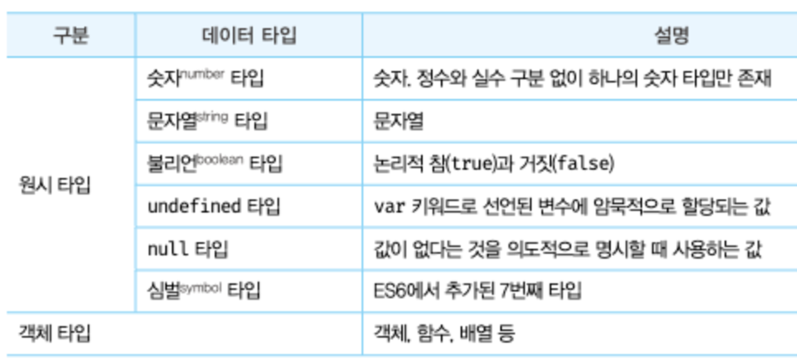

## 6.1 숫자 타입

- 데이터 타입 = 값의 종류
- JS의 모든 값은 데이터 타입을 가짐
- JS에는 총 7개의 타입이 있고, 원시 타입과 객체 타입으로 분류 가능
  <br>
- 숫자 1과 문자열 “1”은 전혀 다른 값
  - 확보해야 할 메모리 공간의 크기, 메모리에 저장되는 2진수, 읽어서 해석하는 방법 모두 다름
- JS는 하나의 “숫자 타입”만 존재 (int, long, float X)

  - 모든 수를 실수로 처리, 정수만 표현하는 데이터 타입이 별도로 존재 X

    ```jsx
    var integer = 10; // 정수, 숫자 타입으로 취급
    var double = 10.12; // 실수, 숫자 타입으로 취급
    var negative = -20; // 음의 정수, 숫자 타입으로 취급

    var binary = 0b01000001; // 2진수, 표기만 다르지 아래랑 같은 값
    var hex = 0x41; // 16진수, 표기만 다르지 위랑 같은 값

    console.log(binary === hex); // true

    console.log(1 === 1.0); // true, 정수로 표시해도 사실은 실수임
    ```

- 숫자 타입으로 양의 무한대, 음의 무한대, NaN(산술 연산 불가, Not a Number) 표현 가능
  ```jsx
  console.log(10 / 0); // Infinity
  console.log(10 / -0); // -Infinity
  console.log(1 * "String"); // NaN
  ```

<br>

## 6.2 문자열 타입

- 텍스트 데이터를 나타낼 때 사용
- 작은따옴표(’’), 큰따옴표(””), 백틱(``) → 키워드, 식별자와 같은 토큰과 구분하기 위해서 사용
- JS의 문자열은 원시 타입 = 변경 불가능한 값
  - 문자열이 생성되면 그 문자열을 변경할 수 없음 (나중에 자세히 배움)
  - 원시 타입
    - 변수에 할당될 때, 메모리의 고정 크기로 원시 값을 저장하고 해당 저장된 값을 변수가 직접 가리키는 형태
    - 불변성 가짐, 재할당 시 기존 값이 변하는 것 X
    - 새로운 메모리에 재할당한 값이 저장됨, 변수가 가리키는 메모리가 달라졌을 뿐

<br>

## 6.3 템플릿 리터럴

- ES6부터 도입된 새로운 문자열 표기법, 백틱을 사용
- 템플릿 리터럴은 런타임에 일반 문자열로 변환되어 처리됨
- 멀티라인 문자열
  ```jsx
  let str = `hello
  world`;
  // 일반 문자열('' 또는 "") 줄바꿈 할 때 이스케이프 시퀀스인 '\n' 사용해야 함
  // 템플릿 리터럴 내에서는 줄바꿈이 허용됨, 공백도 그대로 적용
  ```
  - 개행 문자
    - 텍스트의 한 줄이 끝났음을 표시하는 문자 또는 문자열
    - 라인 피드(\n)는 커서를 정지한 상태에서 종이를 한 줄 올리는 것
    - 캐리지 리턴(\r)은 종이를 움직이지 않고 커서를 맨 앞줄로 이동시키는 것
    - 운영체제마다 개행 방식이 달라서, 다른 운영체제에서 작성한 텍스트 파일은 서로 개행문자 인식 못 함 (대부분의 텍스트 에디터가 개행문자 자동으로 인식 후 변환해주긴 함)
- 표현식 삽입
  ```jsx
  // 일반 문자열에서의 문자열 연결
  console.log("My name is" + firstname + " " + lastname);
  // 템플릿 리터럴에서의 문자열 연결
  console.log(`My name is ${firstname} ${lastname}`);
  ```
- 태그드 템플릿

  - 함수 호출 문법과 템플릿 리터럴을 결합하여 사용

    ```jsx
    function tag(strings, ...values) {
      // strings: 문자열 부분이 배열로 전달됨
      // values: 표현식 부분이 배열로 전달됨
      return processedString;
    }

    const name = "Alice";
    const age = 25;

    // tag 함수가 템플릿 리터럴 앞에 붙음
    const result = tag`My name is ${name} and I am ${age} years old.`;
    ```

<br>

## 6.4 불리언 타입

- 불리언 타입에는 true, false밖에 없음

<br>

## 6.5 undefined 타입

- undefined 타입에는 undefined밖에 없음
- 변수 선언 후 값을 할당하지 않은 변수를 참조하면 undefined가 반환됨
- 변수에 값이 없다는 것을 명시하고 싶을 때는 null을 할당하는 것을 권장

<br>

## 6.6 null 타입

- null 타입에는 null밖에 없음
- 값이 없다는 것을 의도적으로 명시
- null을 할당한다는 것 = 변수가 이전에 참조하던 값을 더 이상 참조하지 않겠다는 것 = 참조를 제거
  - JS 엔진은 더 이상 참조하지 않는 메모리 공간에 대해 가비지 콜렉션을 수행
- 함수가 유효 값을 반환할 수 없을 때 null을 반환하기도 함

<br>

## 6.7 심벌 타입

- ES6에서 추가된 원시 타입의 값
- 심벌 타입은 다른 값과 중복되지 않는 유일무이한 값
  - 이름 충돌 위험이 없는 객체의 유일한 프로퍼티 키를 만들기 위해 사용
- Symbol 함수를 호출해 생성, 이때 생성된 심벌 값은 외부에 노출되지 않음

  ```jsx
  // 심벌 값 생성
  var key = Symbol("key");
  console.log(typeof key); // symbol

  // 객체 생성
  var obj = {};

  // 이름 충돌 위험이 없는 심벌을 프로퍼티 키로 사용
  obj[key] = "value";
  console.log(obj[key]); // value
  ```

<br>

## 6.8 객체 타입

- 데이터 타입 나눌 때 원시 타입과 객체 타입으로 나눴었음, 그때 말한 객체 타입
- 자바스크립트는 객체 기반의 언어 → JS를 이루는 거의 모든 것이 객체

<br>

## 6.9 데이터 타입의 필요성

- 메모리 공간을 확보하고(저장) 참조하기 위해 데이터 타입이 필요함
  - 타입 파악 → 메모리 공간 크기 결정 (낭비와 손실 최소화)
  - 타입 파악 → 한 번에 읽어들여야 할 메모리 셀의 개수(바이트 수) 결정
    - ex. 숫자 타입이면 8바이트 단위로 읽어야 하는데, 다르게 읽어들이면 값이 훼손됨
  - 심벌 테이블
    - 컴파일러 또는 인터프리터가, 심벌 테이블이라고 부르는 자료 구조를 통해, 식별자를 기준으로, 바인딩된 값의 메모리 주소/데이터 타입/스코프 등을 관리
- 값을 해석하기 위해 데이터 타입이 필요함
  - 모든 값은 메모리에 2진수(비트)의 나열로 저장됨
  - ex. 0100 0001을 메모리에서 불러왔음 → 숫자로는 65, 문자로는 A → 어떻게 해석하지? → 타입에 따라 해석해야겠다!

<br>

## 6.10 동적 타이핑

- JS의 모든 값은 데이터 타입을 가짐, 그렇다면 변수는?
  - C언어나 Java는 정적 타입 언어 → 변수 선언할 때 그 변수의 데이터 타입을 사전에 선언해야 함 = 명시적 타입 선언 → 타입의 일관성을 강제하므로 안정적 코드 구현 가능
  - JS는 변수 타입을 선언하지 않는 동적 타입 언어 → 어떠한 데이터 타입의 값이라도 변수에 자유롭게 할당 가능
  - JS는 선언이 아닌 할당에 의해 타입이 결정(타입 추론)됨
  - 재할당에 의해 변수 타입이 동적으로 변할 수 있음 = 동적 타이핑
- JS 엔진 의해 암묵적으로 타입이 자동 변환 되기도 함
  - 값을 직접 확인하기 전까지는 변수 타입을 예측하기 어려움
  - 동적 타입 언어는 유연성 ↑ 신뢰성 ↓
- 동적 타입 언어에서 변수 사용시 유의해야 할 점
  - 변수는 꼭 필요한 경우에 한해 제한적으로 사용하기
  - 변수 유효 범위(스코프)를 최대한 좁게 만들기
  - 전역 변수는 가급적 사용하지 않기
  - 변수보다는 상수를 사용해 값의 변경을 억제하기
  - 변수 이름을 그 목적과 의미를 알 수 있게 명확하게 짓기
