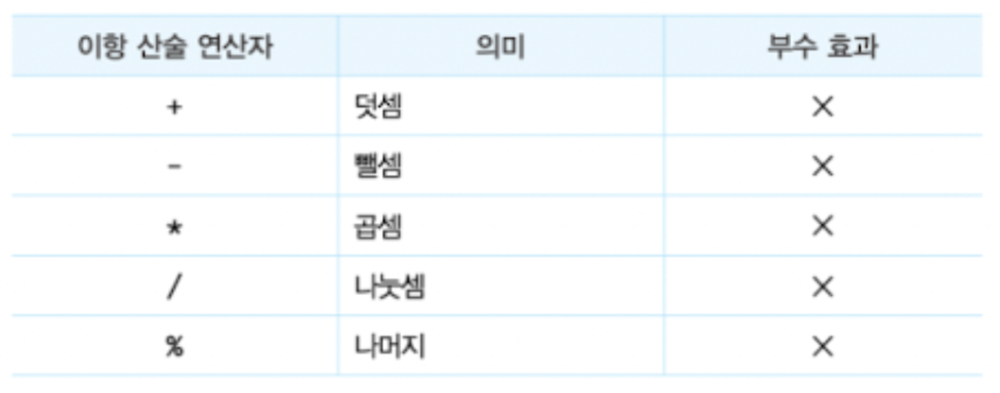
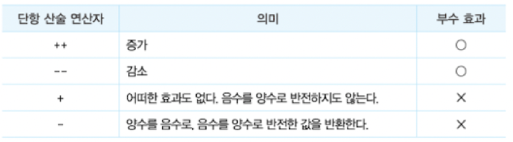
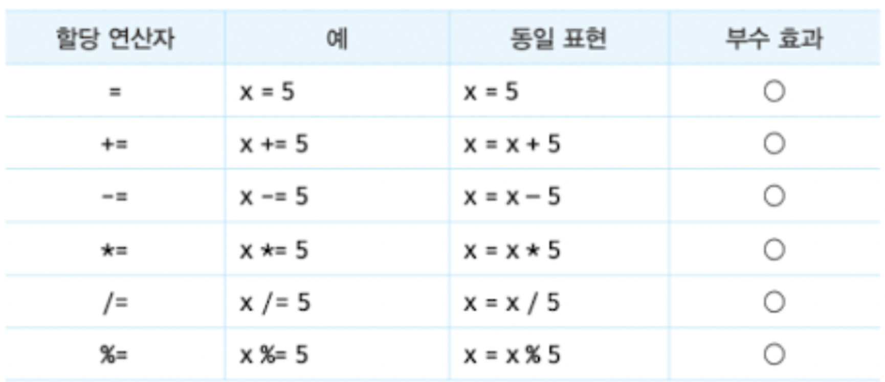
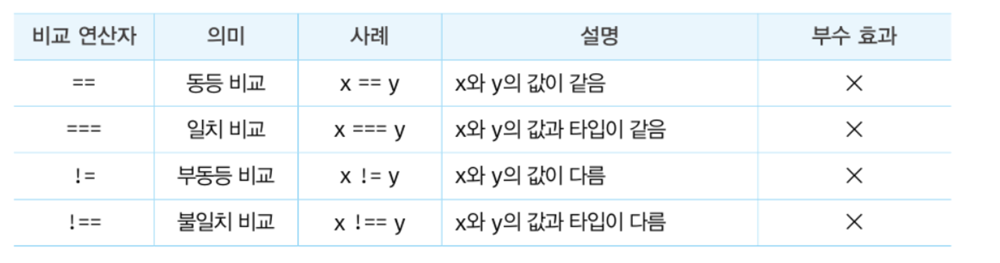
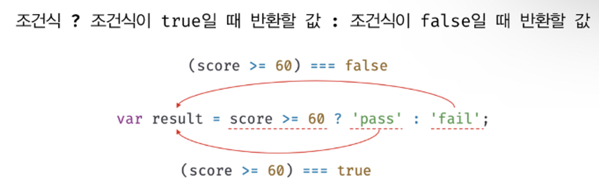
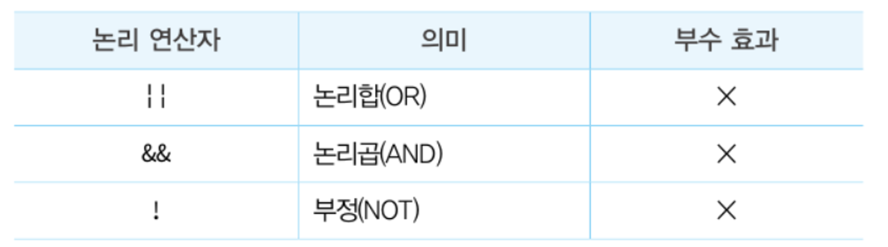
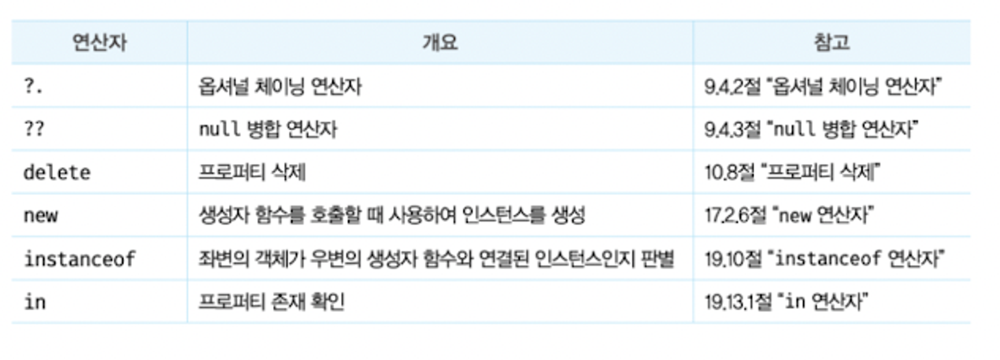

# 연산자

- 연산자: 하나 이상의 표현식을 대상으로 산술, 할당, 비교, 논리, 타입, 지수 연산 등을 수행해 하나의 값을 만든다.
- 피연산자: 연산의 대상, 값으로 평가될 수 있는 표현식어야 한다.

<br/>

## 산술 연산자

산술 연산자는 피연산자를 대상으로 수학적 계산을 수행해 새로운 숫자 값을 만든다.  
산술 연산이 불가능한 경우, NaN을 반환한다.

### 이항 산술 연산자

2개의 피연산자를 산술 연산하여 숫자 값을 만든다.  
피연산자의 값을 변경하는 부수 효과 없고 언제나 새로운 값을 만든다.

  

### 단항 산술 연산자

1개의 피연산자를 산술 연산하여 숫자 값을 만든다.

  

**증가/감소(++/--) 연산자는 피연산자의 값을 변경하는 부수 효과**가 있다. 즉, 피연산자의 값을 변경하는 암묵적 할당이 이뤄진다. 또한, 위치에 따라 의미가 다르다.

- 전위 증가/감소 연산자: **먼저 피연산자의 값을 증가/감소시킨 후**, 다른 연산을 수행한다.
- 후위 증가/감소 연산자: **먼저 다른 연산을 수행한 후**, 피연산자의 값을 증가/감소시킨다.

\+ / - 단항 연산자는 숫자 타입이 아닌 피연산자에 사용하면 **암묵적으로 숫자 타입으로 변환되어 반환**한다.
값을 생성해서 반환하는거니 부수 효과는 없다.

```jsx
// 문자열을 숫자로 타입 변환한다.
+"10"; // -> -10
-"10"; // -> -10

// 불리언 값을 숫자로 타입 변환한다.
+true; // -> 1
-true; // -> -1

// 문자열은 숫자로 타입 변환할 수 없으므로 NaN을 반환한다.
+"Hello"; // -> NaN
-"Hello"; // -> NaN
// 부호를 반전한다.
-(-10); // -> 10
```

### 문자열 연결 연산자

**+ 연산자는 피연산자 중 하나 이상이 문자열인 경우 문자열 연결 연산자로 동작**한다. 암묵적 타입 변환이 일어난다.

```jsx
// 문자열 연결 연산자
"1" + 2; // -> '12'
1 + "2"; // -> '12'

// 산술 연산자
1 + 2; // -> 3

// true는 1로 타입 변환된다.
1 + true; // -> 2

// false는 0으로 타입 변환된다.
1 + false; // -> 1

// null은 0으로 타입 변환된다.
1 + null; // -> 1

// undefined는 숫자로 타입 변환되지 않는다.
+undefined; // -> NaN
1 + undefined; // -> NaN
```

<br/>

## 할당 연산자

할당 연산자는 우항에 있는 피연산자의 평가 결과를 좌항에 있는 변수에 할당한다.
좌항의 변수에 값을 할당하므로 변수 값이 변하는 부수 효과가 있다.

  

**할당문은 값으로 평가되는 표현식인 문**으로서 할당된 값으로 평가 된다.

연쇄 할당 가능하며, 이는 오른쪽에서 왼쪽으로 진행된다.

```jsx
var a, b, c;

// 연쇄 할당. 오른쪽에서 왼쪽으로 진행.
// ① c = 0 : 0으로 평가된다
// ② b = 0 : 0으로 평가된다
// ③ a = 0 : 0으로 평가된다
a = b = c = 0;

console.log(a, b, c); // 0 0 0
```

<br/>

## 비교 연산자

비교 연산자는 좌항과 우항의 피연산자를 비교한 다음 그 결과를 **불리언 값으로 반환**한다.

  

### 동등 비교(==) 연산자

좌항과 우항의 피연산자를 비교할 때 먼저 **암묵적 타입 변환을 통해 타입을 일치 시킨 후 같은 값인지 비교**한다. 예측하기 어려운 결과를 만드므로 일치 비교(===) 연산자를 사용하는걸 권장한다.

### 일치 비교(===) 연산자

좌항과 우항의 피연산자가 **타입도 같고 값도 같은 경우에 한하여 true를 반환**한다.

**주의해야할 점**

1. NaN은 자신과 일치하지 않는 유일한 값이므로, **숫자가 NaN인지 조사하려면 Number.isNaN함수 사용해야 한다.**

```jsx
NaN === NaN; // -> false

// Number.isNaN 함수: 지정한 값이 NaN인지 확인하고 그 결과를 불리언 값으로 반환
Number.isNaN(NaN); // -> true
Number.isNaN(10); // -> false
Number.isNaN(1 + undefined); // -> true
```

2. **Object.is 메서드를 사용하면 예측 가능한 정확한 비교 결과 반환**하고, 그 외에는 일치 비교 연산자와 동일하게 동작한다.

```jsx
-0 === +0; // -> true
Object.is(-0, +0); // -> false

NaN === NaN; // -> false
Object.is(NaN, NaN); // -> true
```

부동등 비교 연산자(!=)와 불일치 비교 연산자(!==)는 각각 동등 비교(==) 연산자와 일치 비교(===) 연산자의 반대 개념이다.

<br/>

### 대소 관계 비교 연산자

피연산자의 크기를 비교하여 **불리언 값을 반환**한다.

  

## 삼항 조건 연산자

삼항 조건 연산자는 조건식의 평가 결과에 따라 반환할 값을 결정한다. 부수 효과는 없다.

  

만약 조건식의 평가 결과가 불리언 값이 아니면 불리언 값으로 암묵적 타입 변환된다.

**값으로 평가할 수 있는 표현식인 문**이므로 값처럼 다른 표현식의 일부가 될 수 있어, 이럴때 매우 유용하다.

if…else문은 표현식이 아닌 문이므로 값처럼 쓸 수없다. 하지만 조건에 따라 수행해야 할 문이 여러개라면, if…else문의 가독성이 더 좋다.

<br/>

## 논리 연산자

논리 연산자는 우항과 좌항의 피연산자(부정 논리 연산자의 경우 우항의 피연산자)를 논리 연산한다.

  

논리 부정(!) 연산자는 언제나 불리언 값을 반환한다. 이때, 피연산자가 불리언 값이 아니면 불리언 타입으로 암묵적 타입 변환한다.

```jsx
!0; // -> true
!"Hello"; // -> false
```

논리합(||) 또는 논리곱(&&) 연산자 표현식의 평가 결과는 불리언 값이 아닐 수도 있다. 그리고 언제나 2개의 피연산자 중 어느 한쪽으로 평가된다.

```jsx
// 단축 평가
"Cat" && "Dog"; // -> 'Dog'
```

드 모르간 법칙을 활용하면 복잡한 표현식을 좀 더 가독성 좋은 표현식으로 변환할 수 있다.

```jsx
!(x || y) === (!x && !y);
!(x && y) === (!x || !y);
```

<br/>

## 쉼표 연산자

쉼표 연산자는 왼쪽 피연산자부터 차례대로 피연산자를 평가하고, 마지막 피연산자의 평가가 끝나면 마지막 피연산자의 평가 결과를 반환한다.

```jsx
var x, y, z;
(x = 1), (y = 2), (z = 3); // 3
```

<br/>

## 그룹 연산자

그룹연산자는 소괄호(’( )’)로 감싸는 연산자로, 연산자 우선순위가 가장 높아 연산자 우선순위를 조절할 수 있다.

<br/>

## typeof 연산자

typeof 연산자는 **피연산자의 데이터 타입을 문자열로 반환**한다.

해당 데이터 타입과 일치하지 않을 수 있다.

ex) null을 반환하는 경우는 없으며, 함수의 경우 “function”을 반환한다.

**주의해야 할 점**

- null 값은 “object”를 반환하므로 null 값인지 확인할 때는 일치 연산자(===)를 사용하자.
- 선언하지 않은 식별자를 typeof 연산자로 연산해보면 ReferenceError가 발생하지 않고 undefined를 반환한다.

<br/>

## 지수 연산자

지수 연산자는 좌항의 피연산자를 밑, 우항의 피연산자를 지수로 거듭 제곱하여 숫자 값을 반환한다.

```jsx
2 ** 2; // -> 4
2 ** 2.5; // -> 5.65685424949238
2 ** 0; // -> 1
2 ** -2; // -> 0.25
```

이것이 도입하기 전에는 Math.pow 메서드를 사용했다.

```jsx
Math.pow(2, 2); // -> 4
Math.pow(2, 2.5); // -> 5.65685424949238
Math.pow(2, 0); // -> 1
Math.pow(2, -2); // -> 0.25
```

음수를 밑으로 사용하려면 괄호로 묶어야 하며, 할당 연산자와 함께 사용 가능하다.  
이항 연산자 중에서 우선순위가 가장 높다.

<br/>

## 그 외의 연산자

  

<br/>

## 연산자의 부수 효과

일부 연산자는 다른 코드에 영향을 주는 부수 효과가 있다.  
그 예로는, 할당 연산자, 증가/감소 연산자, delete 연산자가 있다.

```jsx
var x;

// 할당 연산자는 변수 값이 변하는 부수 효과가 있다.
// 이는 x 변수를 사용하는 다른 코드에 영향을 준다.
x = 1;
console.log(x); // 1

// 증가/감소 연산자(++/--)는 피연산자의 값을 변경하는 부수 효과가 있다.
// 피연산자 x의 값이 재할당되어 변경된다. 이는 x 변수를 사용하는 다른 코드에 영향을 준다.
x++;
console.log(x); // 2

var o = { a: 1 };

// delete 연산자는 객체의 프로퍼티를 삭제하는 부수 효과가 있다.
// 이는 o 객체를 사용하는 다른 코드에 영향을 준다.
delete o.a;
console.log(o); // {}
```

<br/>

## 연산자 우선순위

여러 개의 연산자로 이뤄진 문이 실행될 때 연산자가 실행되는 순서를 말한다.

기억에 의존하기보다는 연산자 우선순위가 가장 높은 **그룹 연산자를 사용하여 우선순위를 명시적으로 조절**하는 것을 권장한다.

```jsx
// 그룹 연산자를 사용하여 우선순위를 명시적으로 조절
10 * (2 + 3); // -> 50
```

<br/>

## 연산자 결합 순서

연산자의 어느 쪽부터 평가를 수행할 것인지 나타내는 순서를 말한다.
