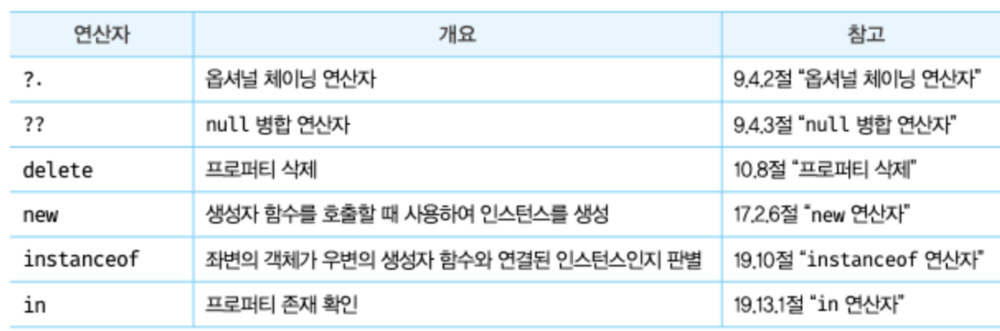
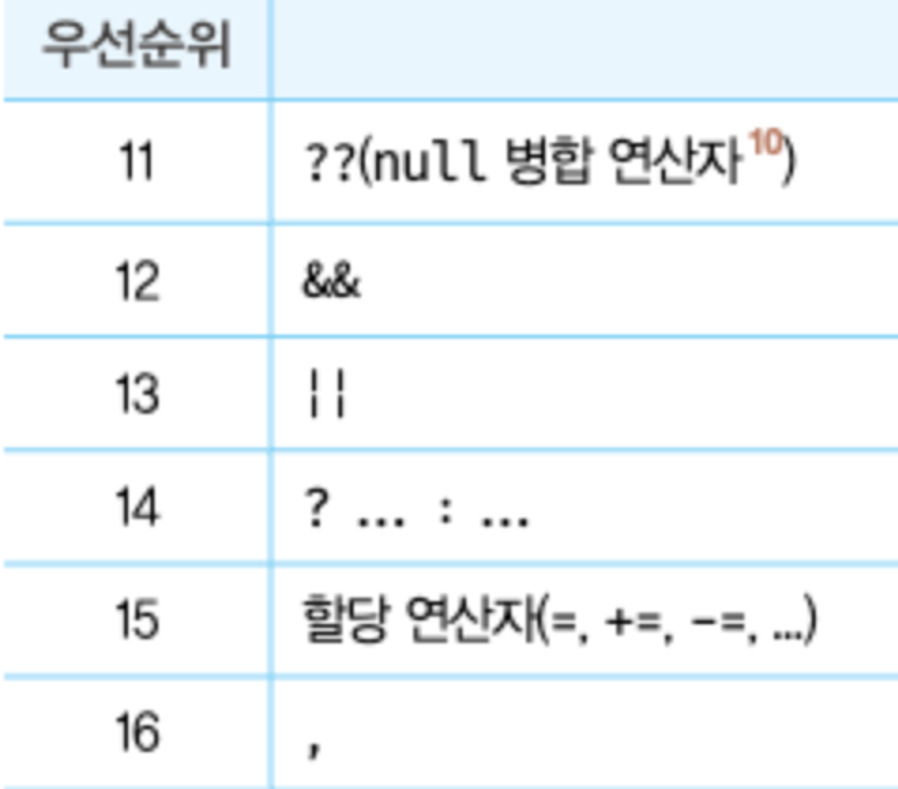
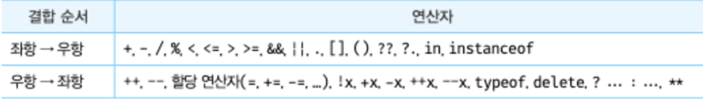

## 7.1 산술 연산자

- 연산자 + 피연산자 = 연산자 표현식
  - 연산자: 피연산자를 연산하여 새로운 값을 만듦, 산술/할당/비교/논리/타입/지수 등
  - 피연산자: 연산의 대상이 되는 값, 값으로 평가될 수 있는 표현식
- 산술 연산자

  - 피연산자를 대상으로 수학적 계산을 수행하고 새로운 숫자 값을 만듦
  - 산술 연산이 불가능하면 NaN을 반환
  - 피연산자 개수에 따라 두 가지로 분류

    - 이항 산술 연산자 (+, -, \*, /, %)
      - 2개의 피연산자를 산술 연산하여 숫자 값 만듦, 피연산자 값을 변경하는 부수 효과 X
    - 단항 산술 연산자 (++, —, +(숫자 앞에 붙는 거), -(양수를 음수로, 음수를 양수로))

      - 1개의 피연산자를 산술 연산하여 숫자 값 만듦, ++(증가)/—(감소)는 부수 효과 O
      - 증가/감소 연산자는 위치(전위/후위)가 중요함

        ```jsx
        var x = 5,
          result;

        // 선할당 후증가
        result = x++;
        console.log(result, x); // 5 6

        // 선증가 후할당
        result = ++x;
        console.log(result, x); // 7 7

        // 선할당 후감소
        result = x--;
        console.log(result, x); // 7 6

        // 선감소 후할당
        result = --x;
        console.log(result, x); // 5 5
        ```

      - 단항 산술 연산자 +, - (부수 효과 X)

        ```jsx
        var x = "1"; // 문자열
        console.log(+x); // 문자열을 숫자로 타입 변환, 1

        x = true; // 불리언
        console.log(+x); // 불리언을 숫자로 타입 변환, 1
        x = false;
        console.log(-x); // 0

        x = "hello";
        console.log(+x); // 문자열을 숫자로 바꿀 수는 없음, NaN
        ```

  - 문자열 연결 연산자 (+)

    - - 연산자는 피연산자 중 하나 이상이 문자열일 경우, 문자열 연결 동작을 수행

        ```jsx
        "1" + 2; // 12

        // 암묵적 타입 변환(타입 강제 변환)
        1 + true; // 2
        1 + false; // 1
        1 + null; // 1
        ```

<br>

## 7.2 할당 연산자

- 우항에 있는 피연산자의 평가 결과를 좌항의 변수에 할당, 부수 효과 O
- =, +=, -=, \*=, /=, %=
- 할당문은 값으로 평가되는 표현식인 문 → 할당된 값으로 평가됨

<br>

## 7.3 비교 연산자

- 좌항과 우항의 피연산자를 비교한 다음, 그 결과를 불리언 값으로 반환 (주로 if문, for문)
- 동등 비교 연산자 vs 일치 비교 연산자

  - 동등 비교 연산자(==)
    - 비교적 느슨한 비교, 값만 비교, 결과 예측이 상대적으로 어려움, 암묵적 타입 변환 O
  - 일치 비교 연산자(===)
    - 엄격한 비교, 값과 타입 모두 고려해서 비교, 결과 예측이 좀 더 쉬움, 암묵적 타입 변환 X

  ```jsx
  5 == "5"; // true, 타입은 다르지만 암묵적 타입 변환 통해, 타입을 일치시키면 동등해짐
  5 === "5"; // false, 일치 비교 연산자는 암묵적 타입 변환 안 하고 두 값을 비교

  NaN === NaN; // false, NaN은 자신과 일치하지 않는 유일한 값
  // 그래서 숫자가 NaN인지 조사하려면 빌트인 함수를 사용해야 함
  Number.isNaN(NaN); // true
  Number.isNaN(123); // false
  Number.isNaN(1 + undefined); // true

  // 양의 0과 음의 0은 일치 비교 연산자로 비교해도 무조건 같다고 나옴
  0 === -0; // true
  0 == -0; // true
  ```

- 대소 관계 비교 연산자 (>, <, >=, <=)

<br>

## 7.4 삼항 조건 연산자

- 조건식 ? 조건식 true일 때 반환값 : 조건식 false일 때 반환값
  - 조건식의 결과값이 불리언 타입이 아니면, 알아서 불리언 타입으로 암묵적 타입 변환
  - ex. x % 2 ? ‘홀수’ : ‘짝수’
    - x % 2 === 0이면 0은 false, 따라서 짝수가 출력됨, x는 짝수
    - x % 2 === 1이면 1은 true, 따라서 홀수가 출력됨, x는 홀수
    ```jsx
    var age = 25;
    var beverage = age >= 20 ? "Beer" : "Juice";
    console.log(beverage); // Beer
    ```
- 조건식의 평가 결과에 따라 반환 값을 결정
- 삼항 조건 연산자 표현식은 값으로 평가할 수 있는 표현식인 문 = 다른 표현식의 일부가 될 수 있음 (유용함)

<br>

## 7.5 논리 연산자

- 좌항과 우항의 피연산자를 논리 연산
- ||(논리합), &&(논리곱), !(부정) → 부수 효과 X

  ```jsx
  true || true; // true
  false || false; // false
  true || false; // 둘 중 하나만 true여도 true

  true && false; // 둘 다 true일 때만 true, false

  !true; // false
  !false; // true

  // 피연산자가 불리언 값이 아니면 불리언으로 암묵적 타입 변환
  !0; // 0은 false니까 true
  !"hello"; // false

  // 단축 평가: 논리 연산에서 불필요한 계산을 건너뛰는 프로그래밍 기법
  // 자세한 건 뒤에서 더 배움
  // 단축 평가에서, && 연산자는 왼쪽 피연산자가 true면 오른쪽 피연산자를 평가하고 그 값을 반환
  "Cat" && "Dog"; // JS에서 비어있지 않은 문자열은 true 취급, 따라서 Dog 반환
  ```

- 드 모르간 법칙
  - ∁(A∪B) == ∁A∩∁B / ∁(A∩B) == ∁A∪∁B
    ```jsx
    !(x || y) === (!x && !y);
    !(x && y) === (!x || !y);
    ```

<br>

## 7.6 쉼표 연산자

- 왼쪽 피연산자부터 차례대로 피연산자를 평가하고, 마지막 피연산자 평가가 끝나면, 그 연산자의 평가 결과를 반환
  ```jsx
  var x, y, z;
  (x = 1), (y = 2), (z = 3); // 3
  ```

<br>

## 7.7 그룹 연산자

- 소괄호로 피연산자를 감싸는 것, 괄호 안의 표현식을 가장 먼저 평가
  - ex. 10 \* (2 + 3) → 50
- 그룹 연산자는 연산자 우선순위가 가장 높음

<br>

## 7.8 typeof 연산자

- 피연산자의 데이터 타입을 문자열로 반환
- typeof() 연산자는 string, number, boolean, undefined, symbol, object, function 중 하나를 반환
  ```jsx
  typeof NaN; // number
  typeof null; // object, 자바스크립트 첫 번째 버전의 버그, 기존 코드 영향줄까 봐 아직 수정 X
  ```
- 선언하지 않은 식별자를 typeof 연산하면 ReferenceError가 아닌 undefined가 반환됨
- null을 반환하는 경우 X, null 타입 파악할 때는 일치 연산자(===) 사용하면 됨

<br>

## 7.9 지수 연산자

- ES7에서 도입, 밑과 지수로 거듭제곱하여 숫자 값을 반환
  - ex. 3 ** 2 → 9, 2 ** -1 → 0.5
- 지수 연산자 생기기 전까지는 Math.pow() 메서드 사용했음
  - ex. Math.pow(3, 2) → 9
- 음수를 밑으로 사용하려면 괄호로 묶어줘야 함
  - ex. (-3) \*\* 2 → 9
- 이항 연산자 중 우선순위가 가장 높음
  - ex. 2 \* 5 \*\* 2 → 50
- 할당 연산자와 함께 사용 가능
  - ex. var num = 5; num \*\*= 2; → num = 25

<br>

## 7.10 그 외의 연산자

<br>

<br>

## 7.11 연산자의 부수 효과

- 대부분의 연산자는 다른 코드에 영향 주지 않음 = 부수 효과 X
- 부수 효과가 있는 연산자
  - 할당(=) 연산자, 증가/감소(++, —) 연산자, delete 연산자
  - delete 연산자는 객체의 프로퍼티를 삭제하는 부수 효과가 있음
    ```jsx
    var object = { a: 1 };
    delete object.a;
    console.log(object); // {}, 빈 객체
    ```

<br>

## 7.12 연산자 우선 순위

<br>

<br>

<br>

## 7.13 연산자 결합 순서

- 좌항과 우항 중 어느 쪽의 평가를 먼저 수행할 것인지 나타낸 순서
  <br>
