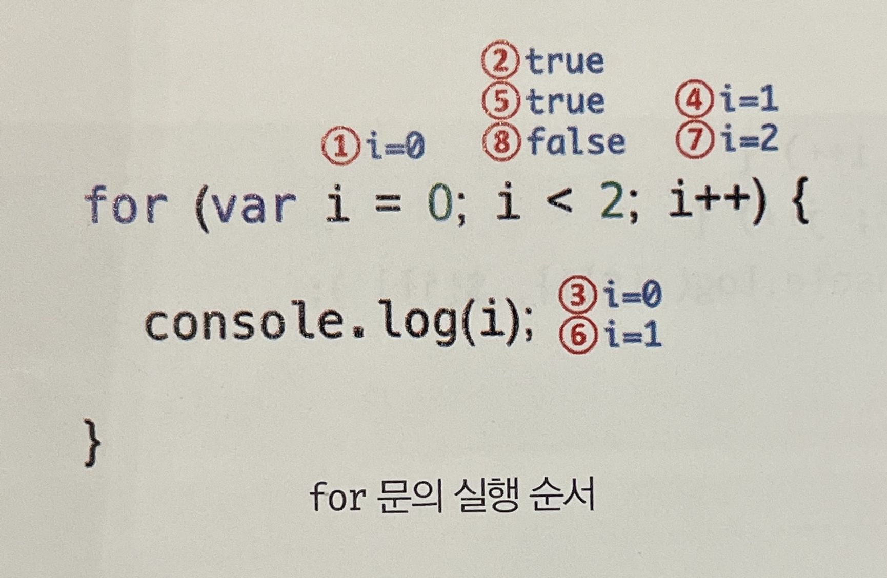

# 제어문

제어문은 조건에 따라 코드 블록을 실행(조건문)하거나 반복 실행(반복문)할 때 사용한다.

일반적으로 코드는 위에서 아래 방향으로 순차적으로 실행하는데, 제어문을 사용하면 코드의 실행 흐름을 인위적으로 제어할 수 있다. 이는 코드 흐름을 이해하기 힘들고 가독성을 해치는 단점이 있는데, 추후에 살펴볼 고차 함수를 통해 제어문 사용을 억제하여 복잡성 해결할 수 있다.

<br/>

## 블록문

블록문은 0개 이상의 문을 중괄호로 묶은 것인데, 코드 블록, 블록이라고 부르기도 한다.  
**js는 블록문을 하나의 실행 단위로 취급**한다. 단독으로 사용할 수도 있으나 일반적으로 제어문이나 함수를 정의할때 사용한다.  
**언제나 문의 종료를 의미하는 자체 종결성을 갖기 떄문에 블록문의 끝에는 세미콜론을 붙이지 않는다.**

```jsx
// 블록문
{
  var foo = 10;
}

// 제어문
var x = 1;
if (x < 10) {
  x++;
}

// 함수 선언문
function sum(a, b) {
  return a + b;
}
```

<br/>

## 조건문

조건문은 주어진 조건식의 평가 결과에 따라 코드 블록(블록문)의 실행을 결정한다.

### if … else 문

주어진 조건식의 평가 결과, 즉 논리적 참 또는 거짓에 따라 실행할 코드 블록을 결정한다.  
조건식이 불리언 값이 아닌 값이면 암묵적으로 불리언 값으로 강제 변환된다.  
문이 하나라면 중괄호 생략 가능하다.

```jsx
if (x % 2) result = "홀수";
else result = "짝수";
```

삼항 조건 연산자로 바꿔 쓸 수 있다.

```jsx
result = x % 2 ? "홀수" : "짝수";
```

조건에 따라 단순히 값을 결정하여 변수에 할당하는 경우 삼항 조건 연산자를 사용하는게 가독성에 좋지만, 조건에 따라 실행해야 할 내용이 복잡하여 여러 줄의 문이 필요하다면 if … else 문을 사용하는 편이 가독성에 좋다.

<br/>

### switch 문

주어진 표현식을 평가하여 그 값과 일치하는 표현식을 갖는 case 문으로 실행 흐름을 옮긴다.  
case 문은 상황을 의미하는 표현식을 지정하고 콜론(:)으로 마치며, 그 뒤에는 실행할 문들을 위치시킨다.

switch 문의 표현식은 불리언 값보다는 문자열이나 숫자 값인 경우가 많다. **논리적 참, 거짓보다는 다양한 상황(case)에 따라 실행할 코드 블록을 결정할 때 사용**한다.

break문을 사용하여 코드 블록을 탈출할 수 있다. **break문을 사용하지 않으면 연이어 값이 재할당**되는데, 이를 폴스루라고 부른다.

```jsx
// 월을 영어로 변환 (11 → 'November')
var month = 11;
var monthName;

switch (month) {
  case 1:
    monthName = "January";
    break;
  case 2:
    monthName = "February";
    break;
  case 3:
    monthName = "March";
    break;
  case 4:
    monthName = "April";
    break;
  case 5:
    monthName = "May";
    break;
  case 6:
    monthName = "June";
    break;
  case 7:
    monthName = "July";
    break;
  case 8:
    monthName = "August";
    break;
  case 9:
    monthName = "September";
    break;
  case 10:
    monthName = "October";
    break;
  case 11:
    monthName = "November";
    break;
  case 12:
    monthName = "December";
    break;
  default:
    monthName = "Invalid month";
}

console.log(monthName); // November
```

<br/>

## 반복문

반복문은 조건식의 평가 결과가 참인 경우 코드 블록을 실행하고 조건식이 거짓일 때까지 반복된다.

### for 문

for문은 조건식이 거짓으로 평가될 때까지 코드 블록을 반복 실행한다.

```jsx
for ( 변수 선언문 또는 할당문 ; 조건식 ; 증감식){
 조건식이 참일 경우 반복 실행될 문;
}
```

  

변수 선언문, 조건식, 증감식은 모두 옵션이지만, 어떤 식도 사용하지 않으면 무한루프가 된다.

### while 문

while 문은 주어진 **조건식의 평가 결과가 참이면** 코드 블록을 계속해서 반복 실행한다.  
**반복 횟수가 불명확할 때 주로 사용**한다.  
무한 루프에서 탈출하기 위해서는 코드 내에 if문으로 탈출 조건을 만들고 break문으로 코드 블록을 탈출한다.

```jsx
var count = 0;

// 무한루프
while (true) {
  console.log(count);
  count++;
  // count가 3이면 코드 블록을 탈출한다.
  if (count === 3) break;
} // 0 1 2
```

### do … while 문

do … while 문은 코드 블록을 먼저 실행하고 조건식을 평가한다. 즉, 코드 블록은 무조건 한 번 이상 실행된다.

<br/>

## break 문

**break문은 레이블 문, 반복문, switch 문의 코드 블록을 탈출**하며, 그 외의 코드 블록에 사용하면 SyntaxError가 발생한다.

반복문, switch문에서는 break문에 레이블 식별자를 지정하지 않는다.

> 💡 레이블 문은 식별자가 붙은 문으로, 프로그램의 실행 순서를 제어하는 데 사용한다. 레이블 문을 탈출하려면 break문에 레이블 식별자를 지정한다.
>
> ```jsx
> // foo라는 식별자가 붙은 레이블 블록문
> foo: {
>   console.log(1);
>   break foo; // foo 레이블 블록문을 탈출한다.
>   console.log(2);
> }
>
> console.log("Done!");
> ```
>
> 중첩된 for문의 내부 for문에서 break문을 실행하면 내부 for문을 탈출하여 외부 for문으로 진입한다.  
> 이때, 내부 for문이 아닌 외부 for문을 탈출하려면 레이블 문을 사용한다.
>
> ```jsx
> // outer라는 식별자가 붙은 레이블 for 문
> outer: for (var i = 0; i < 3; i++) {
>   for (var j = 0; j < 3; j++) {
>     // i + j === 3이면 outer라는 식별자가 붙은 레이블 for 문을 탈출한다.
>     if (i + j === 3) break outer;
>     console.log(`inner [${i}, ${j}]`);
>   }
> }
>
> console.log("Done!");
> ```
>
> 레이블 문은 중첩된 for 문 외부로 탈출할 때 유용하지만 그 밖의 경우에는 **일반적으로 권장하지 않는다.**  
> 참고로 switch문의 case문과 default문도 레이블 문이긴 하다.

<br/>

## continue 문

continue 문은 반복문의 코드 블록 실행을 현 지점에서 중단하고 반복문의 증감식으로 실행 흐름을 이동 시킨다.  
break 문처럼 반복문을 탈출하지는 않는다.

```jsx
// continue 문을 사용하지 않으면 if 문 내에 코드를 작성해야 한다.
for (var i = 0; i < string.length; i++) {
  if (string[i] === search) {
    count++;
  }
}

// continue 문을 사용하면 if 문 밖에 코드를 작성할 수 있다.
for (var i = 0; i < string.length; i++) {
  if (string[i] !== search) continue;

  count++;
}
```
