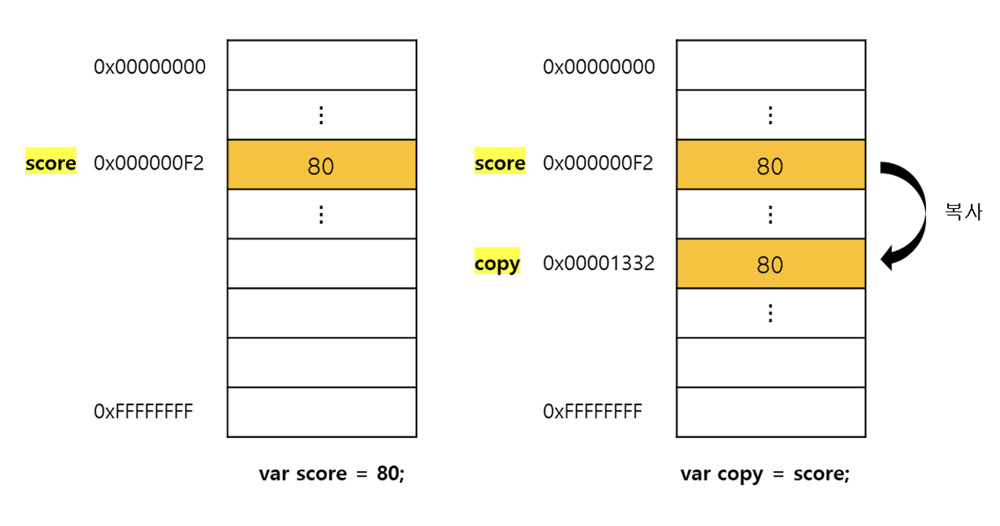
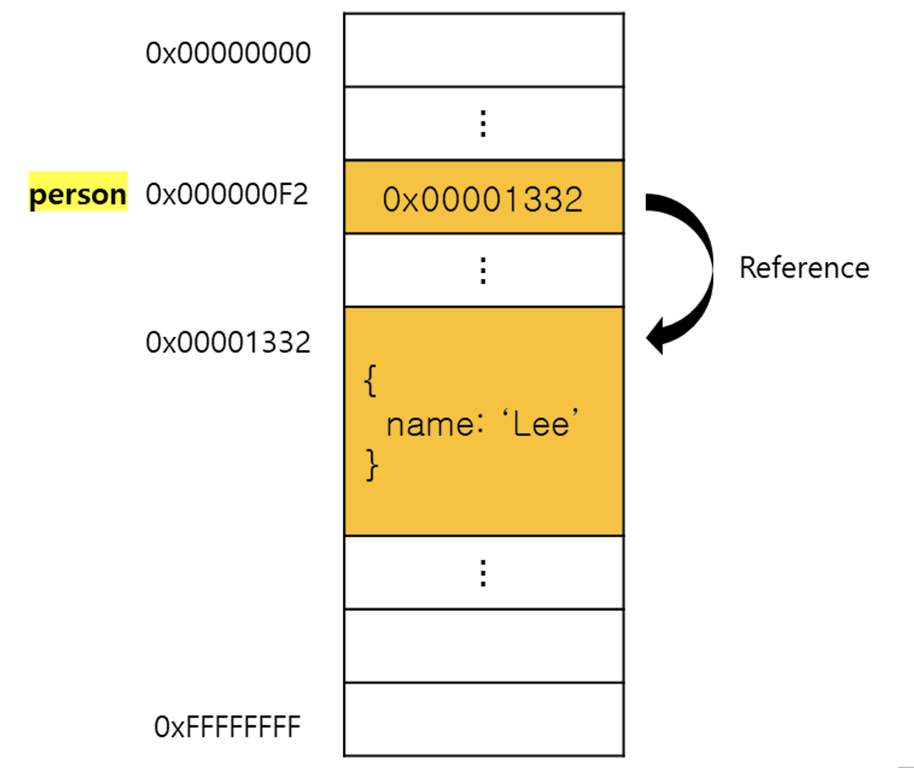
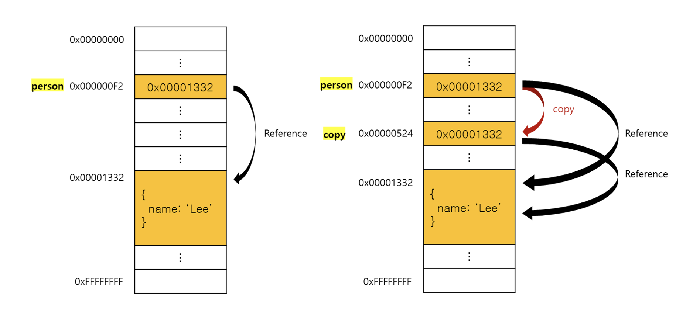

# 원시 값과 객체의 비교

## 원시 값

### 변경 불가능한 값

원시 값 자체를 변경할 수 없지만 재할당을 통해 변수 값을 변경할 수 있다. 그러면 새로운 메모리 공간을 확보하고 재할당 값 저장한 후, 변수가 참조하던 메모리 공간의 주소를 변경한다.

상수는 재할당이 금지된 변수를 말한다.

이렇게 값을 직접 변경 못하는 특성을 **불변성**이라 한다. 불변성을 갖는 원시 값을 할당한 변수는 재할당 이외에 변수 을 변경할 수 있는 법이 없다.

### 문자열과 불변성

문자열은 0개 이상의 문자로 이뤄진 집합으로, 1개 문자는 2byte의 메모리 공간에 저장된다.  
문자열은 몇 개의 문자로 이뤄졌느냐에 따라 필요한 메모리 공간의 크기가 결정된다.  
원시 값이므로 변경 불가능하다.

```jsx
var str = "Hello";
str = "world";
```

문자열의 식별자는 문자열이 저장된 메모리 공간의 첫 번째 메모리 셀 주소를 가리킨다.

위 예제 코드에서 두번째 문이 실행되면 새로운 메모리 공간에 문자열을 집어넣고 그 주소를 가리키게 된다. 즉, “Hello”와 “world”는 모두 메모리에 존재하, 식별자는 “world”를 가리키도록 변경되었을 뿐이다.

문자열은 유사 배열 객체이면서 이터러블이므로 배열과 유사하게 각 문자에 접근할 수 있다.

> 💡 유사 배열 객체
>
> - 마치 배열처럼 인덱스로 프로퍼티 값에 접근할 수 있고 length 프로퍼티를 갖는 객체를 말한다.
> - 원시 값을 객체처럼 사용하면 원시 값을 감싸는 래퍼 객체로 자동 변환된다.

```jsx
var str = "string";
str[0] = "S";

console.log(str); // string
```

문자열은 변경 불가능한 값이므로, 이미 생성된 문자열의 일부 문자를 변경해도 반영되지 않는다. 변수에 새로운 문자열을 재할당하는 것은 가능하다. 기존 문자열을 변경하는 것이 아닌, 새로운 문자열을 새롭게 할당하는 것이기 때문이다.

### 값에 의한 전달

```jsx
var score = 80;
var copy = score;

console.log(score, copy); // 80  80
```

변수에 원시 값을 갖는 변수를 할당하면 할당받는 변수에는 할당되는 변수의 원시 값이 복사되어 전달된다. 이 경우에는 다른 메모리 공간에 저장된 별개의 값이다.

  

**엄격하게 표현하면 변수에는 값이 전달되는 것이 아니라 메모리 주소가 전달된다. 이는 변수와 같은 식별자는 값이 아닌 메모리 주소를 기억하고 있기 때문이다.** 식별자는 메모리 주소에 붙인 이름이라고 할 수 있다.

원시값 복사로 인해 값이 평가되는 방식은 두가지 있는데, 다 생략하고, **두 변수의 원시 값은 서로 다른 메모리 공간에 저장된 별개의 값이 되어 어느 한쪽에서 재할당을 통해 값을 변경하더라도 서로 간섭할 수 없다.**

<br/>

## **객체**

**객체는 원시 값과 같이 확보해야 할 메모리 공간의 크기를 사전에 정해 둘 수 없다**. 즉, 객체 값은 원시 값과 다른 방식으로 동작하도록 설계되어 있다.

### 변경 가능한 값

객체를 할당한 변수가 기억하는 메모리 주소를 통해 메모리 공간에 접근하면 참조 값에 접근할 수 있다. 참조 값은 생성된 객체가 저장된 메모리 공간의 주소. 그 자체다. 참조 값을 통해 객체에 접근할 수 있다.

  

원시 값을 할당한 변수를 참조하면 메모리에 저장되어 있는 원시 값에 접근한다. ‘변수는 ㅇ값을 갖는다’, ‘변수의 값은 ㅇ다’라고 표현한다.

객체를 할당한 변수를 참조하면 메모리에 저장되어 있는 참조 값을 통해 실제 객체에 접근한다. ‘변수는 객체를 참조하고 있다’, ‘변수는 객체를 가리키고 있다’라고 표현한다.

객체를 할당한 변수는 재할당 없이 객체를 직접 변경할 수 있다. 즉, 재할당 없이 프로퍼티를 동적으로 추가할 수 있고, 프로퍼티 값을 갱신, 프로퍼티 자체를 삭제할 수 있다.

재할당을 하지 않으므로 객체를 할당한 변수의 참조 값은 변경되지 않는다. 이는 메모리를 효율적으로 사용하고, 성능 향상의 장점이 있다.

원시 값과 다르게 **여러 개의 식별자가 하나의 객체를 공유할 수 있다는 부작용**이 있다.

> 💡 얕은 복사와 깊은 복사
>
> - 얕은 복사: 한 단계까지만 복사
> - 깊은 복사: 객체에 중첩되어있는 객체까지 모두 복사
> - 이와 같이 생성된 객체는 원본과는 다른 객체다.(참조 값이 다른 별개의 객체)

### 참조에 의한 전달

```jsx
var person = {
  name: "Lee",
};

// 참조값을 복사(얕은 복사)
var copy = person;
```

객체를 가리키는 변수를 다른 변수에 할당하면 원본의 참조 값이 복사되어 전달된다. 이를 **참조에 의한 전달**이라 한다.

  

**저장된 메모리 주소는 다르지만 동일한 참조 값**을 가진다. 즉, 원본과 사본 모두 동일한 객체를 가리키고, 두 개의 식별자가 하나의 객체를 공유한다는 말이다. 원본 또는 사본 중 어느 한쪽에서 객체를 변경하면 서로 영향을 주고 받는다.

```jsx
var person = {
  name: "Lee",
};

// 참조값을 복사(얕은 복사). copy와 person은 동일한 참조값을 갖는다.
var copy = person;
console.log(copy === person); // true

// copy를 통해 객체를 변경한다.
copy.name = "Kim";

// person을 통해 객체를 변경한다.
person.address = "Seoul";

// copy와 person은 동일한 객체를 가리킨다.
// 따라서 어느 한쪽에서 객체를 변경하면 서로 영향을 주고 받는다.
console.log(person); // {name: "Kim", address: "Seoul"}
console.log(copy); // {name: "Kim", address: "Seoul"}
```

결국 “값에 의한 전달”과 “참조에 의한 전달”은 식별자가 기억하는 메모리 공간에 저장되어 있는 값을 복사해서 전달한다는 면에서 동일하다. 다만 식별자가 기억하는 메모리 공간, 즉 변수에 저장되어 있는 값이 원시 값이냐 참조 값이냐의 차이만 있을 뿐이다.
