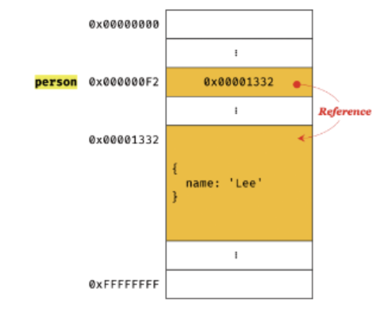

## 11.1 원시 값

- JS가 제공하는 7가지 데이터 타입(숫자, 문자열, 불리언, null, undefined, 심벌, 객체)은 원시 타입, 객체 타입으로 구분 가능
- 원시 타입

  - 변경 불가능한 값 (읽기 전용 값) → 데이터 신뢰성 보장
    - 변수 값 변경이 불가능하다는 말 X, 원시 값 자체를 변경할 수 없다는 의미, “불변성”
    - 상수는 재할당이 금지된 “변수” ≠ 변경 불가능한 값
    - const 키워드를 사용해 선언한 변수에 할당한 객체는 변경 가능
      ```jsx
      const o = {};
      o.a = 1;
      console.log(o); // {a: 1}
      ```
  - 원시 값을 변수에 할당하면, 변수(확보한 메모리 공간)에 실제 값이 저장됨
  - 원시 값 갖는 변수를 다른 변수에 할당하면, 원시 값이 복사되어 전달됨 = 값에 의한 전달(pass by value)

    - 값에 의한 전달

      - 변수에 원시 값을 갖는 변수를 할당했을 때, 할당”받는” 변수에 할당”되는” 변수 원시 값이 복사되어 전달되는 것

        ```jsx
        var score = 80;
        var copy = score; // 변수에 변수를 할당, 80이 복사되어 전달됨 = 값에 의한 전달
        // score 변수의 80과 copy 변수의 80은 다른 메모리 공간에 저장된 별개의 값

        score = 100; // score를 변경해도 copy에는 아무런 영향 안 줌, 다른 메모리 공간이니까

        console.log(score); // 100
        console.log(copy); // 80
        ```

        <br>

        - JS 엔진 제조사에 따라 실제 내부 동작 방식은 그림과는 다른 미묘한 차이가 있을 수 있음
        - 두 번째 메모리 그림처럼 copy가 일어날 수도 있고, score와 copy가 같은 원시 값을 참조하다가(같은 걸 가리키다가) 새로운 메모리 공간에 재할당된 값을 저장하도록 동작할 수도 있음

      - 정확히 말하면 “값에 의한 전달”은 값을 전달하는 게 아님, 메모리 주소를 전달하는 것
      - 두 변수의 원시 값은 서로 다른 메모리 공간에 저장된 별개의 값이 되어, 한쪽에서 재할당으로 값을 변경해도, 서로 간섭할 수 없음

  - 원시 값을 할당한 변수에 새로운 원시 값을 재할당 → 새로운 메모리 공간 확보 → 변수가 새롭게 재할당한 원시 값 가리킴 (변수가 참조하던 메모리 공간의 주소가 바뀜)
    - 변수가 참조하던 메모리 공간의 주소가 바뀌는 이유: 원시 값이 변경 불가능한 값이기 때문
      <br>
    - 원시 값 변경 가능하다면 메모리 공간의 주소 바꿀 필요 없이, 원시 값 자체를 변경하면 되는데, 그러면 메모리 공간 주소도 안 바뀔 텐데, 그게 안 되네?
      <br>
    - 불변성 갖는 원시 값을 할당한 변수는, 재할당 이외에 변수 값을 변경할 수 있는 방법 없음
  - 문자열과 불변성
    - 원시 값을 저장하려면 확보해야 하는 메모리 공간의 크기를 결정해야 함
    - 원시 타입별로 메모리 공간의 크기가 미리 정해져 있음
    - JS의 문자열은 변경 불가능한 값 = 원시 타입
      ```jsx
      var str = "hello"; // 식별자 str이 문자열 'hello'가 저장된 메모리 공간의 첫 번째 메모리 셀 주소 가리킴
      str = "world"; // 새 문자열 'world'를 메모리에 생성하고 str이 이걸 가리킴
      // 결론
      // hello와 world는 메모리에 둘 다 존재하고 있음
      // 값이 바뀐 게 아니고, 식별자 str이 가리키는 게 달라졌을 뿐
      ```
    - 원시 값인 문자열은 0개 이상의 문자로 이루어진 집합, 문자 개수에 따라 메모리 공간 크기가 결정됨 (다른 원시 값과 비교되는 독특한 특징)
      - ex) 숫자 1과 100000은 동일하게 8바이트가 필요함
      - ex) 문자열은 단순히 계산했을 때, 1개의 문자로 이루어진 문자열은 2바이트, 10개의 문자로 이루어진 문자열은 20바이트가 필요함
    - 문자열은 “유사 배열 객체”이면서 “이터러블”이므로, 배열과 유사하게 각 문자에 접근 가능
      - 유사 배열 객체
        - 배열처럼 인덱스로 프로퍼티 값에 접근할 수 있고, length 프로퍼티를 갖는 객체
      - 이터러블
        - 문자열을 반복 가능한 객체로 다룰 수 있다는 것을 의미, 나중에 자세히 배움…
      - 아니 문자열은 원시 값이라면서요? 유사 배열 “객체”요?
        - 원시 값을 객체처럼 사용하면, 원시 값을 감싸는 래퍼 객체로 자동 변환됨, 이것도 나중에 자세히 배움…

- 객체(참조) 타입
  - 변경 가능한 값
  - 객체를 변수에 할당하면, 변수(확보한 메모리 공간)에 참조 값이 저장됨
  - 객체를 가리키는 변수를 다른 변수에 할당하면, 참조 값이 복사되어 전달됨 = 참조에 의한 전달(pass by reference)

<br>

## 11.2 객체

- 객체는 프로퍼티의 개수가 정해져 있지 않음, 동적으로 추가 및 삭제 가능
- 프로퍼티의 값에도 제약이 없음 → 확보해야 할 메모리 공간의 크기를 사전에 정해둘 수 없음 (원시 값과 다른 점)
- 객체는 복합적 자료구조, 생성 및 접근이 원시 값에 비하면 비용이 많이 드는 편
- 객체는 원시 값에 비해 상대적으로 많은 메모리를 사용할 수도 있음
- 자바스크립트 객체
  - 프로퍼티 키를 인덱스로 사용하는 해시 테이블(연관 배열)
  - JS 엔진은 해시 테이블과 유사하지만 그것보다는 더 나은 방법으로 객체를 구현
  - JS는 클래스 없이 객체 생성 가능, 동적으로 프로퍼티와 메서드 추가 가능
    - 편리함, 근데 생성 및 프로퍼티 접근에 있어서는 비효율적 → 동적 탐색 대신 히든 클래스라는 방식으로 성능 높임 (V8 JS 엔진)
- 변경 가능한 값

  - 객체는 변경 가능한 값
  - 객체를 할당한 변수가 기억하는 메모리 주소로 접근하면 참조 값(메모리 공간의 주소) 얻을 수 있음, 참조 값으로 객체에 접근 가능
    <br>
  - 재할당 이외에 변수 값 변경 방법이 없는 원시 값과 달리, 객체는 재할당 없이 직접 변수 값 변경 가능 (동적으로 추가, 갱신, 삭제 가능 - 10장 객체 리터럴에서 배운 내용)
    - 변수에 재할당 한 게 아니기 때문에 참조 값은 당연히 안 변함
      ```jsx
      var person = {
        name: "Lee",
      };
      person.name = "Kim"; // 갱신
      person.address = "Seoul"; // 생성
      console.log(person); // {name: 'Kim', address: 'Seoul'}
      ```
      <br>
  - 변경 가능한 값으로 설계된 이유: 메모리를 효율적으로 관리하기 위해 (객체 복사 생성 비용을 절약) → 여러 개의 식별자가 하나의 객체를 공유할 수 있다는 단점 존재 (원시 값과는 다른 점)
  - 얕은 복사(shallow copy) vs 깊은 복사(deep copy)

    - 얕은 복사: 객체를 프로퍼티 값으로 갖는 객체에서, 한 단계까지만 복사하는 것
      - 객체에 중첩되어 있는 객체의 경우, “참조 값”을 복사함
    - 깊은 복사: 객체를 프로퍼티 값으로 갖는 객체에서, 객체에 중첩된 객체까지 모두 복사하는 것
      - 객체에 중첩되어 있는 객체까지 모두 복사, “원시 값처럼” 완전한 복사본 만듦
    - 얕은 복사와 깊은 복사로 생성된 객체는 원본과는 다른 객체 (참조 값이 다르다는 뜻)

      ```jsx
      const v = 1;
      const o = { x: 1 };

      // 깊은 복사
      const c1 = v;
      console.log(c1 === v); // true

      // 얕은 복사
      const c2 = o;
      console.log(c2 === o); // true
      ```

- 참조에 의한 전달

  - 객체를 가리키는 변수를 다른 변수에 할당하면, 원본의 참조 값이 복사되어 전달되는 것
  - 위에서 말한 “여러 개의 식별자가 하나의 객체를 공유할 수 있다”의 의미

    ```jsx
    var person = {
    	name: 'Lee';
    };

    var copy = person; // 참조 값을 복사 = 얕은 복사
    ```

    <br>

    - 두 개의 식별자(person, copy)가 하나의 객체를 공유하고 있음
      - 프로퍼티 값을 변경하면 서로 영향을 주고 받음
    - 원시 값-값에 의한 전달 vs 객체-참조에 의한 전달
      - 식별자가 기억하는 메모리 공간에 저장된 값을 복사해서 전달한다는 공통점
      - 식별자가 기억하는 메모리 공간(변수)에 저장된 값이 원시 값이냐 참조 값이냐의 차이
      - 결론: JS에는 값에 의한 전달”만” 존재
      - “값에 의한 전달”, “참조에 의한 전달” 모두 공식 용어는 아님

  - 정리

    ```jsx
    var person1 = {
      name: "Lee",
    };

    var person2 = {
      name: "Lee",
    };

    console.log(person1 === person2); // false, 두 객체는 다른 메모리에 저장된 별개의 객체
    console.log(person1.name === person2.name); // true, 원시 값 'Lee'로 동일하게 평가됨
    ```
