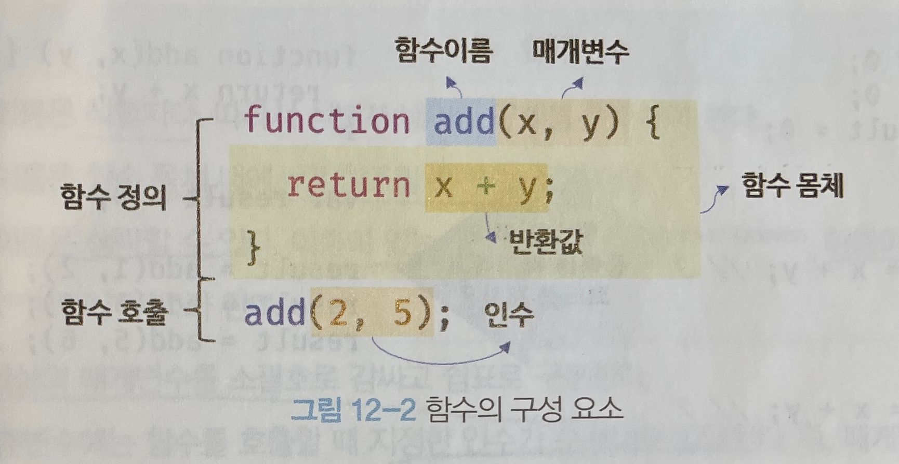
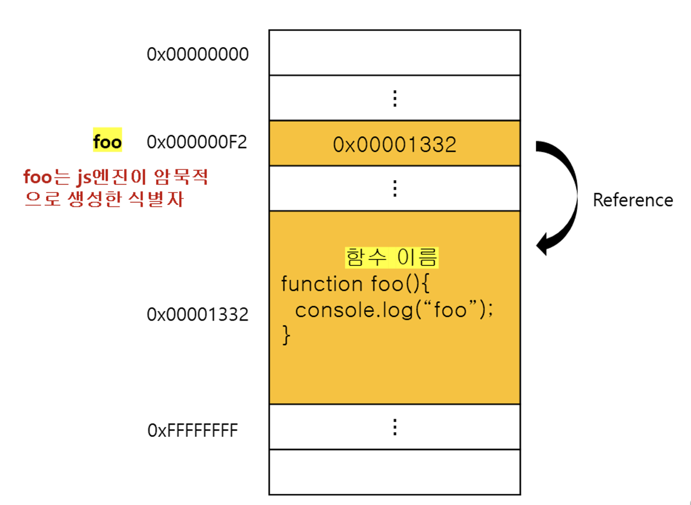
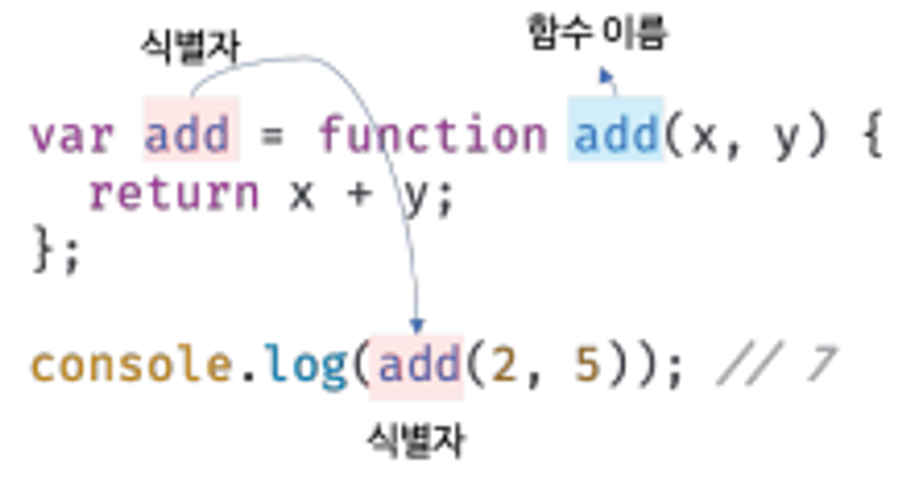
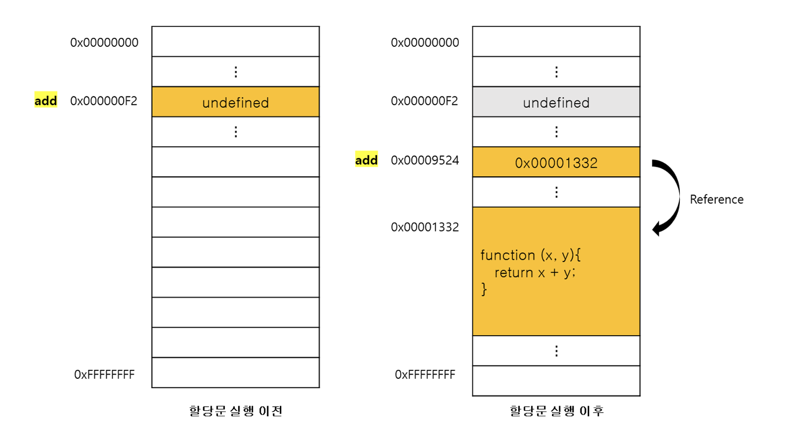
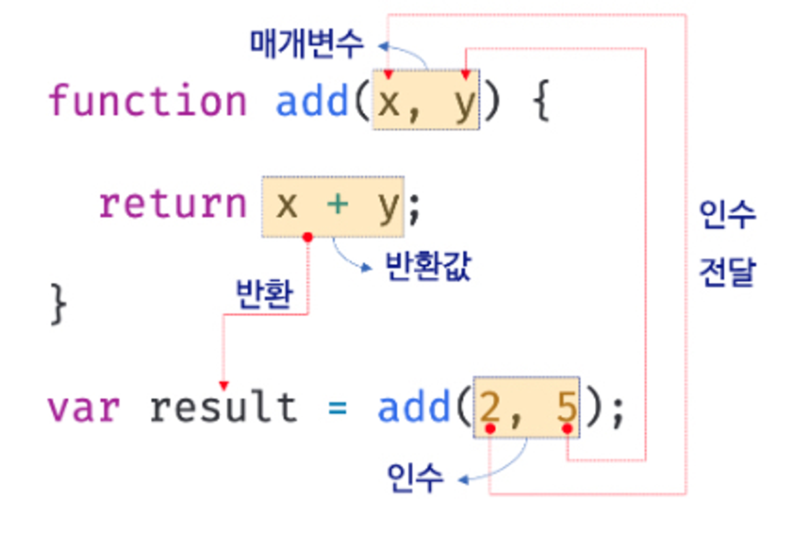
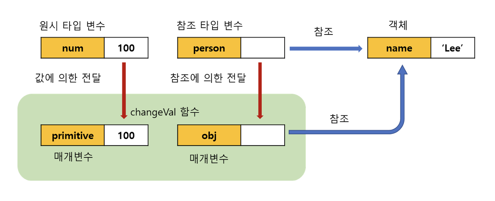

## 함수란?

함수는 일련의 과정을 문으로 구현하고 코드 블록으로 감싸서 하나의 실행 단위로 정의한 것이다.

함수 내부로 입력을 전달받는 변수를 매개변수, 입력을 인수, 출력을 반환값이라 한다.

또한 함수는 값이며, 여러 개 존재할 수 있으므로 특정 함수를 구별하기 위해 식별자인 함수 이름을 사용할 수 있다.

함수는 함수 정의를 통해 생성하고 함수 호출로 함수를 실행한다. 함수를 호출하면 코드 블록에 담긴 문들이 일괄적으로 실행되고 실행 결과인 반환값을 반환한다.

  

<br/>

## 함수를 사용하는 이유

동일한 작업을 반복적으로 수행해야 한다면 같은 코드를 중복해서 여러 번 작성하는 것이 아니라 미리 정의된 함수를 재사용하는 것이 효율적이다.

코드의 중복을 억제하고 재사용성을 높이는 함수는 유지보수의 편의성을 높이고 실수를 줄여 코드의 신뢰성을 높이는 효과가 있다.

적절한 함수 이름은 내부 코드를 이해하지 않고도 함수 역할을 파악할 수 있게 돕는다. 이는 코드의 가독성을 향상시킨다.

<br/>

## 함수 리터럴

함수는 객체 타입의 값이기에 함수 리터럴로 생성할 수 있다.
함수 리터럴은 function 키워드, 함수 이름, 매개변수 목록, 함수 몸체로 구성한다.

#### 함수 리터럴의 구성 요소

| 구성 요소     | 설명                                                                                                                                                                                                                           |
| ------------- | ------------------------------------------------------------------------------------------------------------------------------------------------------------------------------------------------------------------------------ |
| 함수 이름     | - 함수 이름은 식별자이므로 식별자 네이밍 규칙 준수해야 함 <br/> - 함수 이름은 함수 몸체 내에서만 참조할 수 있는 식별자 <br/> \- 함수 이름은 생략할 수 있음. 이름이 있는 함수를 기명함수, 이름이 없는 함수를 무명/익명함수라 함 |
| 매개변수 목록 | \- 0개 이상의 매개변수를 소괄호로 감싸고 쉼표로 구분 <br/> \- 각 매개변수에는 함수를 호출할 때 지정한 인수가 순서대로 할당됨 <br/> - 매개변수는 함수 몸체 내에서 변수와 동일하게 취급                                          |
| 함수 몸체     | - 함수가 호출되었을 때 일괄적으로 실행될 문들을 하나의 실행 단위로 정의한 코드 블록 <br/> - 함수 호출에 의해 실행됨                                                                                                            |

리터럴은 값을 생성하기 위한 표기법이므로 함수 리터럴도 평가되어 값을 생성하며, 이 값은 객체다.
일반 객체는 호출할 수 없지만 함수는 호출할 수 있으며, 일반 객체에는 없는 함수 객체만의 고유한 프로퍼티를 갖는다.

<br/>

## 함수 정의

함수 정의란 함수를 호출하기 이전에 인수를 전달받을 매개변수와 실행할 문들, 반환할 값을 지정하는 것을 말한다. 정의된 함수는 js 엔진에 의해 평가되어 함수 객체가 된다.

```jsx
// 함수 선언문
function add(x, y) {
  return x + y;
}

// 함수 표현식
var add = function (x, y) {
  return x + y;
};

// Function 생성자 함수
var add = new Function("x", "y", "return x + y");

// 화살표 함수(ES6)
var add = (x, y) => x + y;
```

> 💡 변수는 ‘선언’한다고 했지만 함수는 ‘정의’한다고 표현한다. 함수 선언문이 평가되면 식별자가 암묵적으로 생성되고 함수 객체가 할당되기 때문이다.

<br/>

### 함수 선언문

```jsx
// 함수 선언문
function add(x, y) {
  return x + y;
}

// 함수 참조
console.dir(add); // ƒ add(x, y)

// 함수 호출
console.log(add(2, 5)); // 7
```

함수 선언문은 함수 리터럴과 형태가 동일하다. 단, 함수 리터럴은 함수 이름을 생략할 수 있지만 함수 선언문은 생략할 수 없다.

함수 선언문은 표현식이 아닌 문이다. 따라서 변수에 할당할 수 없다.

> **💡 console.dir**
> console.dir은 console.log와는 달리 함수 객체의 프로퍼티까지 출력한다.
> 단, Node.js 환경에서는 console.log와 같은 결과가 출력된다.

```jsx
// 함수 선언문은 표현식이 아닌 문이므로 변수에 할당할 수 없다.
// 하지만 함수 선언문이 변수에 할당되는 것처럼 보인다.
var add = function add(x, y) {
  return x + y;
};

// 함수 호출
console.log(add(2, 5)); // 7
```

{ }은 블록문 혹은 객체 리터럴일 수 있는 중의적 표현으로, 코드의 문맥에 따라 해석이 달라진다.

```jsx
// 기명 함수 리터럴을 단독으로 사용하면 함수 선언문으로 해석된다.
// 함수 선언문에서는 함수 이름을 생략할 수 없다.
function foo() {
  console.log("foo");
}
foo(); // foo

// 함수 리터럴을 피연산자로 사용하면 함수 선언문이 아니라 함수 리터럴 표현식으로 해석된다.
// 함수 리터럴에서는 함수 이름을 생략할 수 있다.
(function bar() {
  console.log("bar");
});
bar(); // ReferenceError: bar is not defined
```

함수 선언문과 함수 리터럴 표현식은 함수 객체를 생성한다는 점에서 동일하지만 호출에 차이가 있다.

위 예제에서 함수 선언문으로 생성된 foo는 호출할 수 있으나 함수 리터럴 표현식으로 생성된 bar는 호출할 수 없다.

**함수 이름은 함수 몸체 내에서만 참조할 수 있는 식별자**다. 따라서 위 예제에서 bar 함수는 bar 함수를 가리키는 식별자가 없으므로 호출할 수 없다.

  

하지만 위 예제에서 함수 선언문으로 정의된 함수는 foo라는 이름으로 호출할 수 있었다. foo는 js 엔진이 암묵적으로 생성한 식별자이기 때문이다.

  

**js 엔진은 생성된 함수를 호출하기 위해 함수 이름과 동일한 이름의 식별자를 암묵적으로 생성하고, 거기에 함수 객체를 할당한다.**

함수는 함수 이름으로 호출하는 것이 아닌 **함수 객체를 가리키는 식별자로 호출한다.**

  

위 의사 코드가 함수 표현식이다. js엔진은 함수 선언문을 함수 표현식으로 변환해 함수 객체를 생성한다. 단, 함수 선언문과 함수 표현식이 정확히 동일하게 동작하는 것은 아니다.

<br/>

### 함수 표현식

js의 함수는 값처럼 변수에 할당할 수도 있고 프로퍼티 값, 배열의 요소가 될 수 있다. 이처럼 값의 성질을 갖는 객체를 일급 객체라 한다. 따라서 함수를 값처럼 자유롭게 사용할 수 있다.

함수 표현식은 함수 리터럴로 생성한 함수 객체를 변수에 할당하여 정의하는 방식이다.

```jsx
var add = function (x, y) {
  return x + y;
};

console.log(add(2, 5)); // 7
```

함수 리터럴의 함수 이름은 생략 가능하며 익명 함수라고 부른다.
함수 표현식의 함수 리터럴은 함수 이름을 생략하는 것이 일반적이다.

함수를 호출할 때는 함수 이름이 아니라 함수 객체를 가리키는 식별자를 사용해야 한다. 함수 이름은 함수 몸체 내부에만 유효한 식별자다.

```jsx
var add = function foo(x, y) {
  return x + y;
};

console.log(add(2, 5)); // 7
console.log(foo(2, 5)); // ReferenceError: foo is not defined
```

함수 선언문은 표현식이 아닌 문이고 함수 표현식은 표현식인 문이다.

<br/>

### 함수 생성 시점과 함수 호이스팅

함수 선언문으로 정의한 함수와 함수 표현식으로 정의한 함수의 생성 시점이 다르다.

**함수 선언문**

함수 선언문은 런타임 이전에 js 엔진에 의해 먼저 실행되어 함수 객체가 생성되며, 함수 이름과 동일한 이름의 식별자를 암묵적으로 생성하고 생성된 함수 객체를 할당한다. 따라서 함수 선언문 이전에 호출 가능하다.

> **함수 호이스팅**
> 이처럼 함수 선언문이 코드의 선두로 끌어 올려진 것처럼 동작하는 js 고유의 특징을 함수 호이스팅이라고 말한다.  
> 변수 호이스팅과 차이가 있는데, var 키워드로 선언된 변수는 undefined로 초기화되고, 함수 선언문을 통해 암묵적으로 생성된 식별자는 함수 객체로 초기화된다.  
> 함수 호이스팅은 함수를 호출하기 전에 반드시 함수를 선언해야 한다는 당연한 규칙을 무시하므로 함수 표현식을 사용할 것을 권장한다.

**함수 표현식**

함수 표현식은 변수에 할당되는 값이 함수 리터럴인 문이다. 따라서 함수 표현식의 함수 리터럴도 할당문이 실행되는 시점에 평가되어 함수 객체가 된다.

즉, 함수 호이스팅이 아닌, 변수 호이스팅이 발생한다. 따라서 함수 표현식 이전에 함수를 참조하면 undefined로 평가된다. 이때 함수를 호출하면 undefined를 호출하는 것과 마찬가지이므로 타입 에러 발생한다. 함수 표현식으로 정의한 함수는 반드시 함수 표현식 이후에 참조 또는 호출해야한다.

```jsx
// 함수 참조
console.dir(add); // ƒ add(x, y)
console.dir(sub); // undefined

// 함수 호출
console.log(add(2, 5)); // 7
console.log(sub(2, 5)); // TypeError: sub is not a function

// 함수 선언문
function add(x, y) {
  return x + y;
}

// 함수 표현식
var sub = function (x, y) {
  return x - y;
};
```

  

<br/>

### Function 생성자 함수

Function 생성자 함수에 매개변수 목록과 함수 몸체를 문자열로 전달하면서 new 연산자와 함께 호출하면 함수 객체를 생성해서 반환한다. new 연산자 없이 호출해도 결과는 동일하다.

이 방식은 일반적이지 않으며 바람직하지도 않다. 클로저를 생성하지 않는 등, 함수 선언문이나 함수 표현식으로 생성한 함수와 다르게 동작한다.

> 생성자 함수: 객체를 생성하는 함수

```jsx
var add = new Function("x", "y", "return x + y");

console.log(add(2, 5)); // 7
```

<br/>

### 화살표 함수

```jsx
// 화살표 함수
const add = (x, y) => x + y;
console.log(add(2, 5)); // 7
```

ES6에서 도입된 화살표 함수는 function 키워드 대신 화살표 =>를 사용해 좀 더 간략한 방법으로 함수를 선언할 수 있다. 화살표 함수는 항상 익명 함수로 정의한다.

기존의 함수보다 표현만 간략한 것이 아니라 내부 동작 또한 간략화되어 있다.
화살표 함수는 생성자 함수로 사용할 수 없으며, 기존 함수와 this 바인딩 방식이 다르고, prototype 프로퍼티가 없으며 arguments 객체를 생성하지 않는다.

<br/>

## 함수 호출

함수는 함수를 가리키는 식별자와 한 쌍의 소괄호인 함수 호출 연산자로 호출한다.

함수를 호출하면 현재의 실행 흐름을 중단하고 호출된 함수로 실행 흐름을 옮긴다.

<br/>

### 매개변수와 인수

함수를 실행하기 위해 필요한 값을 함수 외부에서 함수 내부로 전달할 필요가 있을 경우, 매개변수(인자)를 통해 인수를 전달한다. 인수는 값으로 평가될 수 있는 표현식이어야 한다.

함수가 호출되면 함수 몸체 내에서 암묵적으로 매개변수가 생성되고 일반 변수와 마찬가지로 undefined로 초기화된 이후 인수가 순서대로 할당된다. 매개변수의 스코프는 함수 내부다.

  

함수는 매개변수의 개수와 인수의 개수가 일치하는지 체크하지 않는다.
인수가 부족해서 인수가 할당되지 않은 매개변수의 값은 undefiend다. 매개변수보다 인수가 더 많은 경우 초과된 인수는 무시된다.

```jsx
function add(x, y) {
  return x + y;
}

console.log(add(2)); // 2 + undefined = NaN
console.log(add(2, 5, 10)); // 7
```

초과된 인수는 그냥 버려지는 것이 아니다. **모든 인수는 암묵적으로 arguments 객체의 프로퍼티로 보관**된다. arguments 객체는 함수를 정의할 때 매개변수 개수를 확정할 수 없는 가변 인자 함수를 구현할 때 유용히 사용된다.

<br/>

### 인수 확인

js의 경우 함수를 정의할 때 적절한 인수가 전달되었는지 확인할 필요가 있다.

```jsx
function add(x, y) {
  if (typeof x !== "number" || typeof y !== "number") {
    // 매개변수를 통해 전달된 인수의 타입이 부적절한 경우 에러를 발생시킨다.
    throw new TypeError("인수는 모두 숫자 값이어야 합니다.");
  }

  return x + y;
}

console.log(add(2)); // TypeError: 인수는 모두 숫자 값이어야 합니다.
console.log(add("a", "b")); // TypeError: 인수는 모두 숫자 값이어야 합니다.
```

arguments 객체를 통해 인수 개수를 확인할 수도 있다.

인수가 전달되지 않은 경우 단축 평가를 사용해 매개변수에 기본값을 할당하는 방법도 있다.

```jsx
function add(a, b, c) {
  a = a || 0;
  b = b || 0;
  c = c || 0;
  return a + b + c;
}

console.log(add(1, 2, 3)); // 6
console.log(add(1, 2)); // 3
console.log(add(1)); // 1
console.log(add()); // 0
```

ES6에 도입된 매개변수 기본값을 사용하면 함수 내에서 수행하던 인수 체크 및 초기화를 간소화할 수 있다. 이는 매개변수에 인수를 전달하지 않았을 경우와 undefined를 전달한 경우에만 유효하다.

```jsx
function add(a = 0, b = 0, c = 0) {
  return a + b + c;
}

console.log(add(1, 2, 3)); // 6
console.log(add(1, 2)); // 3
console.log(add(1)); // 1
console.log(add()); // 0
```

<br/>

### 매개변수의 최대 개수

매개변수는 순서에 의미가 있으므로 매개변수가 많아지면 함수를 호출할 때 전달해야 할 인수의 순서를 고려해야 한다.

매개변수의 개수가 많다는 것은 함수가 여러 가지 일을 한다는 증거이므로 바람직하지 않다. 이상적인 함수는 한 가지 일만 해야하며 가급적 작게 만들어야 한다.

매개변수는 최대 3개 이상을 넘지 않는 것을 권장하며, 그 이상이 필요하다면 하나의 매개변수를 선언하고 객체를 인수로 전달하는 것이 유리하다.

객체를 인수로 사용하는 경우 프로퍼티 키만 정확히 지정하면 매개변수 순서를 신경 쓰지 않아도 된다. 또한 명시적으로 인수의 의미를 설명하는 프로퍼티 키를 사용하게 되므로 코드의 가독성 좋아진다.

하지만 함수 외부에서 함수 내부로 전달한 객체를 함수 내부에서 변경하면 함수 외부의 객체가 변경되는 부수 효과가 발생하므로 이점 주의해야 한다.

<br/>

### 반환문

함수는 return 키워드와 표현식(반환값)으로 이뤄진 반환문을 사용해 실행 결과를 함수 외부로 반환할 수 있다. 함수 호출은 표현식이다. 함수 호출 표현식은 return키워드가 반환한 표현식의 평가 결과, 즉 반환값으로 평가된다.

반환문은 함수의 실행을 중단하고 함수 몸체를 빠져나간다.

return 키워드 뒤에 오는 표현식을 평가해 반환하며, 명시적으로 지정하지 않으면 undefined가 반환된다.

반환문은 생략 가능하다. 함수 몸체의 마지막 문까지 실행한 후 암묵적으로 undefined를 반환한다.

함수 몸체 내부에서만 사용할 수 있으며, 전역에서 사용하면 문법 에러가 발생한다.

> Node.js는 모듈 시스템에 의해 파일별로 독립적인 파일 스코프를 갖기때문에 파일의 가장 바깥 영역에 반환문을 사용해도 에러가 발생하지 않는다.

<br/>

## 참조에 의한 전달과 외부 상태의 변경

매개변수도 함수 몸체 내부에서 변수와 동일하게 취급되므로 매개변수 또한 타입에 따라 값에 의한 전달, 참조에 의한 전달 방식을 그대로 따른다.

```jsx
// 매개변수 primitive는 원시 값을 전달받고, 매개변수 obj는 객체를 전달받는다.
function changeVal(primitive, obj) {
  primitive += 100;
  obj.name = "Kim";
}

// 외부 상태
var num = 100;
var person = { name: "Lee" };

console.log(num); // 100
console.log(person); // {name: "Lee"}

// 원시 값은 값 자체가 복사되어 전달되고 객체는 참조 값이 복사되어 전달된다.
changeVal(num, person);

// 원시 값은 원본이 훼손되지 않는다.
console.log(num); // 100

// 객체는 원본이 훼손된다.
console.log(person); // {name: "Kim"}
```

원시 타입 인수는 값 자체가 복사되어 매개변수에 전달되므로 함수 몸체에서 그 값을 변경(재할당을 통한 교체)해도 원본은 훼손되지 않는다.

객체 타입 인수는 참조 값이 복사되어 매개변수에 전달되기 때문에 함수 몸체에서 참조 값을 통해 객체를 변경할 경우 원본이 훼손된다.

  

이처럼 함수가 외부 상태를 변경하면 상태 변화를 추적하기 어려워진다.
객체의 변경을 추적하려면 옵저버 패턴 등을 통해 객체를 참조를 공유하는 모든 이들에게 변경 사실을 통지하고 이에 대처하는 추가 대응이 필요하다.

해결 방법 중 하나는 객체를 불변 객체로 만들어 사용하는 것이다.

복사본을 새롭게 생성하는 비용은 들지만 객체를 마치 원시 값처럼 변경 불가능한 값으로 동작하게 만드는 것이다. 깊은 복사를 통해 새로운 객체를 생성하고 재할당을 통해 교체한다. 이로써 외부 상태가 변경되는 부수 효과를 없앨 수 있다.

> 외부 상태를 변경하지 않고 외부 상태에 의존하지도 않는 함수를 순수함수라 한다.

> 순수 함수를 통해 부수 효과를 최대한 억제하여 오류를 피하고 프로그래밍의 안정성을 높이려는 프로그래밍 패러다임을 함수형 프로그래밍이라 한다.

<br/>

## 다양한 함수의 형태

### 즉시 실행 함수

```jsx
// 익명 즉시 실행 함수
(function () {
  var a = 3;
  var b = 5;
  return a * b;
})();

// 기명 즉시 실행 함수
(function foo() {
  var a = 3;
  var b = 5;
  return a * b;
})();

foo(); // foo is not defined
```

함수 정의와 동시에 즉시 호출되는 함수를 즉시 실행 함수라고 한다. 즉시 실행 함수는 단 한 번만 호출되며 다시 호출할 수 없다.

익명 함수를 사용하는 것이 일반적이지만 기명 즉시 실행 함수도 사용할 수 있다. 하지만 그룹 연산자(...)내의 기명함수는 함수 선언문이 아니라 함수 리터럴로 평가되며 함수 이름은 함수 몸체에서만 참조할 수 있는 식별자이므로 다시 호출할 수는 없다.

즉시 실행 함수는 반드시 그룹 연산자(...)로 감싸야 한다. 그렇지 않으면 에러가 발생한다.
그룹 연산자로 함수를 묶는 이유는 먼저 함수 리터럴을 평가해서 함수 객체를 생성하기 위해서다.

즉시 실행 함수도 일반 함수처럼 값을 반환할 수 있고 인수를 전달할 수도 있다.

즉시 실행 함수 내에 코드를 모아 두면 혹시 있을 수도 있는 변수나 함수 이름의 충돌을 방지할 수 있다.

```jsx
// 즉시 실행 함수도 일반 함수처럼 값을 반환할 수 있다.
var res = (function () {
  var a = 3;
  var b = 5;
  return a * b;
})();

console.log(res); // 15

// 즉시 실행 함수에도 일반 함수처럼 인수를 전달할 수 있다.
res = (function (a, b) {
  return a * b;
})(3, 5);

console.log(res); // 15
```

<br/>

### 재귀 함수

함수가 자기 자신을 호출하는 것을 재귀 호출이라 한다. 재귀 함수는 자기 자신을 호출 하는 행위, 즉 재귀 호출을 수행하는 함수를 말한다.

재귀 함수는 반복되는 처리를 위해 사용한다.

```jsx
// 팩토리얼(계승)은 1부터 자신까지의 모든 양의 정수의 곱이다.
// n! = 1 * 2 * ... * (n-1) * n
function factorial(n) {
  // 탈출 조건: n이 1 이하일 때 재귀 호출을 멈춘다.
  if (n <= 1) return 1;
  // 재귀 호출
  return n * factorial(n - 1);
}

console.log(factorial(0)); // 0! = 1
console.log(factorial(1)); // 1! = 1
console.log(factorial(2)); // 2! = 2 * 1 = 2
console.log(factorial(3)); // 3! = 3 * 2 * 1 = 6
console.log(factorial(4)); // 4! = 4 * 3 * 2 * 1 = 24
console.log(factorial(5)); // 5! = 5 * 4 * 3 * 2 * 1 = 120
```

함수 이름은 함수 몸체 내부에서만 유효하므로 함수 내부에서는 함수 이름을 사용해 자기 자신을 호출할 수 있다.

재귀 함수는 자신을 무한 재귀 호출하므로 탈출 조건을 반드시 만들어야 한다.

반복문을 사용하는 것보다 재귀 함수를 사용하는 편이 더 직관적으로 이해하기 쉬울 때만 한정적으로 사용하는 것이 바람직하다.

<br/>

### 중첩 함수

함수 내부에 정의된 함수를 중첩 함수 또는 내부 함수라 한다. 그리고 중첩 함수를 포함하는 함수는 외부 함수라 부른다.

중첩 함수는 외부 함수 내부에서만 호출할 수 있다. 일반적으로 중첩 함수는 자신을 포함하는 외부 함수를 돕는 헬퍼 함수의 역할을 한다.

```jsx
function outer() {
  var x = 1;

  // 중첩 함수
  function inner() {
    var y = 2;
    // 외부 함수의 변수를 참조할 수 있다.
    console.log(x + y); // 3
  }

  inner();
}

outer();
```

ES6부터 함수 정의는 문이 위치할 수 있는 문맥이라면 어디든지 가능하다.

단, 호이스팅으로 인해 혼란이 발생할 수 있으므로 if문이나 for문 등의 코드 블록에서 함수선언문을 통해 함수를 정의하는 것은 바람직하지 않다.

<br/>

### 콜백 함수

```jsx
// n만큼 어떤 일을 반복한다.
function repeat(n) {
  // i를 출력한다.
  for (var i = 0; i < n; i++) console.log(i);
}

repeat(5); // 0 1 2 3 4
```

위 repeat 함수는 console.log(i)에 강하게 의존하고 있어 다른 일을 할 수 없다. repeat 함수의 반복문 내부에서 다른 일을 하고 싶다면 함수를 새롭게 정의해야 한다.

```jsx
// n만큼 어떤 일을 반복한다.
function repeat1(n) {
  // i를 출력한다.
  for (var i = 0; i < n; i++) console.log(i);
}

repeat1(5); // 0 1 2 3 4

// n만큼 어떤 일을 반복한다.
function repeat2(n) {
  for (var i = 0; i < n; i++) {
    // i가 홀수일 때만 출력한다.
    if (i % 2) console.log(i);
  }
}

repeat2(5); // 1 3
```

위 예제처럼 하면 함수의 일부분만 다르기 때문에 매번 함수를 새롭게 정의해야 한다.

**함수의 변하지 않는 공통 로직은 미리 정의해 두고, 경우에 따라 변경되는 로직은 추상화해서 함수 외부에서 함수 내부로 전달**하여 해결할 수 있다.

```jsx
// 외부에서 전달받은 f를 n만큼 반복 호출한다.
function repeat(n, f) {
  for (var i = 0; i < n; i++) {
    f(i); // i를 전달하면서 f를 호출
  }
}

var logAll = function (i) {
  console.log(i);
};

// 반복 호출할 함수를 인수로 전달한다.
repeat(5, logAll); // 0 1 2 3 4

var logOdds = function (i) {
  if (i % 2) console.log(i);
};

// 반복 호출할 함수를 인수로 전달한다.
repeat(5, logOdds); // 1 3
```

콜백함수는 경우에 따라 변경되는 일을 함수 f로 추상화했고 이를 외부에서 전달받는다. 함수는 일급 객체이므로 함수의 매개변수를 통해 함수를 전달할 수 있다.

이처럼 매개변수를 통해 다른 함수의 내부로 전달되는 함수를 콜백 함수라고 하고 매개변수를 통해 함수의 외부에서 콜백 함수를 전달받는 함수를 고차함수라고 한다.

고차 함수는 콜백 함수를 자신의 일부분으로 합성한다.

고차 함수는 매개변수를 통해 전달받은 콜백 함수의 호출 시점을 결정해서 호출한다. 다시 말해, 콜백 함수는 고차 함수에 의해 호출되며 이때 고차 함수는 필요에 따라 콜백 함수에 인수를 전달할 수 있다.

콜백 함수로서 전달된 함수 리터럴은 고차 함수가 호출될 때마다 평가되어 함수 객체를 생성한다. 따라서 콜백 함수를 다른 곳에서도 호출할 필요가 있거나, 콜백 함수를 전달받는 함수가 자주 호출된다면 함수 외부에서 콜백 함수를 정의한 후 함수 참조를 고차 함수에 전달하는 편이 효율적이다.

웨 예제의 logOdds 함수는 단 한 번만 생성된다. 하지만 콜백 함수를 익명 함수 리터럴로 정의하면서 곧바로 고차 함수에 전달하면 고차 함수가 호출될 때마다 콜백 함수가 생성된다.

콜백 함수는 비동기 처리뿐 아니라 배열 고차 함수에서도 사용된다.

<br/>

### 순수 함수와 비순수 함수

- 순수 함수 : 어떤 외부 상태에 의존하지도 않고 변경하지도 않는, 즉 부수 효과가 없는 함수
- 비순수 함수 : 외부 상태에 의존하거나 외부 상태를 변경하는, 즉 부수 효과가 있는 함수

순수함수는 최소 하나 이상의 인수를 전달받으며, 인수의 불변성을 유지한다. 즉, 함수의 외부 상태를 변경하지 않는다.

```jsx
var count = 0; // 현재 카운트를 나타내는 상태

// 순수 함수 increase는 동일한 인수가 전달되면 언제나 동일한 값을 반환한다.
function increase(n) {
  return ++n;
}

// 순수 함수가 반환한 결과값을 변수에 재할당해서 상태를 변경
count = increase(count);
console.log(count); // 1

count = increase(count);
console.log(count); // 2
```

아래 예제같이 인수를 전달받지 않고 함수 내부에서 외부 상태를 직접 참조하면 외부 상태에 의존하게 되어 반환값이 변할 수 있고, 외부 상태도 변경할 수 있으므로 비순수 함수가 된다.

함수가 외부 상태를 변경하면 상태 변화를 추적하기 어려워진다.

```jsx
var count = 0; // 현재 카운트를 나타내는 상태: increase 함수에 의해 변화한다.

// 비순수 함수
function increase() {
  return ++count; // 외부 상태에 의존하며 외부 상태를 변경한다.
}

// 비순수 함수는 외부 상태(count)를 변경하므로 상태 변화를 추적하기 어려워진다.
increase();
console.log(count); // 1

increase();
console.log(count); // 2
```

함수형 프로그래밍은 순수함수와 보조 함수의 조합을 통해 외부 상태를 변경하는 부수 효과를 최소화해서 불변성을 지향하는 프로그래밍 패러다임이다.
