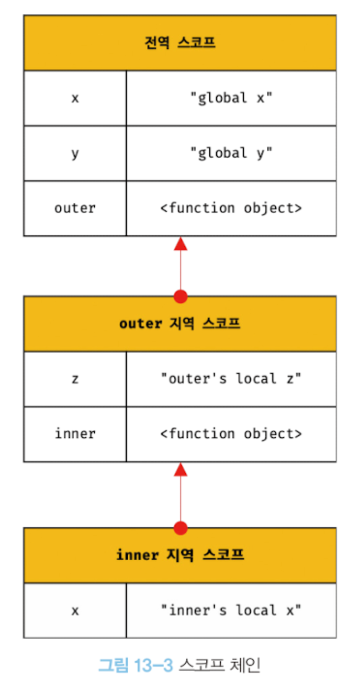

## 스코프란?

모든 식별자는 자신이 선언된 위치에 의해 다른 코드가 식별자 자신을 참조할 수 있는 유효 범위가 결정된다. 이를 스코프라 한다. 즉, 스코프는 식별자가 유효한 범위를 말한다.

js 엔진은 스코프를 통해 이름이 같은 두 개의 변수 중에서 어떤 변수를 참조해야 할 것인지 결정해야하는데, 이를 식별자 결정이라 한다.  
또한, 어떤 변수를 참조해야 할 것인지 결정한다. 따라서 스코프는 식별자를 검색할 때 사용하는 규칙이라고도 할 수 있다.

> **💡 렉시컬 환경과 실행 컨텍스트**
> 코드가 어디서 실행되며 주변에 어떤 코드가 있는지를 렉시컬 환경이라 한다.
> 코드의 문맥은 레시컬 환경으로 이루어져 있으며, 이를 구현한 것이 실행 컨텍스트다. 모든 코드는 실행 컨텍스트에서 평가되고 실행된다.

하나의 값은 유일한 식별자에 연결돼야 하므로 식별자인 변수 이름은 중복될 수 없다.  
파일 이름은 하나의 파일을 구별할 수 있는 식별자다. 식별자인 파일 이름을 중복해서 사용할 수 있는 이유는 폴더(디렉토리)라는 개념이 있기 때문이다.

파일처럼 프로그래밍 언어에서는 스코프를 통해 식별자 충돌을 방지하여 같은 이름의 변수를 사용할 수 있게 한다. 스코프 내에서는 식별자가 유일해야 하지만 다른 스코프에서는 같은 이름의 식별자를 사용할 수 있다.

> var 키워드로 선언된 변수는 같은 스코프 내에서 중복 선언이 허용되지만, 재할당되어 변경된다(두번째로 선언된 변수는 var 키워드가 없는 것처럼 동작한다)

<br/>

## 스코프의 종류

| 구분 | 설명                  | 스코프      | 변수      |
| ---- | --------------------- | ----------- | --------- |
| 전역 | 코드의 가장 바깥 영역 | 전역 스코프 | 전역 변수 |
| 지역 | 함수 몸체 내부        | 지역 스코프 | 지역 변수 |

<br/>

### 전역과 전역 스코프

전역이란 코드 가장 바깥 영역을 말하며, 전역에 변수를 선언하면 전역 스코프를 갖는 전역 변수가 된다. 전역 변수는 어디서든지 참조할 수 있다.

<br/>

### 지역과 지역 스코프

지역은 함수 몸체 내부를 말하며, 지역에 변수를 선언하면 지역 스코프를 갖는 지역 변수가 된다. 지역 변수는 자신의 지역 스코프와 하위 지역 스코프에서 유효하다.

<br/>

## 스코프 체인

함수 몸체 내부에서 함수가 정의된 것을 ‘함수의 중첩’이라고 한다.  
함수 몸체 내부에 정의된 함수를 ‘중첩 함수’, 중첩 함수를 포함하는 함수를 ‘외부 함수’라고 한다.

함수는 중첩될 수 있으므로 함수의 지역 스코프도 중첩이 될 수 있다. 이는 스코프가 함수의 중첩에 의해 계층적 구조를 가질 수 있다는 말이다.  
외부 함수의 지역 스코프는 중첩 함수의 상위 스코프라 한다.

  

<br/>

모든 지역 스코프의 최상위 스코프는 전역 스코프다. 이렇게 **스코프가 계층적으로 연결된 것을 스코프 체인**이라고 한다.

**변수를 참조할 때 js 엔진은 스코프 체인을 통해 변수를 참조하는 코드의 스코프에서 시작하여 상위 방향으로 이동하며 선언된 변수를 검색한다.**

> 스코프 체인은 물리적인 실체로 존재한다. js 엔진은 코드를 실행하기에 앞서 위 그림과 유사한 자료구조인 렉시컬 환경을 실제로 생성한다. 변수 선언이 실행되면 변수 식별자가 이 자료구조에 키로 등록되고, 변수 할당이 일어나면 이 자료구조의 변수 식별자에 해당하는 값을 변경한다.
> 전역 렉시컬 환경은 코드가 로드되면 곧바로 생성되고 함수의 렉시컬 환경은 함수가 호출되면 곧바로 생성된다.

<br/>

### 스코프 체인에 의한 변수 검색

js 엔진은 스코프 체인을 따라 변수를 참조하는 코드의 스코프에서 시작해서 상위 스코프 방향으로 이동하며 선언된 변수를 검색한다.

상위 스코프에서 유효한 변수는 하위 스코프에서 자유롭게 참조할 수 있지만 하위 스코프에서 유효한 변수를 상위 스코프에서 참조할 수 없다(상속과 유사)

<br/>

### 스코프 체인에 의한 함수 검색

함수도 식별자에 할당되기 때문에 스코프를 가진다.

<br/>

## 함수 레벨 스코프

- 블록 레벨 스코프: 모든 코드 블록(if, for 등)이 지역 스코프를 만든다
- 함수 레벨 스코프: 함수에 의해서만 지역 스코프를 만든다

<br/>

var 키워드로 선언된 변수는 오로지 함수의 코드 블록(함수 몸체)만을 지역 스코프로 인정한다. 전역에서 선언한 변수를 if, for문에 또 선언하면 재할당된다.

ES6에서 도입된 let, const는 블록 레벨 스코프를 지원한다.

<br/>

## 렉시컬 스코프

```jsx
var x = 1;

function foo() {
  var x = 10;
  bar();
}

function bar() {
  console.log(x);
}

foo(); // 1
bar(); // 1
```

위 실행 결과는 bar함수의 상위 스코프가 무엇인지에 따라 결정된다.

프로그래밍 언어는 일반적으로 아래 두 가지 방식 중 한 가지 방식으로 함수의 상위 스코프를 결정한다.

1. 함수를 어디서 호출했는지에 따라 함수의 상위 스코프를 결정(동적 스코프)  
   함수를 정의하는 시점에는 함수가 어디서 호출될 지 알 수 없고, 함수가 호출되는 시점에서 동적으로 상위 스코프를 결정된다.
2. 함수를 어디서 정의했는지에 따라 함수의 상위 스코프를 결정(렉시컬 스코프 & 정적 스코프)  
   함수 정의가 평가되는 시점에 상위 스코프가 정적으로 결정된다.

<br/>

**js는 렉시컬 스코프를 따르므로 함수를 어디서 정의했는지에 따라 상위 스코프를 결정된다. 함수가 호출된 위치는 상위 스코프 결정에 어떠한 영향을 주지 않는다. 즉, 함수의 상위 스코프는 언제나 자신이 정의된 스코프**다.

이처럼 함수의 상위 스코프는 함수 정의(함수 선언문 또는 함수 표현식)가 실행될 때 정적으로 결정된다. 함수 객체는 이렇게 결정된 상위 스코프를 기억한다.

따라서 위 코드에서 bar 함수 객체는 자신이 정의된 스코프, 즉 전역 스코프를 기억한다. 그리고 bar 함수가 호출되면 호출된 곳이 어디인지 관계없이 언제나 자신이 기억하고 있는 전역 스코프를 상위 스코프로 사용한다.
