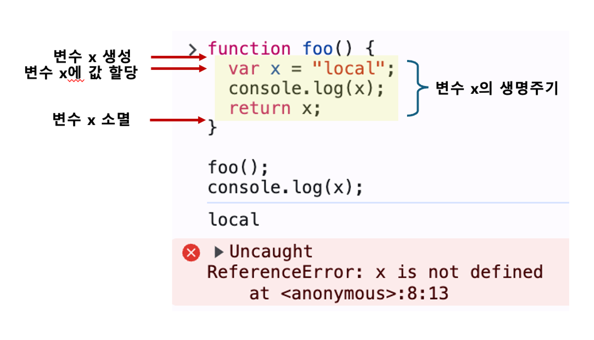
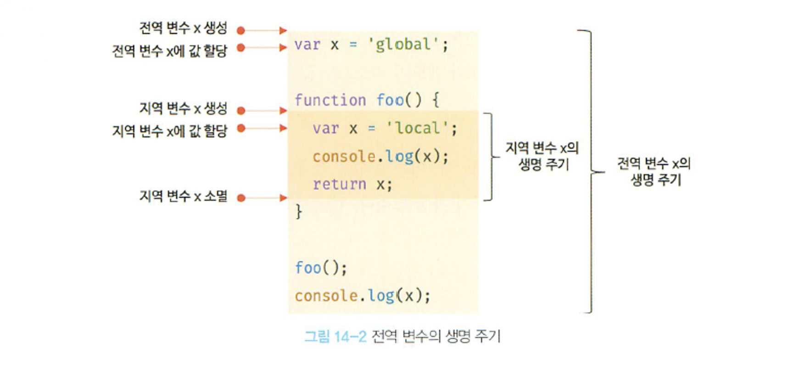

## 변수의 생명 주기

생명 주기란 생성되고 소멸되는 주기를 말한다. 생명 주기가 없다면 프로그램을 종료하지 않는한 영원히 메모리 공간을 점유하게 된다.

<br/>

### 지역 변수의 생명 주기

함수 내부에서 선언된 지역 변수는 함수가 호출되면 생성되고 함수가 종료하면 소멸한다.

<figure>
  
<figcaption>지역 변수의 생명 주기</figcaption>
</figure>
함수 내부에 선언된 지역 변수는 함수가 생성한 스코프에 등록된다.  
   
함수가 생성한 스코프는 렉시컬 환경이라 부르는 물리적 실체가 있으며, 변수는 자신이 등록된 스코프가 소멸(메모리 해제)될 때까지 유효하다. 일반적으로 함수가 종료하면 함수가 생성한 스코프도 소멸한다.

```jsx
var x = "global";

function foo() {
  console.log(x); // undefined
  var x = "local";
}

foo();
console.log(x); // global
```

호이스팅은 변수 선언이 스코프의 선두로 끌어 올려진 것 처럼 동작하는 js 고유 특징을 말한다. 호이스팅은 스코프 단위로 동작한다.

<br/>

### 전역 변수의 생명 주기

함수와 달리 전역코드는 코드가 로드되자마자 곧바로 해석되고 실행되며 더 이상 실행할 문이 없을 때 종료된다.  
var 키워드로 선언한 전역 변수는 전역 객체의 프로퍼티가 되며, 생명 주기는 전역 객체 생명 주기와 일치하다.

> **💡 전역 객체**  
> 코드가 실행되기 이전 단계에 js 엔진에 의해 어떤 객체보다도 먼저 생성되는 특수한 객체
>
> - 클라이언트 사이드 환경(브라우저): window 객체
> - 서버 사이드 환경(Node.js): global 객체
> - ES11에서는 globalThis로 통일 됨

  

<br/>

## 전역 변수의 문제점

### **암묵적 결합**

전역 변수를 선언한 의도는 전역에서 참조하고 할당할 수 있는 변수를 사용하겠다는 것이다. 이는 모든 코드가 전역 변수를 참조하고 변경할 수 있는 암묵적 결합을 허용한다는 말이다.

변수의 유효 범위가 클수록 코드의 가독성은 나빠지고 의도치 않게 상태가 변경될 수 있는 위험성도 높아진다.

<br/>

### **긴 생명 주기**

전역 변수는 생명 주기가 길으므로 메모리 리소스도 오랜 기간 소비한다. 또한 전역 변수의 상태를 변경할 수 있는 시간도 기고 기회도 많다.  
변수 이름이 중복될 가능성이 있고, 의도치 않은 재할당의 위험성도 있다.

<br/>

### **스코프 체인 상에서 종점이 존재**

전역 변수는 스코프 체인 상에서 종점에 존재하므로 검색 속도가 가장 느리다.

<br/>

### **네임 스페이스 오염**

js의 문제점 중 하나는 파일이 분리되어 있어도 하나의 전역 스코프를 공유한다는 것이다.  
다른 파일 내 동일한 이름으로 명명된 전역 변수나 전역 함수가 같은 스코프 내에 존재할 경우 예상치 못한 결과가 날 수 있다.

<br/>

## 전역 변수의 사용을 억제하는 방법

전역 변수를 반드시 사용해야 할 이유를 찾지 못한다면 지역 변수를 사용해야 한다. 변수의 스코프는 좁을수록 좋다.

<br/>

### 즉시 실행 함수

즉시 실행 함수는 함수 정의와 동시에 호출되며 단 한번만 호출 된다.  
모든 코드를 즉시 실행 함수로 감싸면 모든 변수는 즉시 실행 함수의 지역 변수가 된다.  
전역 변수를 생성하지 않으므로 라이브러리 등에 자주 사용된다.

```jsx
(function () {
  var foo = 10; // 즉시 실행 함수의 지역 변수
  // ...
})();

console.log(foo); // ReferenceError: foo is not defined
```

<br/>

### 네임스페이스 객체

전역에 네임스페이스 역할을 담당할 객체를 생성하고 전역 변수처럼 사용하고 싶은 변수를 프로퍼티로 추가하는 방법이다.

```jsx
var MYAPP = {}; // 전역 네임스페이스 객체

MYAPP.name = "Lee";

console.log(MYAPP.name); // Lee
```

네임스페이스를 분리해서 식별자 충돌을 방지하는 효과는 있으나 네임스페이스 객체 자체가 전역 변수에 할당되므로 그다지 유용해 보이지 않다.

<br/>

### 모듈 패턴

클래스를 모방해서 관련이 있는 변수와 함수를 모아 즉시 실행 함수로 감싸 하나의 모듈로 만든다.  
전역 변수의 억제는 물론 캡슐화까지 구현할 수 있다.

> 캡슐화는 객체의 상태를 나타내는 프로퍼티와 프로퍼티를 참조하고 조작할 수 있는 동작인 메서드를 하나로 묶는 것이다. 객체의 특정 프로퍼티나 메서드를 감출 목적으로 사용하기도 한다.(정보 은닉)

```jsx
var Counter = (function () {
  // private 변수
  var num = 0;

  // 외부로 공개할 데이터나 메서드를 프로퍼티로 추가한 객체를 반환한다.
  return {
    increase() {
      return ++num;
    },
    decrease() {
      return --num;
    },
  };
})();

// private 변수는 외부로 노출되지 않는다.
console.log(Counter.num); // undefined

console.log(Counter.increase()); // 1
console.log(Counter.increase()); // 2
console.log(Counter.decrease()); // 1
console.log(Counter.decrease()); // 0
```

위 예제의 즉시 실행 함수는 객체를 반환한다. 이 객체에는 외부에 노출하고 싶은 변수나 함수를 담아 반환한다.  
이때 반환되는 객체의 프로퍼티는 외부에 노출되는 퍼블릭 멤버다.

외부에 노출하고 싶지 않은 변수나 함수는 반환하는 객체에 추가하지 않으면 외부에서 접근할 수 없는 프라이빗 멤버가 된다.

<br/>

### ES6 모듈

ES6 모듈은 파일 자체의 독자적인 모듈 스코프를 제공한다.

script 태그에 type=”module” 어트리뷰트를 추가하면 로드된 js 파일은 모듈로서 동작한다. 이를 사용하지 않으면 분리된 자바스크립트 파일이 하나의 전역을 공유하게된다.

모듈 내에서 var 키워드로 선언한 변수는 더 이상 전역변수가 아니며 window객체의 프로퍼티도 아니다.

```jsx
<script type="module" src="lib.mjs"></script>
<script type="module" src="app.mjs"></script>
```

해당 기능을 사용해도 트랜스파일링이나 번들링이 필요하므로 아직까지는 Webpack 등의 모듈 번들러를 사용하는게 일반적이다.

[참고 링크](https://poiemaweb.com/es6-module)
