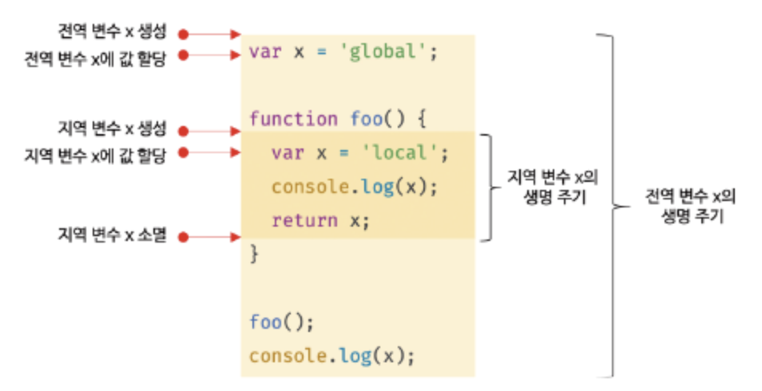

## 14.1 변수의 생명 주기

- 지역 변수의 생명 주기

  - 변수는 선언 의해 생성 → 할당으로 값 가짐 → 언젠가 소멸 = 생명 주기가 있음
  - 변수에 생명 주기가 없다면 영원히 메모리 공간을 차지하고 있을 것
  - 변수는 선언 위치에서 생성되고 소멸됨
  - 전역 변수의 생명 주기 === 애플리케이션 생명 주기
  - 함수 내부의 지역 변수는, 함수 호출 시 생성되고, 함수 종료 시 소멸됨

    ```jsx
    function foo() {
      var x = "local";
      console.log(x); // local
      return x;
    }

    foo();
    console.log(x); // ReferenceError: x is not defined
    ```

    - x는 foo 호출되기 전까지는 생성 X
    - 변수 호이스팅 원리에 따라, 변수의 위치 상관없이, 변수 선언은 “코드 한 줄씩 실행되는 런타임 이전에” 가장 먼저 실행됨
      - 이 말은 사실 전역 변수에 한정된 것
      - 함수 내부에서 선언한 변수는, 함수 호출 직후, 함수 “코드 한 줄씩 실행되기 이전에” 가장 먼저 실행됨
    - foo() 함수 호출 → 다른 코드 실행 이전에 x 변수 선언문이 가장 먼저 실행됨 → x가 일단 undefined로 초기화 → 순차적으로 다른 코드 진행됨 → 함수 종료 시 x 변수 소멸
      - 결론: 지역 변수의 생명 주기 === 함수의 생명 주기
        <br>

  - 함수 내부에서 선언된 지역 변수의 생명 주기는, 함수의 생명 주기와 대부분 일치, 근데 지역 변수가 함수보다 오래 생존하는 경우도 있음
    - 변수의 생명 주기: 메모리 공간 확보 시점부터, 메모리 공간 해제되고, 가용 메모리 풀에 반환되는 시점까지
    - 함수 내부에서 선언된 지역 변수는 함수가 생성한 스코프에 등록됨
    - 함수가 생성한 스코프는 “렉시컬 환경”으로 부르는 물리적 실체가 있음 → 변수는 자신의 스코프가 소멸(매모리 해제)될 때까지 유효 = 누군가 메모리 공간 참조하고 있으면 해제 X, 확보된 상태로 그대로 있게 되는 것, 스코프도 같은 원리(함수 종료 시 스코프 소멸)
  - 호이스팅은 스코프를 단위로 동작하게 됨 = “스코프의 선두”로 올려진 것처럼 동작하는 것

    ```jsx
    var x = "global";

    function foo() {
      console.log(x); // undefined, 전역 변수 아닌 지역 변수 x 참조해 출력
      var x = "local";
    }

    foo();
    console.log(x); // global
    ```

- 전역 변수의 생명 주기
  - 함수와 달리 전역 코드는 명시적 호출 없이 실행됨 = 함수 호출처럼 특별한 진입점 X, 코드 로드되자마자 해석하고 실행 O
  - 전역 변수의 생명 주기 === 전역 객체의 생명 주기
    - 전역 객체
      - 코드 실행 이전에 JS 엔진 의해 어떤 객체보다도 먼저 생성되는 특수 객체
      - 클라이언트 사이드 환경(브라우저)에서는 window, 서버 사이드 환경(Node.js)에서는 global 객체를 의미
      - 브라우저에서 var로 선언한 전역 변수는 전역 객체 window의 프로퍼티, var은 웹페이지 닫을 때까지 유효 → var 전역 변수 생명 주기 === 전역 객체 생성 주기
        <br>

<br>

## 14.2 전역 변수의 문제점

- 암묵적 결합
  - 전역 변수를 사용한다는 것 = 어디서든 참조/할당 가능한 변수 사용하겠다는 것 → 모든 코드가 전역 변수 참조하고 변경할 수 있는 “암묵적 결합”을 허용한다는 것
  - 코드 가독성 ↓ 위험성 ↑
- 긴 생명 주기
  - 전역 변수는 생명 주기가 김 → 메모리 리소스를 오랜 시간 소비
  - 전역 변수의 상태를 변경할 시간도 길고 기회도 많아지게 됨
  - var 키워드는 변수의 중복 선언을 허용 → 의도치 않은 재할당 가능성
  - 지역 변수는 생명 주기가 비교적 짧기 때문에, 전역 변수의 생명 주기가 길어서 생기는 문제 해결 가능
- 스코프 체인 상에서 종점에 존재
  - 전역 변수의 검색 속도가 가장 느릴 수 밖에 없음
- 네임스페이스 오염
  - JS의 가장 큰 문제점 중 하나는 파일이 분리되어 있더라도 하나의 전역 스코프를 공유한다는 것
  - 다른 파일 내에서 동일한 이름으로 명명된 전역 변수 or 전역 함수가, 같은 스코프 내에 존재할 경우, 예상치 못한 결과 발생 가능

<br>

## 14.3 전역 변수의 사용을 억제하는 방법

- 무분별한 전역 변수 사용은 위험, 지역 변수 사용을 권장 = 변수의 스코프는 좁을수록 좋음
- 즉시 실행 함수

  - 함수 정의와 동시에 호출되는 즉시 실행 함수는 단 한 번만 호출됨
  - 모든 코드를 즉시 실행 함수로 감싸면, 모든 변수가 즉시 실행 함수의 지역변수가 됨

    ```jsx
    (function () {
      var foo = 10; // 즉시 실행 함수의 지역 변수
      // ... 어쩌구저쩌구
    })();

    console.log(foo); // ReferenceError: foo is not defined
    ```

- 네임스페이스 객체

  - 전역에 네임스페이스 역할을 담당할 객체를 생성, 전역 변수처럼 사용하고 싶은 변수를 프로퍼티로 추가하는 방법
    ```jsx
    var MYAPP = {}; // 전역 네임스페이스 객체
    MYAPP.name = "Lee";
    console.log(MYAPP.name);
    ```
  - 네임스페이스 객체에 또 다른 네임스페이스 객체를 프로퍼티로 추가하는 방법도 있음 (계층적 구성)

    ```jsx
    var MYAPP = {};
    MYAPP.person = {
      name: "Lee",
      address: "Seoul",
    };

    console.log(MYAPP.person.name); // Lee
    ```

- 모듈 패턴
  - 클래스를 모방해서, 관련이 있는 변수/함수 모아, 즉시 실행 함수로 감싸고, 하나의 모듈을 만듦
  - 모듈 패턴은 클로저(JS의 강력한 기능)를 기반으로 동작
  - 전역 변수의 억제뿐만 아니라 캡슐화 구현까지 가능
    - 캡슐화
      - 객체의 상태를 나타내는 프로퍼티와, 프로퍼티를 참조하고 조작할 수 있는 동작인 메서드를 하나로 묶는 것
      - 객체의 특정 프로퍼티나 메서드를 감출 목적으로 사용하기도 함 → 정보 은닉
      - public, private, protected 같은 접근 제한자가 JS에는 없음, 그래서 정보 은닉을 위해 사용하기도 함
- ES6 모듈
  - ES6 모듈은 파일 자체의 독자적 모듈 스코프를 제공
  - 모듈 내에서 var로 선언해도 전역 변수 X, window 객체의 프로퍼티도 X
