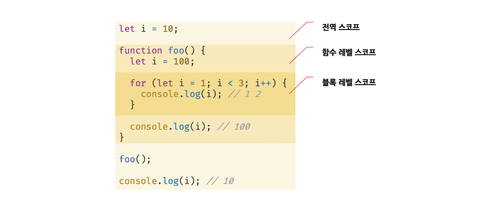
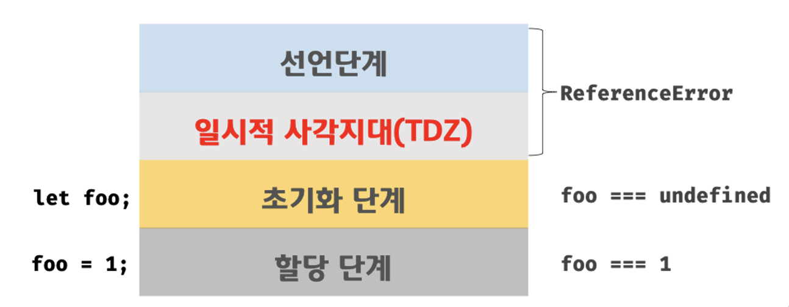

## var 키워드로 선언한 변수의 문제점

### 변수 중복 선언 허용

var 키워드로 선언한 변수는 중복 선언이 가능하다.

또한 초기화문 유무에 따라 다르게 동작하는데, 초기화 문이 있는 변수 선언문은 js 엔진에 의해 var 키워드가 없는 것처럼 동작하고 초기화 문이 없는 변수 선언문은 무시된다.

```jsx
var x = 1;
var y = 1;

var x = 100;
//초기화문이 없는 변수 선언문은 무시된다.
var y;
console.log(x); //100
console.log(y); //1
```

<br/>

### 함수 레벨 스코프

var 키워드로 선언한 변수는 함수의 코드 블록만을 지역 스코프로 인정한다.
따라서 함수 외부에서 var키워드로 선언한 변수 코드는 블록 내에서 선언해도 전역 변수가 된다.

```jsx
var x = 1;
if (true) {
  var x = 10;
}
console.log(x); //10
```

<br/>

### 변수 호이스팅

var 키워드로 변수를 선언하면 변수 호이스팅에 의해 변수 선언문 이전에 참조 가능하다. 단, 할당문 이전에 변수를 참조하면 undefined 반환한다.

```jsx
console.log(foo); // undefined

foo = 123;

console.log(foo); // 123

var foo;
```

<br/>

var 키워드의 단점을 보완하기 위해 ES6에서는 새로운 변수 선언 키워드인 let과 const를 도입했다.

## let 키워드

### 변수 중복 선언 금지

let 키워드로 이름이 같은 변수를 중복 선언하면 문법 에러 발생한다.

<br/>

### 블록 레벨 스코프

let 키워드로 선언한 변수는 모든 코드 블록을 지역 스코프로 인정한다.

```jsx
let foo = 1; // 전역 변수

{
  let foo = 2; // 지역 변수
  let bar = 3; // 지역 변수
}

console.log(foo); // 1
console.log(bar); // ReferenceError: bar is not defined
```

위 코드에서 전역 변수 foo와 지역 변수 foo는 별개의 변수다.

  

<br/>

### 변수 호이스팅

var 키워드로 선언한 변수는 런타임 이전에 js 엔진에 의해 암묵적으로 “선언 단계”와 “초기화 단계”가 한번에 진행된다.

  

let 키워드로 선언한 변수는 “선언 단계”와 “초기화 단계”가 분리되어 진행된다.

런타임 이전에 js 엔진에 의해 암묵적으로 선언 단계가 먼저 실행되지만 초기화 단계는 변수 선언문에 도달했을 때 실행된다. 따라서 초기화 단계가 실행되기 이전에 변수를 접근하려고하면 참조 에러가 발생한다.

스코프의 시작 지점부터 초기화 단계 시작 지점(변수 선언문)까지 변수를 참조할 수 없는데, 이 구간을 일시적 사각지대라고 부른다.

  

변수 호이스팅이 발생하지 않는 것처럼 보이지만 발생한다.

```jsx
let foo = 1; // 전역 변수

{
  console.log(foo); // ReferenceError: Cannot access 'foo' before initialization
  let foo = 2; // 지역 변수
}
```

위 예제에서 블록레벨 스코프에서 호이스팅이 발생했으므로 참조 에러가 발생하는 것이다.

<br/>

### 전역 객체와 let

var 키워드로 선언한 전역 변수와 전역 함수, 선언하지 않은 변수에 값을 할당한 암묵적 전역은 전역 객체 window의 프로퍼티가 된다. 전역 객체의 프로퍼티를 참조할 때 window 생략 가능하다.

```jsx
var x = 1;
y = 2;
function foo() {}

console.log(window.x); // 1
console.log(x); // 1

console.log(window.y); // 2
console.log(y); // 2

console.log(window.foo); // ƒ foo() {}
console.log(foo); // ƒ foo() {}
```

let 키워드로 선언한 전역 변수는 전역 객체의 프로퍼티가 아니다.
이는 보이지 않는 개념적인 블록 내에 존재한다.

```jsx
let x = 1;

console.log(window.x); // undefined
console.log(x); // 1
```

<br/>

## const 키워드

const 키워드는 주로 상수를 선언하기 위해 사용한다.

<br/>

### 선언과 초기화

const 키워드로 선언한 변수는 반드시 선언과 동시에 초기화해야 한다.
let 키워드처럼 블록 레벨 스코프를 가지며, 변수 호이스팅이 발생하지 않는 것처럼 동작한다.

<br/>

### 재할당 금지

const 키워드로 선언한 변수는 재할당이 금지된다.

<br/>

### 상수

상수는 재할당이 금지된 변수를 말한다.

상수로 정의하면 값의 의미를 쉽게 파악할 수 있고 고정값으로 사용할 수 있으며 유지보수성이 향상된다.

일반적으로 상수의 이름은 대문자로 선언해 상수임을 명확히 나타낸다. 여러 단어로 이뤄진 경우에는 언더스코어(\_)로 구분해서 스네이크 케이스로 표현한다.

```jsx
const TAX_RATE = 0.1;

let preTaxPrice = 100;
let afterTaxPrice = preTaxPrice + preTaxPrice * TAX_RATE;

console.log(afterTaxPrice);
```

<br/>

### const 키워드와 객체

const 키워드로 선언된 변수에 객체를 할당한 경우 값을 변경할 수 있다. 객체는 재할당 없이도 직접 변경이 가능하기 때문이다.

const 키워드는 재할당을 금지할 뿐 “불변”을 의미하지 않으므로 객체를 변경하는 것은 가능하다.

이때, 객체가 변경되더라도 변수에 할당한 참조 값은 변경되지 않는다.

<br/>

## var, let, const

- ES6을 사용한다면 var 키워드는 사용하지 않는다
- 재할당이 필요한 경우에 한정해 let 키워드를 사용한다. 이때 변수의 스코프는 최대한 좁게 만든다
- 변경이 발생하지 않고 읽기 전용으로 사용하는(재할당이 필요 없는 상수) 원시 값과 객체에는 const 키워드를 사용한다.

변수를 선언할 때는 일단 const 키워드를 사용하고, 반드시 재할당이 필요할 때 let키워드로 변경하는 것을 추천한다.
