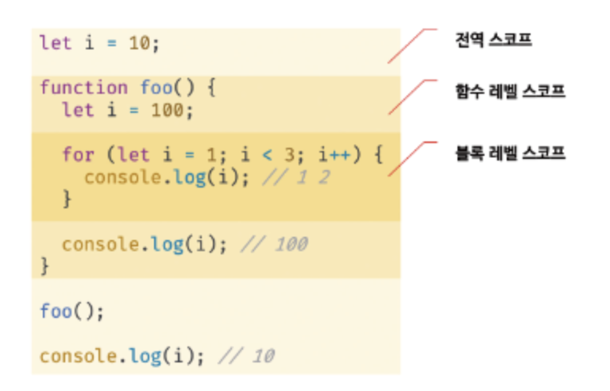
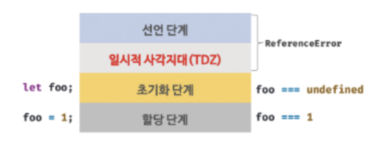

## 15.1 var 키워드로 선언한 변수의 문제점

- ES5까지는 변수 선언할 때 무조건 var 키워드 사용했었어야 했음
- var 키워드의 특징
  - 변수 중복 선언 허용: x라는 이름의 변수를 선언해놓고 또 선언할 수 있음 → 의도치 않은 값 변경 가능성
  - 함수 레벨 스코프: 함수 코드 블록만을 지역 스코프로 인정, 함수 외부에서 선언한 var은, 함수 코드 블록 내에서 선언해도 모두 전역 변수가 됨 (함수 내부에서 값 바꾸면, 함수 외부에서도 그 변수의 값이 바뀐다는 뜻)
  - 변수 호이스팅: 변수 선언문 이전에 변수를 참조하는 것은, 변수 호이스팅에 의해 에러 발생은 안 하지만, 프로그램 흐름상 안 맞고 가독성 떨어뜨림

<br>

## 15.2 let 키워드

- ES6에서 도입된 새로운 변수 선언 키워드 let, const
- let 키워드의 특징

  - 변수 중복 선언 금지: 동일한 이름의 변수를 중복 선언하면 문법 에러 발생
  - 블록 레벨 스코프: 모든 코드 블록(함수, if, for, while, try/catch 등)을 지역 스코프로 인정

    ```jsx
    let foo = 1; // 전역 변수

    {
      let foo = 2; // 지역 변수, 위에 있는 foo랑 전혀 다른 변수
      let bar = 3; // 지역 변수
    }

    console.log(foo); // 1
    console.log(bar); // ReferenceError
    ```

    <br>

    - 함수도 코드 블록이므로 스코프 만듦, 함수 내의 코드 블록은 함수 레벨 스코프에 중첩됨

  - 변수 호이스팅: var 키워드와는 달리 let 키워드는 변수 호이스팅이 발생하지 않(는 것처럼 보임)

    ```jsx
    console.log(foo); // ReferenceError
    let foo;
    ```

    - var 키워드로 선언한 변수는 런타임 이전에 JS 엔진 의해 선언과 초기화가 한 번에 진행됨
    - let 키워드로 선언한 변수는 선언과 초기화가 분리되어 진행됨
      - JS 엔진 의해 암묵적으로 선언 단계 먼저 실행, 초기화 단계는 변수 선언문 도착했을 때 실행됨
    - 일시적 사각지대(Temporal Dead Zone)

      - 스코프 시작 지점부터 초기화 시작 지점까지 변수를 참조할 수 없는 구간

        ```jsx
        // 런타임 이전에 선언 단계 진행
        // 아직 변수 초기화 안 됨
        // 초기화 이전의 일시적 사각지대에서는 변수 참조 불가능
        console.log(foo); // ReferenceError

        let foo; // 변수 선언 단계에서 초기화 실행
        console.log(foo); // undefined

        foo = 1; // 할당 단계 실행
        console.log(foo); // 1
        ```

        - let 키워드로 선언한 변수의 생명 주기
          <br>

    - ES6에서 도입된 let, const를 포함해 모든 선언(var, let, const, function, function\*, class 등)을 사실 호이스팅 함
      - ES6에서 도입된 let, const, class를 사용한 선언문은 호이스팅이 발생하지 않는 것”처럼” 동작 (?????)

<br>

## 15.3 const 키워드

- const는 상수 선언하기 위해 사용 (반드시 상수만을 위해 사용되는 건 아닌데 뒤에서 더 배움)
- let의 특징과 거의 비슷함, 아래 나오는 특징들은 let과 다른 점을 더 중심으로 상술
- 선언과 초기화
  - const 키워드로 선언한 변수는 선언과 동시에 “반드시” 초기화 해야 함 (ex. const foo = 1;)
  - let과 마찬가지로 블록 레벨 스코프, 변수 호이스팅 발생 안 하는 것처럼 동작
- 재할당 금지
  - const로 선언된 변수에 원시 값을 할당한 경우, 그 원시 값은 변경 불가능한 값
- 대문자 + 스네이크 케이스
  - 일반적으로 저렇게 명명함 (ex. const TAX_RATE = 0.1;)
- const 변수에 객체를 할당한 경우 값 변경 가능 (원시 값은 변경 안 되는 것과 차이점)

  - 재할당을 금지할 뿐 불변을 의미하는 것은 아님
  - 새로운 값 재할당은 안 되지만, 프로퍼티 값 변경을 통해 객체 변경은 가능

    ```jsx
    const person = {
      name: "Lee",
    };

    person.name = "Kim"; // 객체는 변경 가능한 값이기 때문

    console.log(person); // {name: 'Kim'}
    ```

<br>

## 15.4 var vs. let vs. const

- 변수 선언에는 기본적으로 const, 재할당 필요한 경우에 let 사용을 권장
- ES6 사용한다면 var 키워드 사용 안 하는 걸 권장
- 변수의 스코프는 최대한 좁게 만드는 걸 권장
