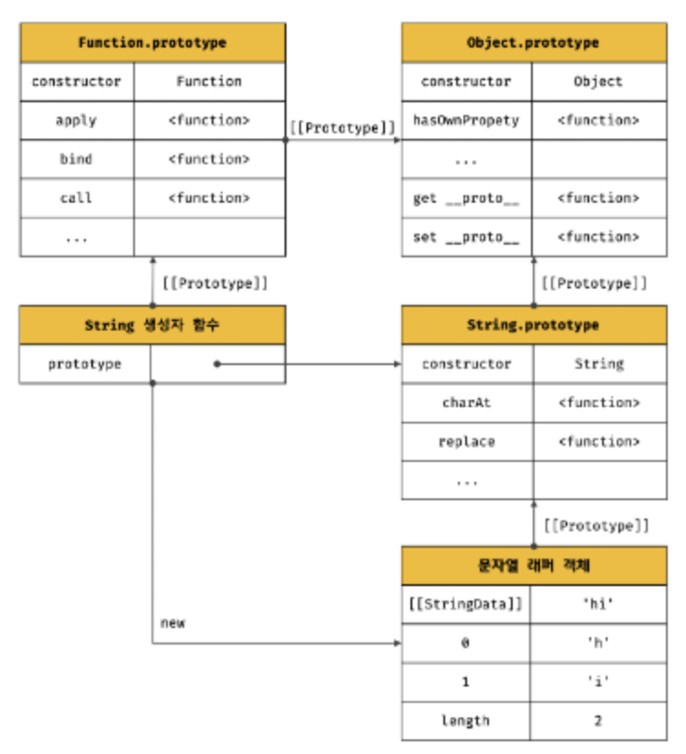

## 21.1 자바스크립트 객체의 분류

- 자바스크립트 객체
  - 표준 빌트인 객체
    - ECMAScript 사양에 정의된 객체 → JS 실행 환경(브라우저 또는 Node.js)과 관계없이 언제나 사용 가능
    - 애플리케이션 전역의 공통 기능을 제공
    - 전역 객체의 프로퍼티로서 제공됨 → 별도의 선언 없이 전역 변수처럼 언제나 참조 가능
  - 호스트 객체
    - ECMAScript 사양에 정의 X → JS 실행 환경에서 추가로 제공하는 객체
    - 브라우저 환경에서는 DOM, BOM, Canvas, XMLHttpRequest, fetch, requestAnimationFrame, SVG, Web Storage, Web Component, Web Worker와 같은 클라이언트 사이드 Web API를 호스트 객체로 제공
    - Node.js 환경에서는 Node.js 고유 API를 호스트 객체로 제공
  - 사용자 정의 객체
    - 표준 빌트인 객체, 호스트 객체처럼 기본 제공되는 객체 X
    - 사용자가 직접 정의한 객체

<br>

## 21.2 표준 빌트인 객체

- JS는 Object, String, Number, Boolean, Symbol, Function 등 40여 개의 표준 빌트인 객체를 제공
- Math, Reflect, JSON을 제외한 표준 빌트인 객체는 모두 인스턴스를 생성할 수 있는 생성자 함수 객체
- 생성자 함수인 표준 빌트인 객체: 프로토타입 메서드, 정적 메서드 제공
- 생성자 함수가 아닌 표준 빌트인 객체: 정적 메서드 제공
- 표준 빌트인 객체 예시 - String, Number, Boolean, Function, Array, Date…

  - 생성자 함수로 호출하여 인스턴스 생성

    ```jsx
    // String 생성자 함수로 String 객체 생성
    const strObj = new String("Lee"); // String {"Lee"}
    console.log(typeof strObj); // object

    // Number
    const numObj = new Number(123); // Number {123}
    console.log(typeof numObj); // object

    // Function
    const func = new Function("x", "return x * x"); // f anonymous(x )
    console.log(typeof func); // function

    // Date
    const date = new Date();
    console.log(typeof date); // object

    // RegExp 생성자 함수 의한 RegExp 객체(정규 표현식) 생성
    const regExp = new regExp(/ab+c/i); // /ab+c/i
    console.log(typeof regExp); // object
    ```

- 생성자 함수인 표준 빌트인 객체가 생성한 인스턴스의 프로토타입은, 표준 빌트인 객체의 프로토타입 프로퍼티에 바인딩된 객체

  - ex) 표준 빌트인 객체 String을, 생성자 함수로서 호출해 생성한 String 인스턴스의 프로토타입은 String.prototype

    ```jsx
    const strObj = new String("Lee");

    console.log(Object.getPrototypeOf(strObj) === String.prototype); // true
    ```

  - 이러한 객체는 다양한 기능의 빌트인 프로토타입 메서드 제공, 표준 빌트인 객체는 인스턴스 없이도 호출 가능한 빌트인 정적 메서드 제공

    ```jsx
    // Number 생성자 함수 의한 Number 객체 생성
    const numObj = new Number(1.5); // Number {1.5}

    // toFixed는 Number.prototype의 프로토타입 메서드
    // Number.prototype.toFixed는 소수점 자리 반올림 해서 문자열로 반환
    console.log(numObj.toFixed()); // 2

    // isInteger는 Number의 정적 메서드
    // Number.isInteger는 인수가 정수인지 검사해 그 결과를 반환
    console.log(Number.isInteger(0.5)); // false
    ```

<br>

## 21.3 원시값과 래퍼 객체

- 문자열/숫자/불리언 등의 원시값 있는데도 String/Number/Boolean 등의 표준 빌트인 생성자 함수가 존재하는 이유

  - 원시값은 객체 X → 프로퍼티나 메서드 가질 수 없음, 근데 객체처럼 동작하기도 함

    ```jsx
    const str = "hello";

    // 원시 타입인 문자열이 프로퍼티와 메서드 가진 객체처럼 동작
    console.log(str.length); // 5
    console.log(str.toUpperCase()); // HELLO
    ```

  - JS 엔진이 원시값을 객체처럼 사용하기 위해 암묵적으로 연관 객체를 생성
    - 여기서 이 연관 객체를 “래퍼 객체”라고 부름
    - 래퍼 객체: 문자/숫자/불리언 값에 대해 객체처럼 접근해서 생성되는 임시 객체
  - 이를 통해 프로퍼티 접근 or 메서드 호출하고 다시 원시값으로 되돌림
  - ex) 문자열 대해 마침표 표기법으로 접근: 래퍼 객체인 String 생성자 함수의 인스턴스가 생성됨 → 문자열은 래퍼 객체의 [[StringData]] 내부 슬롯에 할당 → 래퍼 객체 처리 종료 시 원시값으로 되돌리고, 래퍼 객체는 가비지 컬렉션 대상이 됨

    ```jsx
    const str = "hi";

    // 원시 타입인 문자열이 래퍼 객체인 String 인스턴스로 변환됨
    console.log(str.length); // 2
    console.log(str.toUpperCase()); // HI

    // 래퍼 객체로 프로퍼티에 접근하거나 메서드 호출 후 다시 원시값으로 되돌림
    console.log(typeof str); // string

    // 문자열 래퍼 객체인 String 생성자 함수의 인스턴스는 String.prototype의 메서드 상속받아 사용 가능

    // 1) 식별자 str은 문자열인 값 가짐
    const str = "hello";

    // 2) 식별자 str은 암묵적으로 생성된 래퍼 객체를 가리킴
    // 'hello'는 래퍼 객체의 [[StringData]] 내부 슬롯에 할당됨
    // 래퍼 객체에 name 프로퍼티가 동적 추가됨
    str.name = "Lee";

    // 3) 식별자 str은 다시 원래 문자열, 즉 래퍼 객체의 [[StringData]] 내부 슬롯에 할당된 원시값 가짐
    // 2단계에서 생성된 래퍼 객체는 아무도 참조하기 않고 있으므로 가비지 컬렉션 대상이 됨

    // 4) 식별자 str은 새롭게 암묵적으로 생성된(2단계에서 생성된 래퍼 객체랑 다른) 래퍼 객체를 가리킴
    // 새롭게 생성된 래퍼 객체에는 name 프로퍼티 존재하지 않음
    console.log(str.name); // undefined

    // 5) str이 다시 래퍼 객체의 원시값 갖게 됨
    // 4단계에서 생성된 래퍼 객체는 아무도 참조하기 않고 있으므로 가비지 컬렉션 대상이 됨
    console.log(typeof str, str); // string hello
    ```

- 문자열 래퍼 객체의 프로토타입 체인
  <br>
- 지금까지 문자열 값에 대해 알아봤는데 숫자 값도 마찬가지로 동작
- 불리언도 마찬가지이긴 한데, 불리언 값으로 메서드 호출하는 경우는 없어서 유용하진 않음
- 심벌도 래퍼 객체를 생성, 근데 Symbol 함수 통해 생성해야 하므로 다른 원시값과는 차이 있음
- 결론
  - 문자열/숫자/불리언/심벌은 암묵적으로 생성되는 래퍼 객체 의해 객체처럼 사용 가능
  - 표준 빌트인 객체인 String, Number, Boolean 생성자 함수를 new 연산자와 함께 호출해서 인스턴스 생성할 필요 X 권장 X (Symbol은 생성자 함수 아니니 논외)

<br>

## 21.4 전역 객체

- 전역 객체는 코드 실행 이전 단계에 JS 엔진 의해 어떤 객체보다도 먼저 생성되는 특수 객체 (어떤 객체에도 속하지 않은 최상위 객체)
- 전역 객체는 JS 환경 따라 지칭하는 이름이 제각각
  - 브라우저: window(or self or this or frames)
  - Node.js: global
  - globalThis
    - E11에서 도입된, 브라우저/Node.js 환경에서 공통적으로 전역 객체를 가리킬 때 사용할 수 있는 식별자, 이름 제각각이던 문제 해결(통일됨)
      ```jsx
      // 브라우저 환경, 모두 true
      globalThis === window;
      globalThis === self;
      globalThis === this;
      globalThis === frames;

      // Node.js 환경, 모두 true
      globalThis === global;
      globalThis === this;
      ```
- 전역 객체는 표준 빌트인 객체(Object, String, Number, Function, Array 등)와 환경에 따른 호스트 객체(클라이언트 Web API 또는 Node.js의 호스트 API), var 키워드로 선언한 전역 변수와 전역 함수를 프로퍼티로 가짐
- 전역 객체의 특징
  - 전역 객체는 개발자가 의도적으로 생성할 수 X, 전역 객체 생성자 함수 제공 X
  - 전역 객체의 프로퍼티 참조할 때 window 또는 global 생략 가능
  - 전역 객체는 Object, String, Number, Boolean, Function, Array, RegExp, Date, Math, Promise 같은 모든 표준 필트인 객체를 프로퍼티로 가짐
  - JS 실행 환경 따라 추가적으로 프로퍼티와 메서드 가짐
  - var 키워드로 선언한 전역 변수, 선언하지 않은 변수에 값을 할당한 암묵적 전역, 전역 함수는, 전역 객체의 프로퍼티가 됨
  - let/const 키워드로 선언한 전역 변수는 전역 객체의 프로퍼티 X → window.foo 이렇게 접근 불가능, 이렇게 선언한 전역 변수는 개념적인 블록 안에 존재하게 됨
  - 브라우저 환경의 모든 JS 코드는 하나의 전역 객체 window를 공유
- 빌트인 전역 프로퍼티
  - 전역 객체의 프로퍼티를 의미, 애플리케이션 전역에서 사용
  - Infinity: Infinity 프로퍼티는 무한대를 나타내는 숫자값 Infinity를 가짐
  - NaN: NaN 프로퍼티는 숫자가 아님을 나타내는 숫자값 NaN을 가짐, Number.NaN 프로퍼티와 같음
  - undefined: undefined 프로퍼티는 원시 타입 undefined를 값으로 가짐
- 빌트인 전역 함수
  - 애플리케이션 전역에서 호출할 수 있는 빌트인 함수, 전역 객체의 메서드
  - eval
    - JS 코드를 나타내는 문자열을 인수로 전달받음
    - 전달받은 문자열 코드가 표현식이라면, eval 함수는 문자열 코드를 런타임에 평가하여 값을 생성
    - 전달받은 인수가 표현식 아닌 문이라면, eval 함수는 문자열 코드를 런타임에 실헹
    - 문자열 코드가 여러 개의 문으로 이루어져 있다면, 모든 문을 실행
    - eval 함수는 기존의 스코프를 런타임에 동적으로 수정
    - eval 함수 통해 실행되는 코드는 JS 엔진에 의해 최적화 수행 X, 일반적인 코드 실행에 비해 처리 속도 느림, 가급적 사용 X
  - isFinite
    - 전달받은 인수가 정상적인 유한수인지 검사하고, 유한수이면 true, 무한수이면 false를 반환
    - 전달받은 인수 타입이 숫자가 아닌 경우, 숫자로 타입 변환 후 검사를 수행
    - 인수가 NaN으로 평가되는 값이라면 false를 반환
  - isNaN
    - 전달받은 인수가 NaN인지 검사해 그 결과를 불리언 타입으로 반환
    - 전달받은 인수의 타입이 숫자가 아닌 경우, 숫자로 타입 변환 후 검사 수행
  - parseFloat
    - 전달받은 문자열 인수를 부동 소수점 숫자, 즉 실수로 해석해 반환
  - parseInt
    - 전달받은 문자열 인수를 정수로 해석해 반환
    - 전달받은 인수가 문자열 아닌 경우, 문자열로 변환 후 정수로 해석해 반환
  - encodeURI / decodeURI
    - encodeURI 함수는 완전한 URI를 문자열로 전달받아 이스케이프 처리를 위해 인코딩
      - URI: 인터넷에 있는 자원을 나타내는 유일한 주소 (하위 개념 URL, URN)
        - URL은 아스키 문자 셋으로만 구성되어야 함
        - 특수 문자의 경우 URL 포함 불가능
      - 인코딩: URI의 문자들을 이스케이프 처리 하는 것
    - decodeURI 함수는 인코딩된 URI를 인수로 전달받아 이스케이프 처리 이전으로 디코딩
  - encodeURIComponent / decodeURIComponent
    - encodeURIComponent 함수는 URI 구성 요소를 인수로 전달받아 인코딩
    - decodeURIComponent 함수는 매개변수로 전달된 URI 구성 요소를 디코딩
- 암묵적 전역
  - 마치 전역 변수처럼 동작하는 것
    ```jsx
    var x = 10; // 전역 변수

    function foo() {
      y = 20; // 선언하지 않은 식별자에 값을 할당, window.y = 20;
    }

    foo();

    // 선언하지 않은 식별자 y를 전역에서 참조할 수 있음
    console.log(x + y); // 30
    ```
    - y는 선언 안 한 식별자인데도 참조 에러 안 났음
    - 선언 안 한 식별자에 값을 할당하면 전역 객체의 프로퍼티가 되기 때문
    - foo 함수 호출 시 JS 엔진이 y 변수에 값 할당 위해, 먼저 스코프 체인 통해 선언된 변수인지 확인함
    - foo 함수 스코프와 전역 스코프 어디에서도 y 변수 선언을 찾을 수 없으면 참조 에러 발생
    - JS 엔진이 y = 20을 window.y = 20으로 해석, 전역 객체에 프로퍼티 를 동적 생성
    - y는 단지 전역 객체의 프로퍼티로”만” 추가된 것, y는 변수 아님, 변수 호이스팅 X
    - y는 delete 연산자로 삭제 가능 (전역 변수가 아니니까)
