# 실행 컨텍스트

실행 컨텍스트는 자바스크립트의 동작 원리를 담고 있는 핵심 개념이다. 실행 컨텍스트를 이해하면 자바스크립트의 다음과 같은 특징을 이해할 수 있다.

- 자바스크립트가 스코프를 기반으로 식별자와 식별자에 바인딩된 값을 관리하는 방식
- 호이스팅이 발생하는 이유
- 클로저의 동작 방식
- 태스트 큐와 함께 동작하는 이벤트 핸들러
- 비동기 처리 동작 방식

<br/>

# **소스코드의 타입**

ECMAScript 사양은 소스코드를 4가지 타입으로 구분한다. 4가지 타입의 소스코드는 실행 컨텍스트를 생성한다.

| 소스코드의 타입 | 설명                                                                                                      |
| --------------- | --------------------------------------------------------------------------------------------------------- |
| 전역 코드       | 전역에 존재하는 소스코드를 말한다. 전역에 정의된 함수, 클래스 등의 내부 코드는 포함되지 않는다.           |
| 함수 코드       | 함수 내부에 존재하는 소스코드를 말한다. 함수 내부에 중첩된 함수, 클래스 등의 내부 코드는 포함되지 않는다. |
| eval 코드       | 빌트인 전역 함수인 eval 함수에 인수로 전달되어 실행되는 소스코드를 말한다.                                |
| 모듈 코드       | 모듈 내부에 존재하는 소스코드를 말한다. 모듈 내부의 함수, 클래스 등의 내부 코드는 포함되지 않는다.        |

<br/>

# **소스코드의 평가와 실행**

자바스크립트 엔진은 소스코드를 2개의 과정, **소스코드의 평가**와 **소스코드의 실행 과정**으로 나누어 처리한다.

```jsx
var x;
x = 1;
```

<br/>

### **소스코드의 평가**

- 변수 선언문 var x; 실행
- 이때 생성된 변수 식별자 x 는 실행 컨텍스트가 관리하는 스코프에 등록되고 undefined 로 초기화

<br/>

### **소스코드의 실행(런타임)**

- 이때 x 변수에 값을 할당하기 전에 실행 컨텍스트가 관리하는 스코프에 x 변수가 등록되어 있는지 확인
- x 변수가 실행 컨텍스트가 관리하는 스코프에 등록되어 있다면 변수 할당문 x = 1; 실행
- 할당된 결과를 실행 컨텍스트에 등록하여 관리

<br/>

# **실행 컨텍스트의 역할**

소스코드를 실행하는 데 필요한 환경을 제공하고 코드의 실행 결과를 실제로 관리하는 영역으로 식별자를 등록하고 관리하는 스코프와 코드 실행 순서 관리를 구현한 내부 매커니즘이다.

```jsx
// 전역 변수 선언
const x = 1;
const y = 2;

// 함수 정의
function foo(a) {
  // 지역 변수 선언
  const x = 10;
  const y = 20;

  // 메서드 호출
  console.log(a + x + y); // 130
}

// 함수 호출
foo(100);

// 메서드 호출
console.log(x + y);
```

위 예제 코드에서 자바스크립트 엔진이 전역 코드와 함수 코드를 평가하고 실행하는 방식은 다음과 같다.

1. 전역 코드 평가
   - 소스코드 평가 과정에서는 선언문만 먼저 실행한다.
   - 따라서 전역 코드의 변수 선언문과 함수 선언문이 먼저 실행되고, **전역 변수와 전역 함수**가 **실행 컨텍스트가 관리하는 전역 스코프에 등록**됨
   - 이때 **var 키워드로 선언된 전역 변수와 함수 선언문으로 정의된 전역 함수**는 **전역 객체의 프로퍼티와 메서드**가 됨
2. 전역 코드 실행
   - 전역 코드가 순차적으로 실행되면서 전역 변수에 값이 할당되고 함수가 호출됨
   - 함수가 호출되면 전역 코드의 실행을 일시 중단하고 함수 내부로 진입함
3. 함수 코드 평가
   - **매개변수와 지역 변수**, 함수 내부에서 지역 변수처럼 사용할 수 있는 **arguments 객체**가 **실행 컨텍스트가 관리하는 지역 스코프에 등록**되고 **this 바인딩**이 결정됨
4. 함수 코드 실행
   - 매개변수와 지역 변수에 값이 할당됨
   - 함수 코드 내부에서 **console.log 메서드를 호출**하면, **식별자인 console을 스코프 체인을 통해 검색**함
   - 이를 위해 **함수 코드의 지역 스코프는 상위 스코프인 전역 스코프와 연결되어야 함**
   - 하지만 console 식별자는 스코프 체인에 등록되어 있지 않고 전역 객체에 프로퍼티로 존재함
   - 이는 **전역 객체의 프로퍼티**가 마치 전역 변수처럼 **전역 스코프를 통해 검색 가능해야 한다**는 것의 의미함
   - console.log 메서드의 실행이 종료되고 이후 함수 코드 실행 과정도 종료됨
5. 전역 코드 실행 계속

코드가 실행되려면 위와 같이 스코프, 식별자, 코드 실행 순서 등의 관리가 필요하다.

- 선언에 의해 생성된 모든 **식별자(변수, 함수, 클래스 등)을 스코프에 구분하여 등록**하고 **상태 변화(식별자에 바인딩된 값의 변화)를 지속적으로 관리**할 수 있어야 한다.
- 스코프는 중첩 관계에 의해 **스코프 체인**을 형성해야 한다. 즉, 스코프 체인을 통해 상위 스코프로 이동하여 **식별자를 검색**할 수 있어야 한다.
- 현재 실행 중인 코드의 실행 순서를 변경(함수 호출에 의한 실행 순서 변경 등)할 수 있어야 하며 되돌아갈 수도 있어야 한다. 즉 **현재 실행 중인 코드와 이전에 실행하던 코드를 구분하여 관리**해야 한다.

이 모든 것을 관리하는 것이 바로 **실행 컨텍스트**이다.

실행 컨텍스트는 **식별자(변수, 함수, 클래스 등의 이름)을 등록하고 관리**하는 스코프와 **코드 실행 순서 관리**를 구현한 내부 메커니즘으로, 모든 코드는 실행 컨텍스트를 통해 실행되고 관리된다.

식별자와 스코프는 실행 컨텍스트의 **렉시컬 환경**으로 관리하고 코드 실행 순서는 **실행 컨텍스트 스택**으로 관리한다.

<br/>

# **실행 컨텍스트 스택**

```jsx
const x = 1;

function foo() {
  const y = 2;

  function bar() {
    const z = 3;
    console.log(x + y + z);
  }
  bar();
}

foo();
```

  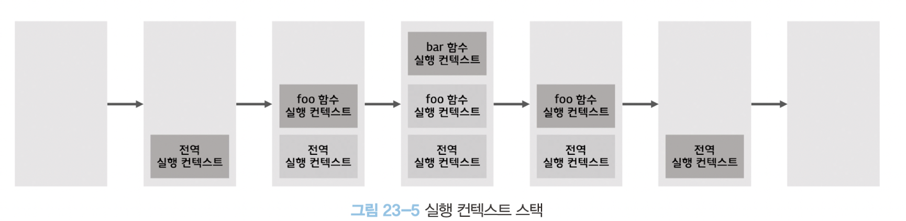

1. 전역 코드의 평가와 실행

   전역 코드를 평가하여 **전역 실행 컨텍스트를 생성**하고 **실행 컨텍스트 스택에 push**함

   전역 변수와 전역 함수가 전역 실행 컨텍스트에 등록됨

   이후 전역 코드가 실행되기 시작하여 전역 변수에 값이 할당되고 전역 함수가 호출됨

2. 전역 함수 코드의 평가와 실행

   전역 함수가 호출되면 전역 코드의 실행은 일시 중단되고 코드의 제어권control이 함수 내부로 이동함

   자바스크립트 엔진은 함수 내부의 함수 코드를 평가하여 **함수 실행 컨텍스트를 생성**하고 **실행 컨텍스트 스택에 push**함

   함수의 지역 변수와 중첩 함수가 함수 실행 컨텍스트에 등록됨

   이후 함수 코드가 실행되기 시작하여 지역 변수에 값이 할당되고 중첩 함수가 호출됨

3. 중첩 함수 코드의 평가와 실행

   중첩 함수가 호출되면 이전 함수 코드의 실행은 일시 중단되고 코드의 제어권이 중첩 함수 내부로 이동함

   자바스크립트 엔진은 중첩 함수 내부의 함수 코드를 평가하여 **중첩 함수 실행 컨텍스트를 생성**하고 **실행 컨텍스트 스택에 push**함

   중첩 함수의 지역 변수가 함수 실행 컨텍스트에 등록됨

   이후 함수 코드가 실행되기 시작하여 지역 변수에 값이 할당되고, 더 이상 실행할 코드가 없으면 종료됨

4. 함수 코드로 복귀

   중첩 함수가 종료되면 코드의 제어권은 다시 이전 함수로 이동함

   이때 자바스크립트 엔진은 **중첩 함수 실행 컨텍스트를 실행 컨텍스트 스택에서 pop**함

   함수에 더 이상 실행할 코드가 없으면 종료됨

5. 전역 코드로 복귀

   함수가 종료되고 코드의 제어권은 다시 전역 코드로 이동함

   이때 자바스크립트 엔진은 **함수 실행 컨텍스트를 실행 컨텍스트 스택에서 pop**함

   더 이상 실행할 전역 코드가 없으면 **전역 실행 컨텍스트도 실행 컨텍스트 스택에서 pop**되어 실행 컨텍스트 스택이 비어있게 됨

이처럼 **실행 컨텍스트 스택은 코드의 실행 순서를 관리**한다.

실행 컨텍스트 스택의 최상위에 존재하는 실행 컨텍스트는 언제나 현재 실행 중인 코드의 실행 컨텍스트이다. 따라서 이를 실행 중인 실행 컨텍스트라 부른다.

<br/>

# **렉시컬 환경**

렉시컬 환경은 **식별자와 식별자에 바인딩된 값, 그리고 상위 스코프에 대한 참조**를 기록하는 자료구조로 실행 컨텍스트를 구성하는 컴포넌트다.

실행 컨텍스트 스택이 코드의 실행 순서를 관리한다면 **렉시컬 환경은 스코프와 식별자를 관리**한다.

  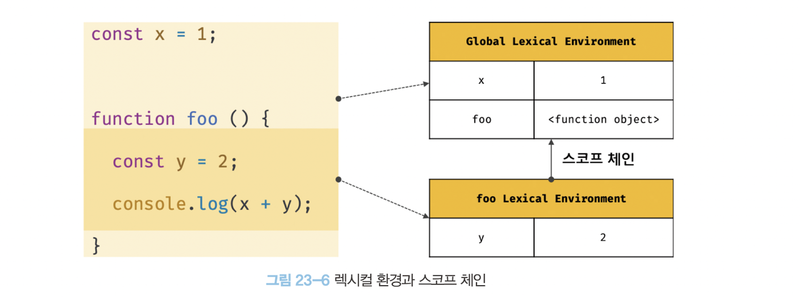

렉시컬 환경은 **키와 값을 갖는 객체 형태의 스코프(전역, 함수, 블록 스코프)를 생성**하여 **식별자를 키로 등록**하고 **식별자에 바인딩된 값을 관리**한다.

즉, 렉시컬 환경은 **스코프를 구분하여 식별자를 등록하고 관리하는 저장소 역할**을 하는 렉시컬 스코프의 실체다.

실행 컨텍스트는 LexicalEnvironment 컴포넌트와 VariableEnvironment 컴포넌트로 구성된다.

  

<br/>

### **환경 레코드(Environment Record)**

스코프에 포한된 식별자를 등록하고 등록된 식별자에 바인딩된 값을 관리하는 저장소다.

환경 레코드는 소스코드의 타입에 따라 관리하는 내용에 차이가 있다.

<br/>

### **외부 렉시컬 환경에 대한 참조(Environment Record)**

외부 렉시컬 환경에 대한 참조는 **상위 스코프를 가리킨다.**

이때 상위 스코프란 욉 렉시컬 환결, 즉 해당 실행 컨텍스트를 생성한 소스코드를 포함하는 상위 코드의 렉시컬 환경을 말한다.

외부 렉시컬 환결에 대한 참조를 총해 단방향 링크드 리스트 스코프 체인을 구현한다.

<br/>

# **실행 컨텍스트의 생성과 식별자 검색 과정**

```jsx
// 전역 변수 선언
const x = 1;

// 함수 정의
function foo(a) {
  // 지역 변수 선언
  const x = 10;

  // 메서드 호출
  console.log(a + x); // 110
}

// 함수 호출
foo(100);

// 메서드 호출
console.log(x); // 1
```

<br/>

## **전역 객체 생성**

전역 객체는 전역 코드가 평가되기 이전에 생성된다.

이때, 전역 객체에는 **빌트인 전역 프로퍼티**와 **빌트인 전역 함수**, 그리고 **표준 빌트인 객체**가 추가되며 동작환경(클라이언트 사이드 또는 서버 사이드)에 따라 **클라이언트 사이드 Web API또는 특정 환경을 위한 호스트 객체를 포함**한다.

<br/>

## **전역 코드 평가**

소스코드가 로드되면 자바스크립트 엔진은 전역 코드를 평가한다.

전역 코드 평가는 다음과 같은 순서로 진행된다.

1. 전역 실행 컨텍스트 생성
2. 전역 렉시컬 환경 생성
   2.1 전역 환경 레코드 생성
   2.1.1 객체 환경 레코드 생성
   2.1.2. 선언적 환경 레코드 생성
   2.2 this 바인딩
   2.3 외부 렉시컬 환경에 대한 참조 결정

전역 실행 컨텍스트의 렉시컬 환경은 다음과 같이 생성된다.

  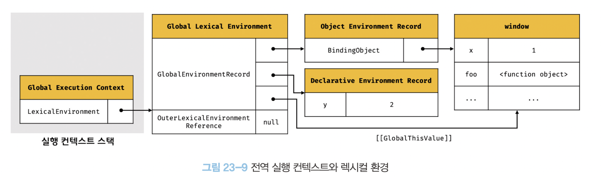

<br/>

### 1. 전역 실행 컨텍스트 생성

  

비어있는 전역 실행 컨텍스트를 실행 컨텍스트 스택에 push한다.

전역 실행 컨텍스트가 실행 중인 실행 컨텍스트running execution context가 된다.

<br/>

### 2. 전역 렉시컬 환경 생성

  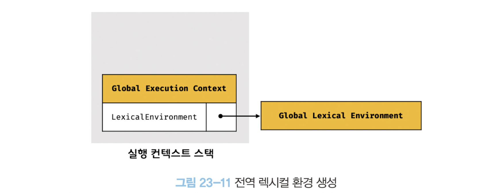

전역 렉시컬 환경을 생성하고 전역 실행 컨텍스트에 바인딩한다.

렉시컬환경은 환경 레코드와 외부 렉시컬 환경에 대한 참조로 구성된다.

> 렉시컬 환경: 스코프 + 식별자

<br/>

### 2.1. 전역 환경 레코드 생성

전역 레코드 환경을 구성하는 컴포넌트인 전역 환경 레코드는 전역 변수를 관리하는 전역 스코프, 전역 객체의 빌트인 전역 프로퍼티와 빌트인 전역 함수, 표준 빌트인 객체를 제공한다.

전역 환경 레코드는 객체 환경 레코드, 선언적 환경 레코드로 구성되어 있다.

**객체 환경 레코드는** 기존의 전역 객체가 관리하던 var 키워드로 선언한 전역 변수롸 함수 선언문으로 정의한 전역함수, 빌트인 전역 프로퍼티와 빌트인 전역 함수, 표준 빌트인 객체를 관리하고,
**선언적 환경 레코드는** let, const 키워드로 선언한 전역 변수를 관리한다.

<br/>

### 2.1.1. 객체 환경 레코드 생성

전역 환경 레코드를 구성하는 컴포넌트인 객체 환경 레코드는 **BindingObject**라고 부르는 객체와 연결된다. BindingObject는 전역 객체 생성 과정에서 생성된 **전역 객체**다.

var 키워드로 선언한 전역 변수와 함수 선언문으로 정의된 전역 함수는 이 과정을 통해 전역 객체의 프로퍼티와 메서드가 된다.

  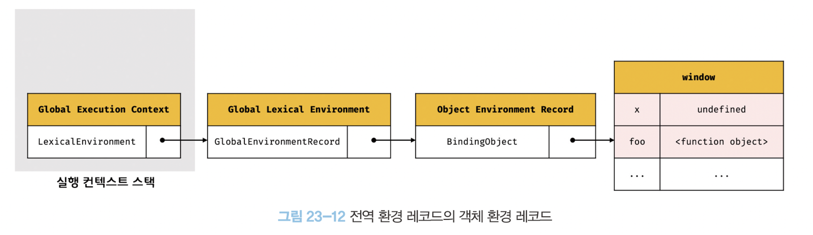

**var 키워드로 선언한 변수**는 전역 코드 평가 시점에 객체 환경 레코드에 바인딩된 **BindingObject를 통해 전역 객체에 변수 식별자를 키로 등록**한 다음, **암묵적으로 undefined를 바인딩**한다. 이것이 **변수 호이스팅**이 발생하는 원인이다.

**함수 선언문으로 정의한 함수**는 식별자를 객체 환경 레코드에 바인딩된 **BindingObject를 통해 전역 객체에 키로 등록**하고 **생성된 함수 객체를 즉시 할당**한다. 이것이 변수 호이스팅과 **함수 호이스팅**의 차이다.

<br/>

### 2.1.2. 선언적 환경 레코드 생성

  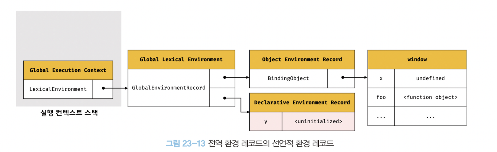

**let, const 키워드로 선언한 전역 변수**는 전역 객체의 프로퍼티가 되지 않고 개념적인 블록인 **선언적 환경 레코드**에 존재하게 된다.

let, const 키워드로 선언한 변수도 변수 호이스팅이 발생하지만 초기화 단계가 진행되지 않아 변수 선언문에 도달하기 전까지 **일시적 사각지대**에 빠지기 때문에 참조할 수 없다.

<br/>

### 2.2. this 바인딩

  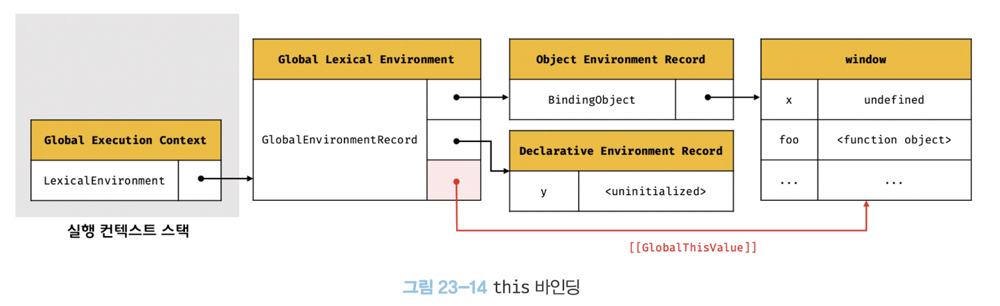

전역 환경 레코드의 [[GlobalThisValue]] 내부 슬롯에 this가 바인딩된다.

일반적으로 전역 코드에서의 this는 전역 객체를 가리키므로 전역 환경 레코드의 [[GlobalThisValule]] 내부 슬롯에는 전역 객체가 바인딩된다.

<br/>

### 2.3. 외부 렉시컬 환경에 대한 참조 결정

외부 렉시컬 환경에 대한 참조는 현재 평가 중인 소스코드를 포함하는 외부 소스코드를 렉시컬 환경, 즉 상위 스코프를 가리킨다. 이를 통해 단방향 링크드 리스트인 스코프 체인을 구현한다.

  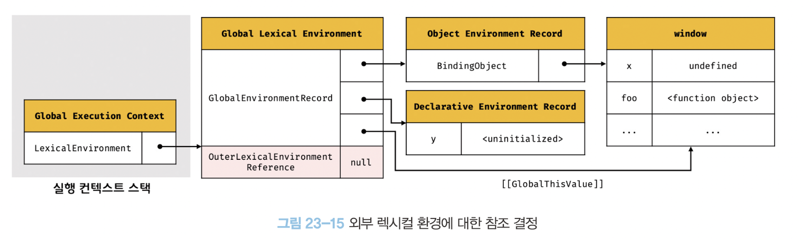

<br/>

## **전역 코드 실행**

이제 전역 코드가 순차적으로 실행되기 시작한다. 변수 할당문이 실행되어 전역 변수 x, y에 값이 할당된다. 그리고 foo 함수가 호출된다.

  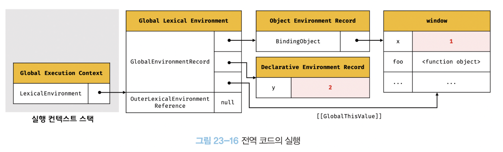

변수 할당문 또는 함수 호출문을 실행하려면 먼저 변수 또는 함수 이름이 선언된 식별자인지 확인이 필요하다.

또한 식별자는 스코프가 다르면 같은 이름을 가질수 있다. 따라서 어느 스코프의 식별자를 참조하면 되는지 결정할 필요가 있다. 이를 **식별자 결정**이라한다.

식별자 결정을 위해 식별자를 검색할 때는 실행 중인 실행 컨텍스트에서 식별자를 검색하기 시작한다. 만약 **실행 중인 실행 컨텍스트의 렉시컬 환경에서 식별자를 검색할 수 없으면 외부 렉시컬 환경에 대한 참조가 가리키는 렉시컬 환경(상위스코프)로 이동하여 식별자를 검색**한다.

이것이 바로 **스코프 체인의 동작 원리**다. 하지만 전역 렉시컬 환경은 스코프 체인의 종점이므로 전역 렉시컬 환경에서 검색할 수 없는 식별자는 참조 에러를 발생시킨다.

<br/>

## **함수 코드 평가**

- foo 함수가 호출되면 전역 코드의 실행을 일시 중단하고 foo 함수 내부로 코드의 제어권이 이동한다.
  그리고 함수 코드를 평가하기 시작한다. 함수 코드 평가는 아래 순서로 진행된다.

1. 함수 실행 컨텍스트 생성
2. 함수 렉시컬 환경 생성
   2.1. 함수 환경 레코드 생성
   2.2. this 바인딩
   2.3. 외부 렉시컬 환경에 대한 참조 결정

위 과정을 거쳐 생성된 foo 함수 실행 컨텍스트와 렉시컬 환경은 다음과 같다.

  

<br/>

### 1. 함수 실행 컨텍스트 생성

함수 실행 컨텍스트는 함수 렉시컬 환경이 완성된 다음 실행 컨텍스트 스택에 push된다. 이때 함수 실행 컨텍스트는 실행 컨텍스트 스택의 최상위, 즉 실행 중인 실행 컨텍스트가 된다.

<br/>

### 2. 함수 렉시컬 환경 생성

  

함수 렉시컬 환경Function Lexical Environment을 생성하고 함수 실행 컨텍스트에 바인딩한다.

<br/>

### 2.1. 함수 환경 레코드 생성

함수 환경 레코드는 매개변수, arguments 객체, 함수 내부에서 선언한 지역 변수와 중첩 함수를 등록하고 관리한다.

  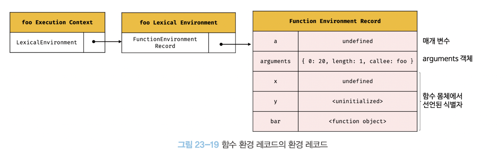

<br/>

### 2.2. this 바인딩

함수 환경 레코드의 [[ThisValue]] 내부 슬롯에 this가 바인딩된다.

  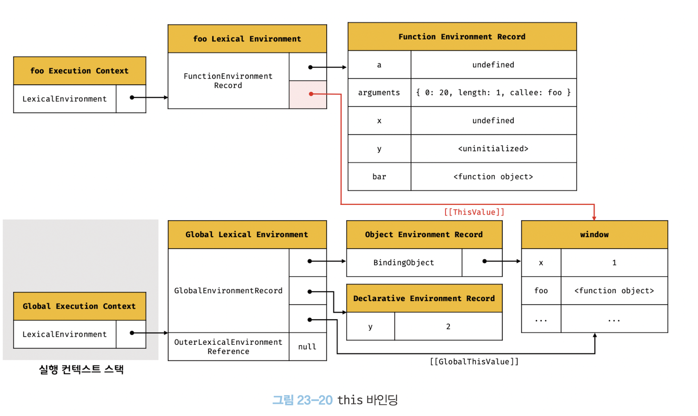

<br/>

### 2.3. 외부 렉시컬 환경에 대한 참조 결정

외부 렉시컬 환경에 대한 참조는 함수 정의가 평가된 시점에 실행 중인 실행 컨텍스트의 렉시컬 환경의 참조가 할당된다.

자바스크립트는 **함수를 어디서 호출했는지가 아니라 어디에 정의했는지에 따라 상위 스코프를 결정**한다. 그리고 함수 객체는 자신이 정의된 스코프, 즉 상위 스코프를 기억한다.

자바스크립트 엔진은 함수 정의를 평가하여 **함수 객체를 생성할 때 현재 실행 중인 실행 컨텍스트의 렉시컬 환경**, 즉 함수의 상위 스코프를 함수 객체의 **내부 슬롯 [[Environment]]에 저장**한다. 즉, **함수 객체의 내부 슬롯 [[Environment]]가 바로 렉시컬 스코프를 구현하는 메커니즘**이다.

  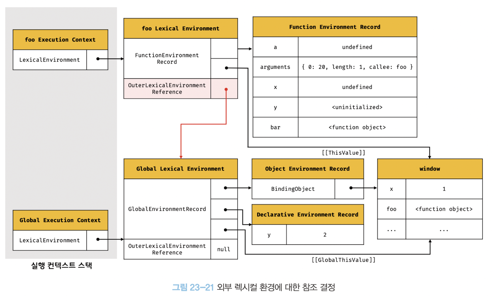

<br/>

## **foo 함수 코드 실행**

이제 런타인이 시작되어 foo 함수의 소스코드가 순차적으로 실행되기 시작한다.

매개변수에 인수가 할당되고, 변수 할당문이 실행되어 지역 변수 x, y 에 값이 할당된다. 그리고 함수 bar가 호출된다.

**이때 식별자 결정을 위해 실행중인 실행 컨텍스트의 렉시컬 환경에서 식별자를 검색하기 시작한다.**

  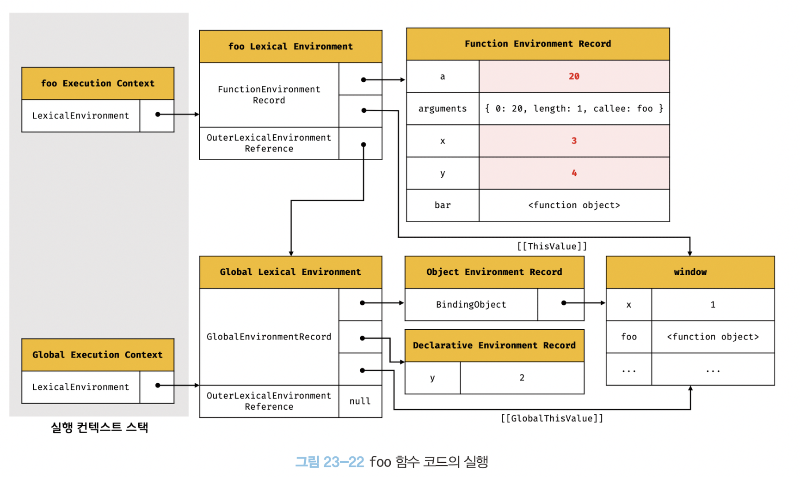

<br/>

## **bar 함수 코드 평가**

bar 함수가 호출되면 bar 함수 내부로 코드의 제어권이 이동한다. 그리고 bar 함수 코드를 평가하기 시작한다.

  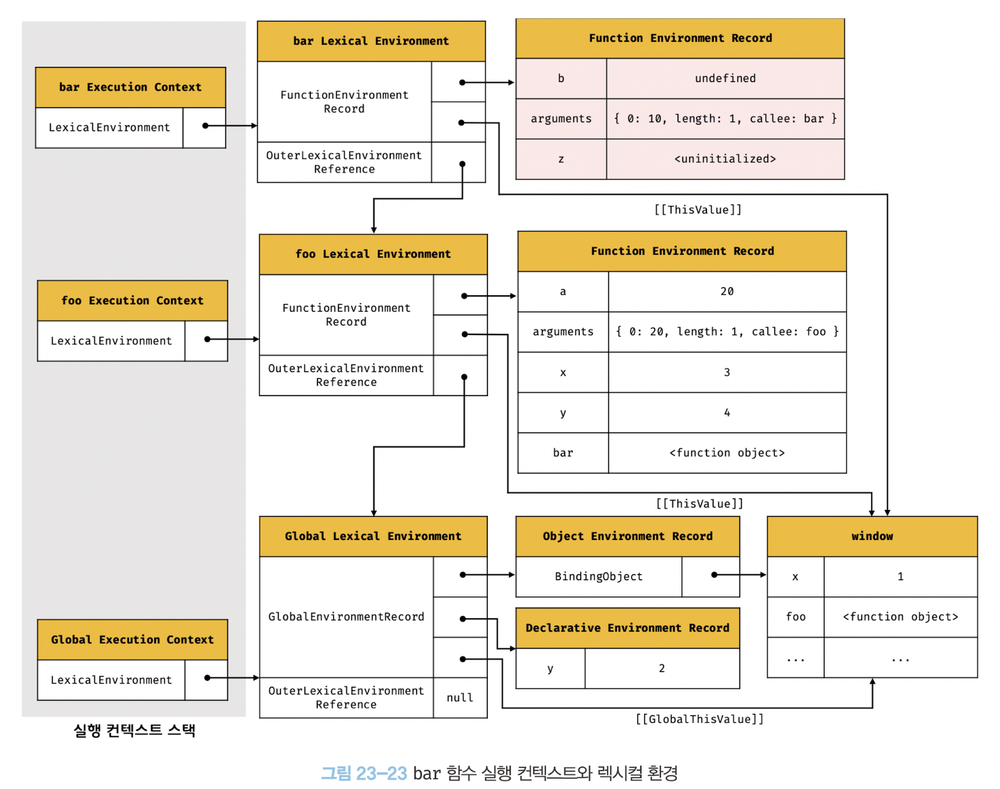

<br/>

## **bar 함수 코드 실행**

이제 런타임이 시작되어 bar 함수의 소스코드가 순차적으로 실행되기 시작한다. 매개 변수에 인수가 할당되고, 변수 할당문이 실행되어 지역 변수 z에 값이 할당된다.

  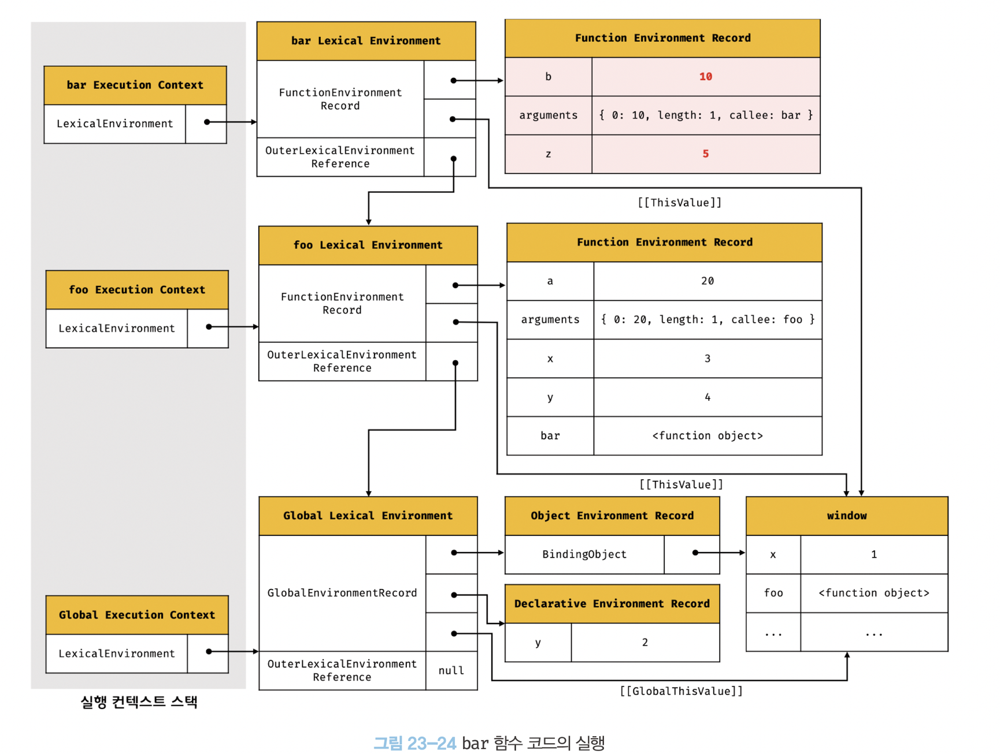

그리고 console.log(a + b + x + y + z); 가 실행된다.

1. console 식별자 검색
2. log 메서드 검색
3. 표현식 a + b + x + y + z의 평가

  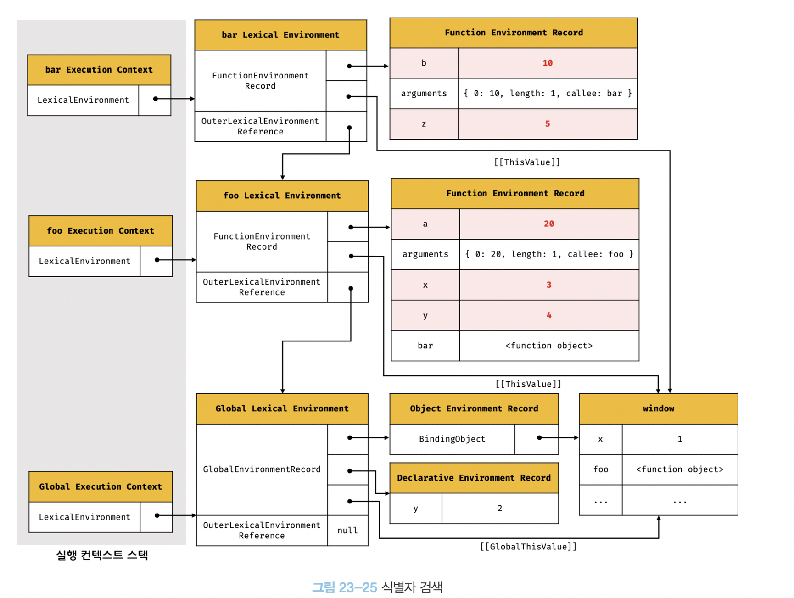

1. console.log 메서드 호출

   표현식 `a + b + x + y + z`의 평가되어 생성한 값 42를 console.log메서드에 전달하여 호출한다.

<br/>

## **bar 함수 코드 실행 종료**

console.log 메서드가 호출되고 종료하면 더는 실행할 코드가 없으므로 bar 함수 코드의 실행이 종료된다.

이때 실행 컨텍스트 스택에서 bar 함수 실행 컨텍스트가 팝되어 제거되고 foo 실행 컨텍스트가 실행 중인 실행 컨텍스트가 된다.

  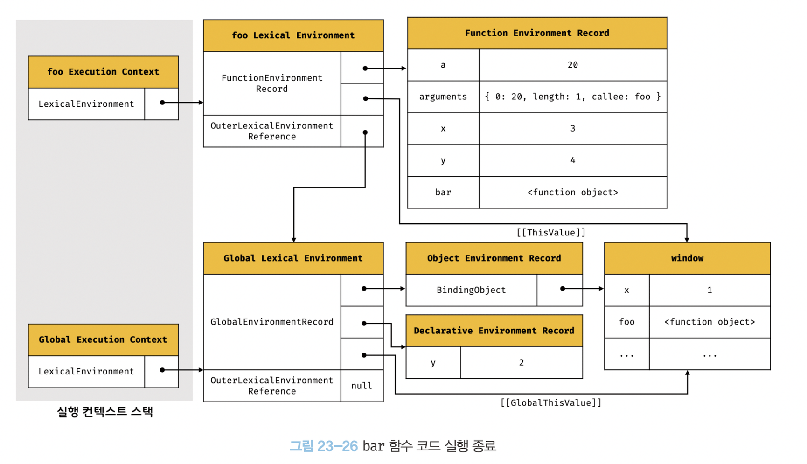

<br/>

## **foo 함수 코드 실행 종료**

bar 함수가 종료하면 더 이상 실행할 코드가 없으므로 foo 함수 코드의 실행이 종료된다.

이때 실행 컨텍스트 스택에서 foo 함수 실행 컨텍스트가 팝되어 제거되고 전역 실행 컨텍스트가 실행 중인 실행 컨텍스트가 된다.

  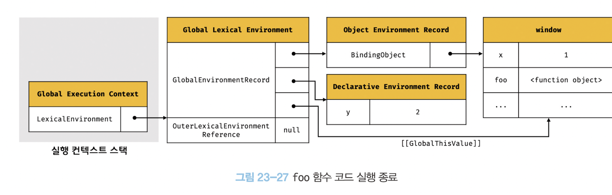

<br/>

## **전역 코드 실행 종료**

foo 함수가 종료되면 더는 실행할 전역 코드가 없으므로 전역 코드의 실행이 종료되고 전역 실행 컨텍스트도 실행 컨텍스트 스택에 팝되어 실행 컨텍스트 스택에는 아무것도 남아있지 않게 된다.

<br/>

# **실행 컨텍스트와 블록 레벨 스코프**

```jsx
let x = 1;

if (true) {
  let x = 10;
  console.log(x); // 10
}

console.log(x); // 1
```

위의 예제에서 if 문의 코드 블록 내에 let 키워드로 변수가 선언되었다. 따라서 if 문의 코드 블록이 실행되면 if 문의 코드 블록을 위한 블록 레벨 스코프를 생성해야 한다.

  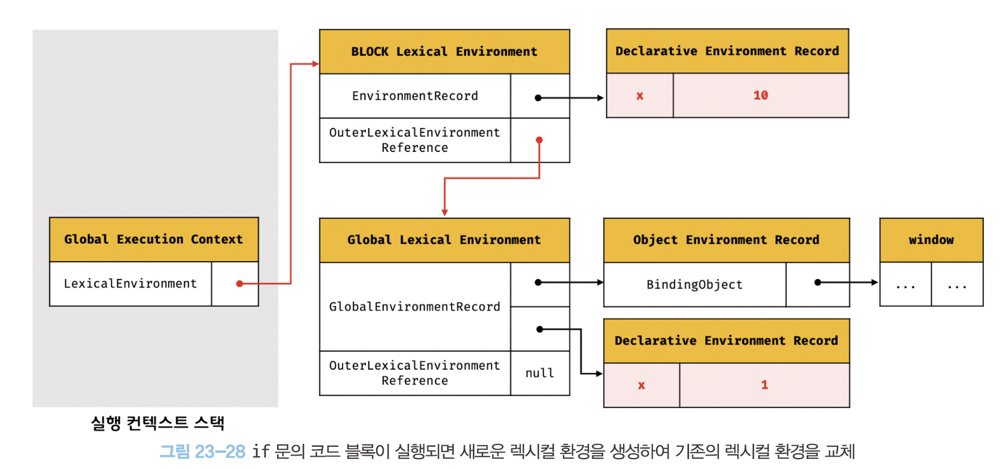

이를 위해 선언적 환경 레코드를 갖는 렉시컬 환경을 새롭게 생성하여 기존의 전역 렉시컬 환경을 교체한다.

  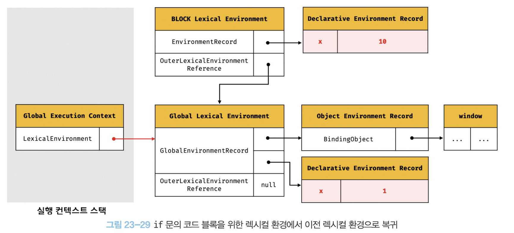

if 문 코드 블록의 실행이 종료되면 if 문의 코드 블록이 실행되기 이전의 렉시컬 환경으로 되돌린다.

이는 블록 레벨 스코프를 생성하는 모든 블록문에 적용된다.
