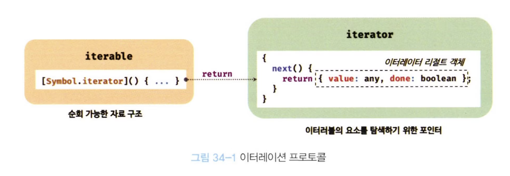
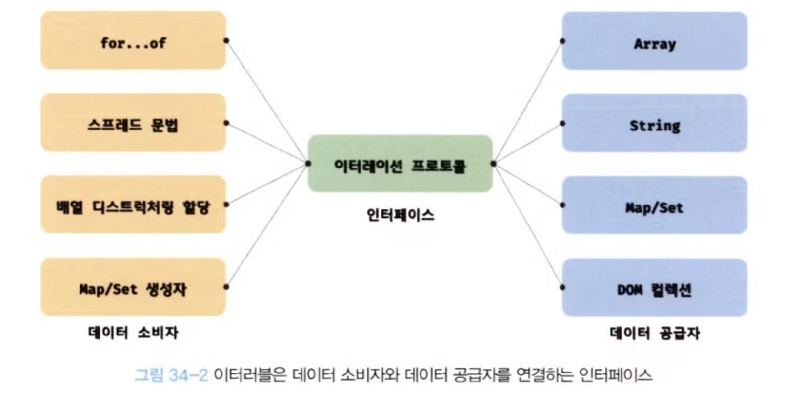

# **이터레이션 프로토콜**

ES6에서 도입된 이터레이션 프로토콜은 **순회 가능한 데이터 컬렉션(자료구조)을 만들기 위해 ECMAScript 사양에 정의하여 미리 약속한 규칙**이다.

ES6 이전의 순회 가능한 데이터 컬렉션, 즉 배열, 문자열, 유사 배열 객체, DOM 컬렉션 등은 통일된 규약 없이 각자 나름의 구조를 가지고 for 문, for…in 문, forEach 메서드 등 다양한 방법으로 순회할 수 있었다.

ES6에서는 순회 가능한 데이터 컬렉션을 이터레이션 프로토콜을 준수하는 이터러블로 통일하여 for … of 문, 스프레드 문법, 배열 디스트럭처링 할당의 대상으로 사용할 수 있도록 일원화했다.

이터레이션 프로토콜에는 이터러블 프로토콜과 이터레이터 프로토콜이 있다.

### **이터러블 프로토콜**

- Well-known Symbol인 **Symbol.iterator를 프로퍼티 키로 사용한 메서드를 직접 구현하거나 Symbol.iterator 메서드를 상속받는다.**
- 호출시 이터레이터 프로토콜을 준수한 이터레이터를 반환한다.
- 이러한 규약을 이터러블 프로토콜이라 하며, 이터러블 프로토콜을 준수한 객체를 이터러블이라고 한다.
- 이터러블은 for…of 문으로 순회할 수 있고 스프레드 문법과 배열 디스트럭처링 할당의 대상으로 사용할 수 있다.

### **이터레이터 프로토콜**

- Symbol.iterator 메서드를 호출시 이터레이터 프로토콜을 준수한 이터레이터를 반환한다.
- 이터레이터는 next 메서드를 소유하여 next메서드를 호출시 이터러블을 순회하며 value와 done 프로퍼티를 갖는 이터레이터 리절트 객체를 반환한다.
- 이러한 규약을 이터레이터 프로토콜이라 하며, 이터레이터 프로토콜을 준수한 객체를 이터레이터라 한다.
- 이터레이터는 이터러블의 요소를 탐색하기 위한 포인터 역할을 한다.

  

<br/>

## **이터러블**

이터러블 프로토콜을 준수한 객체이다.

Symbol.iterator를 프로퍼티 키로 사용한 메서드를 직접 구현하거나 프로토타입 체인을 통해 상속받은 객체이다.

이터러블인지 확인하는 함수는 다음과 같이 구현할 수 있다.

```jsx
const isIterable = (v) =>
  v !== null && typeof v[Symbol.iterator] === "function";

// 배열, 문자열, Map, Set 등은 이터러블이다.
isIterable([]); // -> true
isIterable(""); // -> true
isIterable(new Map()); // -> true
isIterable(new Set()); // -> true
isIterable({}); // -> false
```

배열은 Array.prototype의 Symbol.iterator 메서드를 상속받는 이터러블이다.
이터러블은 for…of로 순회할 수 있고, 스프레드 문법과 배열 디스트럭처링 할당의 대상으로 사용할 수 있다.

```jsx
const array = [1, 2, 3];

// 배열은 Array.prototype의 Symbol.iterator 메서드를 상속받는 이터러블이다.
console.log(Symbol.iterator in array); // true

// 이터러블인 배열은 for...of 문으로 순회 가능하다.
for (const item of array) {
  console.log(item); // 1 2 3
}

// 이터러블인 배열은 스프레드 문법의 대상으로 사용할 수 있다.
console.log([...array]); // [1, 2, 3]

// 이터러블인 배열은 배열 디스트럭처링 할당의 대상으로 사용할 수 있다.
const [a, ...rest] = array;
console.log(a, rest); // 1, [2, 3]
```

Symbol.iterator 메서드를 직접 구현하지 않거나 상속받지 않은 일반 객체는 이터러블이 아니므로 순회할 수 없고 스프레드 문법과 배열 디스트럭쳐링 할당의 대상으로 사용할 수 없다.

```jsx
const obj = { a: 1, b: 2 };

// 일반 객체는 Symbol.iterator 메서드를 구현하거나 상속받지 않는다.
// 따라서 일반 객체는 이터러블 프로토콜을 준수한 이터러블이 아니다.
console.log(Symbol.iterator in obj); // false

// 이터러블이 아닌 일반 객체는 for...of 문으로 순회할 수 없다.
for (const item of obj) {
  // -> TypeError: obj is not iterable
  console.log(item);
}

// 이터러블이 아닌 일반 객체는 배열 디스트럭처링 할당의 대상으로 사용할 수 없다.
const [a, b] = obj; // -> TypeError: obj is not iterable
```

단, 2021년 1월 TC39 프로세스 stage 4(Finished) 단계에 제안되어 있는 스프레드 프로퍼티 제안은 일반 객체에 스프레드 문법 사용을 허용한다.

```jsx
// 객체 리터럴 내부에서 스프레드 문법의 사용을 허용한다.
console.log({ ...obj }); // {a: 1, b: 2}
```

하지만 일반 객체도 이터러블 프로토콜을 준수하도록 구현하면 이터러블이 된다.

<br/>

## **이터레이터**

이터러블의 Symbol.iterator 메서드는 이터레이터를 반환한다. 반환한 이터레이터는 next 메서드를 갖는다.

```jsx
// 배열은 이터러블 프로토콜을 준수한 이터러블이다.
const array = [1, 2, 3];

// Symbol.iterator 메서드는 이터레이터를 반환한다.
const iterator = array[Symbol.iterator]();

// Symbol.iterator 메서드가 반환한 이터레이터는 next 메서드를 갖는다.
console.log("next" in iterator); // true
```

이터레이터의 next 메서드는 이터러블의 각 요소를 순회하기 위한 포인터 역할을 한다.

그리고 next 메서드는 이터러블을 순차적으로 한 단계씩 순회한 결과인 이터레이터 리절트 객체를 반환한다. 이터레이터 리절트 객체는 value와 done 프로퍼티를 갖는 객체다.

```jsx
const array = [1, 2, 3];

const iterator = array[Symbol.iterator]();

console.log(iterator.next()); // { value: 1, done: false }
console.log(iterator.next()); // { value: 2, done: false }
console.log(iterator.next()); // { value: 3, done: false }
console.log(iterator.next()); // { value: undefined, done: true }
```

value 프로퍼티는 현재 순회 중인 이터러블의 값을 나타내고, done 프로퍼티는 이터러블의 순회 완료 여부를 나타낸다.

<br/>

# **빌트인 이터러블**

아래 표준 빌트인 객체들은 빌트인 이터러블이다.

| 빌트인 이터러블 | Symbol.iterator 메서드                                                         |
| --------------- | ------------------------------------------------------------------------------ |
| Array           | Array.prototype[Symbol.iterator]                                               |
| String          | String.prototype[Symbol.iterator]                                              |
| Map             | Map.prototype[Symbol.iterator]                                                 |
| Set             | Set.prototype[Symbol.iterator]                                                 |
| TypedArray      | TypedArray.prototype[Symbol.iterator]                                          |
| arguments       | arguments[Symbol.iterator]                                                     |
| DOM 컬렉션      | NodeList.prototype[Symbol.iterator], HTMLCollection.prototype[Symbol.iterator] |

<br/>

# **for…of 문**

이터러블을 순회하면서 이터러블의 요소를 변수에 할당한다.

```jsx
for (변수 선언문 of 이터러블) { ... }
```

> for…in 문의 형식과 매우 유사하다.
>
> ```jsx
> for (변수 선언문 in 객체) { ... }
> ```
>
> 객체의 프로퍼티 중에서 프로퍼티 어트리뷰트 [[Enumerable]] 값이 true인 프로퍼티를 순회하며 열거한다. 이때 프로퍼티 키가 심벌인 프로퍼티는 열거하지 않는다.

for…of 문은 내부적으로 이터레이터의 next 메서드를 호출해 이터러블을 순회하며 next 메서드가 반환한 이터레이터 리절트 객체의 value 프로퍼티 값을 for…of 문의 변수에 할당한다.

이터레이터 리절트 객체의 done 프로퍼티 값이 true일동안 순회한다.

```jsx
for (const item of [1, 2, 3]) {
  // item 변수에 순차적으로 1, 2, 3이 할당된다.
  console.log(item); // 1 2 3
}
```

위 예제의 for…of 내부 동작을 for문으로 표현하면 다음과 같다.

```jsx
const iterable [1, 2, 3];
const iterator = iterable[Symbol.iterator]();

for( ;; ){
	// next 메서드를 호출하여 이터러블을 순회한다.
	// next 메서드는 resut 객체를 반환한다.
	const res = iterator.next();

	// result 객체의 done 프로퍼티가 true이면 종료
	if(res.done) break;

	// result 객체의 value 프로퍼티 값을 item 변수에 할당한다.
	const item = res.value;
	console.log(item);
}
```

<br/>

# **이터러블과 유사 배열 객체**

유사 배열 객체는 배열처럼 인덱스로 프로퍼티 값에 접근할 수 있고 length 프로퍼티를 갖는 객체다.

유사 배열 객체는 length 프로퍼티를 갖기 때문에 for 문으로 순회할 수 있고, 인덱스를 나타내는 숫자 형식의 문자열을 프로퍼티 키로 가지므로 배열처럼 인덱스로 값에 접근할 수 있다.

```jsx
const arrayLike = {
  0: 1,
  1: 2,
  2: 3,
  length: 3,
};

// length 프로퍼티를 가지므로 for 문으로 순회 가능
for (let i = 0; i < arrayLike.length; i++) {
  // 배열처럼 인덱스로 프로퍼티 값에 접근할 수 있다,
  console.log(arrayLike[i]);
}
```

유사 배열 객체는 이터러블이 아닌 일반 객체이므로(Symbol.iterator 메서드가 없음) for…of로 순회 불가능하다.

```jsx
for (const item of arrayLike) {
  console.log(item);
}
// TypeError: arrayLike is not iterable
```

단, arguments, NodeList, HTMLCollection은 유사 배열 객체이면서 이터러블이다.

> ES6에서 이터러블이 도입되면서 유사 배열 객체인 arguments, NodeList, HTMLCollection에 Symbol.iterator 메서드를 구현하면서 이터러블이 되었다.

유사 배열 객체인 arrayLike 를 ES6에서 도입된 Array.from메서드를 사용해 배열로 변환할 수 있다.

```jsx
const arrayLike = {
  0: 1,
  1: 2,
  2: 3,
  length: 3,
};

// Array.from은 유사 배열 객체 또는 이터러블을 배열로 변환한다.
const arr = Array.from(arrayLike);
console.log(arr); // [1, 2, 3]
```

<br/>

# **이터레이션 프로토콜의 필요성**

데이터 소비자와 데이터 공급자를 연결하는 인터페이스 역할을 한다.

ES6 이전 이터러블은 저마다 나름의 구조를 가지고 다양한 방법으로 순회할 수 있었다. ES6에서는 이터레이션 프로토콜을 준수하는 이터러블로 통일해 순회 방법을 일원화했다.

다양한 데이터 공급자의 이터레이션 프로토콜을 준수하도록 규정해서 데이터 소비자가 **효율적으로** 데이터 공급자를 사용한다.

  

<br/>

# **사용자 정의 이터러블**

## **사용자 정의 이터러블 구현**

일반 객체도 이터레이션 프로토콜을 준수해 이터러블로 만들어보자.

피보나치 수열을 구현한 사용자 정의 이터러블을 구현해 보자.

```jsx
// 피보나치 수열을 구현한 사용자 정의 이터러블
const fibonacci = {
  // Symbol.iterator 메서드를 구현하여 이터러블 프로토콜을 준수한다.
  [Symbol.iterator]() {
    let [pre, cur] = [0, 1]; // "36.1. 배열 디스트럭처링 할당" 참고
    const max = 10; // 수열의 최대값

    // Symbol.iterator 메서드는 next 메서드를 소유한 이터레이터를 반환해야 하고
    // next 메서드는 이터레이터 리절트 객체를 반환해야 한다.
    return {
      next() {
        [pre, cur] = [cur, pre + cur]; // "36.1. 배열 디스트럭처링 할당" 참고
        // 이터레이터 리절트 객체를 반환한다.
        return { value: cur, done: cur >= max };
      },
    };
  },
};

// 이터러블인 fibonacci 객체를 순회할 때마다 next 메서드가 호출된다.
for (const num of fibonacci) {
  console.log(num); // 1 2 3 5 8
}
```

이터러블 객체는 for…of뿐만 아니라 스프레드 문법, 배열 디스트럭처링 할당에도 사용할 수 있다.

```jsx
// 이터러블은 스프레드 문법의 대상이 될 수 있다.
const arr = [...fibonacci];
console.log(arr); // [ 1, 2, 3, 5, 8 ]

// 이터러블은 배열 디스트럭처링 할당의 대상이 될 수 있다.
const [first, second, ...rest] = fibonacci;
console.log(first, second, rest); // 1 2 [ 3, 5, 8 ]
```

<br/>

## **이터러블을 생성하는 함수**

앞의 fibonacci의 최대값을 외부에서 전달할 수 있도록 개선해 보자

수열의 최대값을 인수로 전달받아 이터러블을 반환하는 함수를 만들면 된다.

```jsx
// 피보나치 수열을 구현한 사용자 정의 이터러블을 반환하는 함수. 수열의 최대값을 인수로 전달받는다.
const fibonacciFunc = function (max) {
  let [pre, cur] = [0, 1];

  // Symbol.iterator 메서드를 구현한 이터러블을 반환한다.
  return {
    [Symbol.iterator]() {
      return {
        next() {
          [pre, cur] = [cur, pre + cur];
          return { value: cur, done: cur >= max };
        },
      };
    },
  };
};

// 이터러블을 반환하는 함수에 수열의 최대값을 인수로 전달하면서 호출한다.
for (const num of fibonacciFunc(10)) {
  console.log(num); // 1 2 3 5 8
}
```

<br/>

## **이터러블이면서 이터레이터인 객체를 생성하는 함수**

앞의 fibonacci가 이터레이터인 객체를 생성하도록 개선해 보자

```jsx
// fibonacciFunc 함수는 이터러블을 반환한다.
const iterable = fibonacciFunc(5);
// 이터러블의 Symbol.iterator 메서드는 이터레이터를 반환한다.
const iterator = iterable[Symbol.iterator]();

console.log(iterator.next()); // { value: 1, done: false }
console.log(iterator.next()); // { value: 2, done: false }
console.log(iterator.next()); // { value: 3, done: false }
console.log(iterator.next()); // { value: 5, done: true }
```

이터러블이면서 이터레이터인 객체를 생성하면 Symbol.iterator 메서드를 호출하지 않아도 된다.

Symbol.iterator 메서드는 this를 반환하므로 next 메서드를 갖는 이터레이터를 반환한다.

```jsx
// 이터러블이면서 이터레이터인 객체. 이터레이터를 반환하는 Symbol.iterator 메서드와
// 이터레이션 리절트 객체를 반환하는 next 메서드를 소유한다.
{
  [Symbol.iterator]() { return this; },
  next() {
    return { value: any, done: boolean };
  }
}
```

```jsx
// 이터러블이면서 이터레이터인 객체를 반환하는 함수
const fibonacciFunc = function (max) {
  let [pre, cur] = [0, 1];

  // Symbol.iterator 메서드와 next 메서드를 소유한 이터러블이면서 이터레이터인 객체를 반환
  return {
    [Symbol.iterator]() {
      return this;
    },
    // next 메서드는 이터레이터 리절트 객체를 반환
    next() {
      [pre, cur] = [cur, pre + cur];
      return { value: cur, done: cur >= max };
    },
  };
};

// iter는 이터러블이면서 이터레이터다.
let iter = fibonacciFunc(10);

// iter는 이터러블이므로 for...of 문으로 순회할 수 있다.
for (const num of iter) {
  console.log(num); // 1 2 3 5 8
}

// iter는 이터러블이면서 이터레이터다
iter = fibonacciFunc(10);

// iter는 이터레이터이므로 이터레이션 리절트 객체를 반환하는 next 메서드를 소유한다.
console.log(iter.next()); // { value: 1, done: false }
console.log(iter.next()); // { value: 2, done: false }
console.log(iter.next()); // { value: 3, done: false }
console.log(iter.next()); // { value: 5, done: false }
console.log(iter.next()); // { value: 8, done: false }
console.log(iter.next()); // { value: 13, done: true }
```

<br/>

## **무한 이터러블과 지연 평가**

이터러블로 무한 수열을 간단히 구현할 수 있다

```jsx
// 무한 이터러블을 생성하는 함수
const fibonacciFunc = function () {
  let [pre, cur] = [0, 1];

  return {
    [Symbol.iterator]() {
      return this;
    },
    next() {
      [pre, cur] = [cur, pre + cur];
      // 무한을 구현해야 하므로 done 프로퍼티를 생략한다.
      return { value: cur };
    },
  };
};

// fibonacciFunc 함수는 무한 이터러블을 생성한다.
for (const num of fibonacciFunc()) {
  if (num > 10000) break;
  console.log(num); // 1 2 3 5 8...4181 6765
}

// 배열 디스트럭처링 할당을 통해 무한 이터러블에서 3개의 요소만 취득한다.
const [f1, f2, f3] = fibonacciFunc();
console.log(f1, f2, f3); // 1 2 3
```

이터러블은 지연 평가를 통해 데이터를 생성한다. 지연 평가는 데이터가 필요한 시점이 되면 데이터를 생성하는 기법이다.

for…of 문이나 배열 디스트럭처링 할당 등이 실행되기 이전까지 데이터를 생성하지 않는다. for…of문의 경우 이터러블을 순회할 때 내부에서 이터레이터의 next 메서드를 호출하는 때에 데이터가 생성된다.

지연 평가를 사용하면 불필요한 데이터를 미리 생성하지 않고 필요한 데이터를 필요한 순간에 생성해 **빠른 실행 속도**를 기대할 수 있고 **불필요한 메모리**를 소비하지 않으며 무한을 표현할 수 있다.
